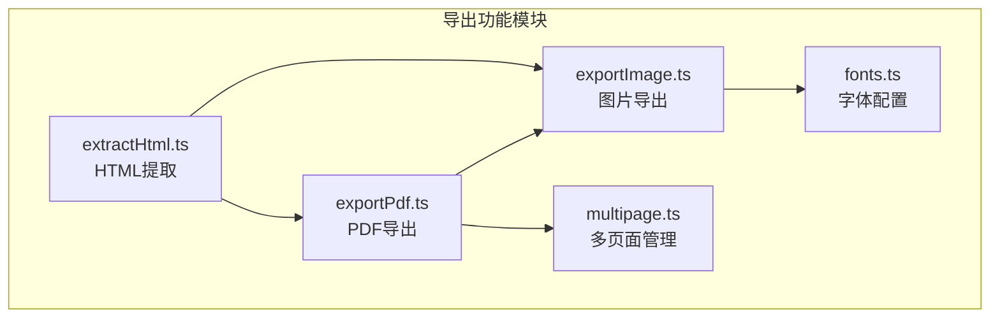
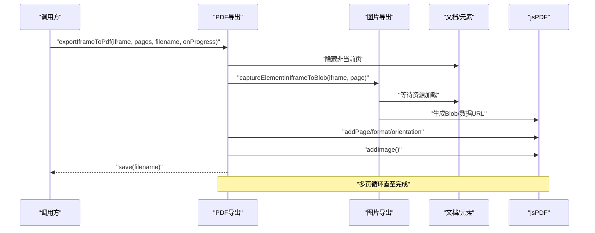
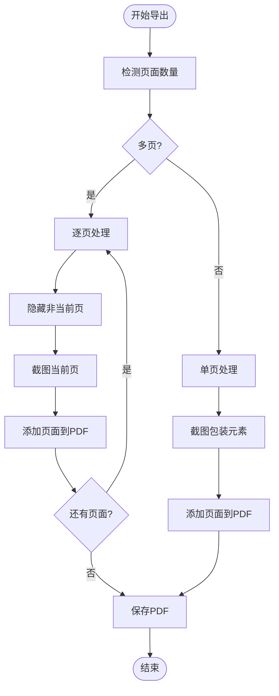
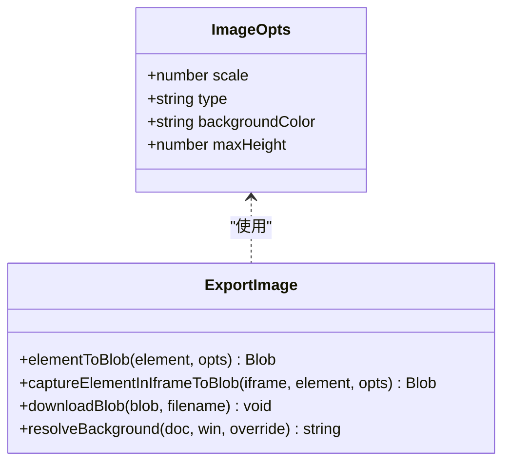
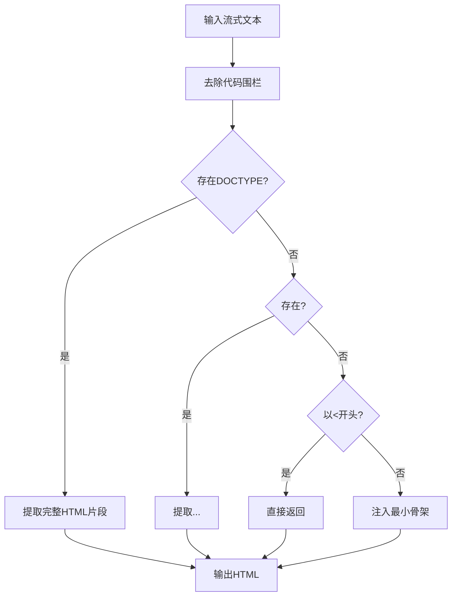
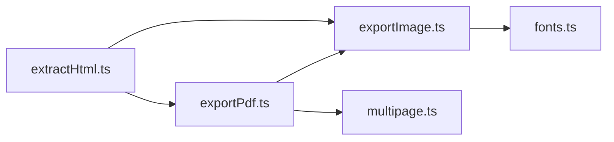

# 导出功能API

<cite>
**本文档引用的文件**
- [exportPdf.ts](file://src/lib/exportPdf.ts)
- [exportImage.ts](file://src/lib/exportImage.ts)
- [extractHtml.ts](file://src/lib/extractHtml.ts)
- [multipage.ts](file://src/lib/multipage.ts)
- [fonts.ts](file://src/lib/fonts.ts)
</cite>

## 更新摘要
**所做更改**
- 移除了废弃的 iframeToBlob 和 downloadIframeAsImage 函数相关文档
- 更新了导出接口列表，仅保留当前活跃的API
- 修正了许可证归属URL引用
- 更新了图片导出API的接口描述，移除了已废弃的函数

## 目录
1. [简介](#简介)
2. [项目结构](#项目结构)
3. [核心组件](#核心组件)
4. [架构概览](#架构概览)
5. [详细组件分析](#详细组件分析)
6. [依赖分析](#依赖分析)
7. [性能考虑](#性能考虑)
8. [故障排除指南](#故障排除指南)
9. [结论](#结论)
10. [附录](#附录)

## 简介
本文件为 Markdown2View 项目的导出功能API参考文档，涵盖PDF导出、图片导出、HTML提取、多页面导出、字体嵌入与资源管理、进度监控与错误处理等核心能力。文档基于源代码实现进行系统化梳理，提供接口规范、参数说明、使用示例与最佳实践，帮助开发者快速集成与扩展导出功能。

## 项目结构
导出功能主要分布在以下模块：
- PDF导出：基于iframe截图与jsPDF生成PDF
- 图片导出：支持PNG/JPEG/WebP格式，可配置缩放与背景色
- HTML提取：从AI输出中提取有效HTML并注入打印样式
- 多页面管理：检测与滚动到指定页面节点
- 字体管理：提供中英文字体族配置

**图表来源**
- [exportPdf.ts:1-194](file://src/lib/exportPdf.ts#L1-L194)
- [exportImage.ts:1-320](file://src/lib/exportImage.ts#L1-L320)
- [extractHtml.ts:1-113](file://src/lib/extractHtml.ts#L1-L113)
- [multipage.ts:1-34](file://src/lib/multipage.ts#L1-L34)
- [fonts.ts:1-16](file://src/lib/fonts.ts#L1-L16)

## 核心组件
本节概述导出功能的核心API与职责分工：

- PDF导出
  - 多页模式：逐页截图并合并为PDF
  - 单页模式：对包装容器进行截图
  - 元素导出：兼容非iframe场景的元素导出
- 图片导出
  - iframe整体截图
  - 指定元素截图（保留全局样式）
  - 下载与Blob处理
- HTML提取
  - 从流式输出中提取HTML
  - 注入打印样式与防御性排版
- 多页面管理
  - 页面节点检测
  - 滚动定位
- 字体配置
  - 字体族映射
  - CSS字符串生成

**章节来源**
- [exportPdf.ts:20-184](file://src/lib/exportPdf.ts#L20-L184)
- [exportImage.ts:160-318](file://src/lib/exportImage.ts#L160-L318)
- [extractHtml.ts:5-112](file://src/lib/extractHtml.ts#L5-L112)
- [multipage.ts:18-33](file://src/lib/multipage.ts#L18-L33)
- [fonts.ts:1-16](file://src/lib/fonts.ts#L1-L16)

## 架构概览
导出流程采用"截图+合成"的架构：先通过现代截图库对DOM进行高质量截图，再由PDF引擎合成最终产物。多页面通过CSS打印媒体查询实现分页控制。

**图表来源**
- [exportPdf.ts:21-89](file://src/lib/exportPdf.ts#L21-L89)
- [exportImage.ts:183-318](file://src/lib/exportImage.ts#L183-L318)

## 详细组件分析

### PDF导出API
- 多页模式导出
  - 函数：exportIframeToPdf
  - 参数
    - iframe: HTMLIFrameElement
    - pageNodes: HTMLElement[]（页面节点数组）
    - filename: string（文件名）
    - onProgress?: (current: number, total: number) => void（进度回调）
  - 行为
    - 逐页隐藏/显示，确保每页独立渲染
    - 使用iframe内截图，保留字体与背景
    - 动态计算页面方向与尺寸，压缩存储
  - 错误处理
    - iframe未就绪抛出异常
    - 截图失败抛出异常
  - 性能要点
    - 3倍缩放确保清晰度
    - 逐页进度回调便于用户感知
- 单页模式导出
  - 函数：exportSinglePageToPdf
  - 行为
    - 自动定位第一层包装元素（body > div/main/section或body）
    - 统一背景色，避免透明导致的背景丢失
- 元素导出（非iframe）
  - 函数：exportElementsToPdf
  - 参数
    - elements: HTMLElement[]
    - filename: string
    - opts?: { width: number; height: number }
    - onProgress?: (current: number, total: number) => void
  - 行为
    - 使用modern-screenshot进行DOM转JPEG
    - 支持显式宽高与默认尺寸推断

**图表来源**
- [exportPdf.ts:21-89](file://src/lib/exportPdf.ts#L21-L89)
- [exportPdf.ts:92-127](file://src/lib/exportPdf.ts#L92-L127)
- [exportPdf.ts:131-184](file://src/lib/exportPdf.ts#L131-L184)

**章节来源**
- [exportPdf.ts:21-184](file://src/lib/exportPdf.ts#L21-L184)

### 图片导出API
- 截图配置(ImageOpts)
  - scale?: number（缩放系数，默认2）
  - type?: 'image/png' | 'image/jpeg' | 'image/webp'（图片类型，默认PNG）
  - backgroundColor?: string（背景色）
  - maxHeight?: number（最大高度，用于分段截图）
- 指定元素截图（推荐用于PDF导出）
  - 函数：captureElementInIframeToBlob
  - 行为
    - 临时重置缩放与自适应，锁定桌面端布局
    - 将iframe、html、body与目标元素对齐，消除外边距与居中影响
    - 截图后恢复所有样式
- 元素截图（非iframe）
  - 函数：elementToBlob
  - 行为
    - 获取元素自然尺寸，进行高质量截图
- 下载与Blob处理
  - 函数：downloadBlob
  - 行为
    - 创建对象URL并触发下载
    - 延迟释放URL，避免内存泄漏

**图表来源**
- [exportImage.ts:16-21](file://src/lib/exportImage.ts#L16-L21)
- [exportImage.ts:183-318](file://src/lib/exportImage.ts#L183-L318)
- [exportImage.ts:160-169](file://src/lib/exportImage.ts#L160-L169)

**章节来源**
- [exportImage.ts:16-21](file://src/lib/exportImage.ts#L16-L21)
- [exportImage.ts:183-318](file://src/lib/exportImage.ts#L183-L318)
- [exportImage.ts:160-169](file://src/lib/exportImage.ts#L160-L169)

### HTML提取API
- extractHtml(streamed: string): string
  - 行为
    - 去除代码围栏，提取DOCTYPE到</html>片段
    - 识别<html>标签范围
    - 以<开头直接信任
    - 兜底：注入最小骨架（含Tailwind CDN）与转义内容
- previewHtml(input: string): string
  - 行为
    - 自动为<link rel="stylesheet">注入crossorigin="anonymous"
    - 注入打印换页CSS与屏幕居中预览CSS
    - 防御性排版样式，避免字体回退导致的渲染问题
    - 保证闭合标签完整性

**图表来源**
- [extractHtml.ts:5-44](file://src/lib/extractHtml.ts#L5-L44)
- [extractHtml.ts:51-112](file://src/lib/extractHtml.ts#L51-L112)

**章节来源**
- [extractHtml.ts:5-44](file://src/lib/extractHtml.ts#L5-L44)
- [extractHtml.ts:51-112](file://src/lib/extractHtml.ts#L51-L112)

### 多页面导出API
- detectPages(doc: Document): PageInfo[]
  - 行为
    - 检测<section class="page|slide|card">节点
    - 返回页面索引、标签与节点引用
    - 无匹配返回空数组（单页长文档）

**章节来源**
- [multipage.ts:18-33](file://src/lib/multipage.ts#L18-L33)

### 字体嵌入与资源管理API
- getFontFamilyCss(option: FontFamilyOption): string
  - 选项
    - songti: 宋体系
    - fangsong: 仿宋体系
    - lxgwwenkai: 轻颜体
    - heiti: 黑体系（默认）
  - 行为
    - 返回对应CSS字体族字符串
- 资源加载策略
  - HTML提取时为样式表注入crossorigin="anonymous"，便于截图库读取@font-face规则
  - 截图前等待字体、图片、样式表加载完成

**章节来源**
- [fonts.ts:1-16](file://src/lib/fonts.ts#L1-L16)
- [extractHtml.ts:55-59](file://src/lib/extractHtml.ts#L55-L59)
- [exportImage.ts:61-117](file://src/lib/exportImage.ts#L61-L117)

## 依赖分析
- 外部依赖
  - jspdf：PDF生成与图像添加
  - modern-screenshot：DOM转Blob/截图
  - modern-screenshot.waitUntilLoad：等待渲染稳定
- 内部依赖
  - exportPdf.ts 依赖 exportImage.ts 的截图能力
  - extractHtml.ts 为PDF导出提供预处理HTML与打印样式
  - multipage.ts 为PDF导出提供页面检测与滚动控制

**图表来源**
- [exportPdf.ts:7](file://src/lib/exportPdf.ts#L7)
- [exportImage.ts:7](file://src/lib/exportImage.ts#L7)
- [extractHtml.ts:1](file://src/lib/extractHtml.ts#L1)

**章节来源**
- [exportPdf.ts:7](file://src/lib/exportPdf.ts#L7)
- [exportImage.ts:7](file://src/lib/exportImage.ts#L7)
- [extractHtml.ts:1](file://src/lib/extractHtml.ts#L1)

## 性能考虑
- 清晰度与体积平衡
  - 默认缩放系数为2-3倍，兼顾清晰度与文件大小
  - PDF启用压缩选项
- 大文档分段处理
  - captureElementInIframeToBlob内置maxHeight限制，避免超大文档内存溢出
- 资源加载优化
  - 截图前等待字体、图片、样式表加载完成，减少重排与回流
  - 使用缓存策略（fetch: { requestInit: { cache: 'force-cache' } }）
- 多页导出
  - 逐页隐藏/显示，避免一次性渲染所有页面
  - 进度回调提升用户体验

## 故障排除指南
- 常见错误与处理
  - iframe尚未就绪：检查iframe是否已加载完成
  - 预览暂无内容：确认iframe内容已渲染
  - 导出节点暂无尺寸：检查元素是否可见且有明确宽高
  - 截图失败：确认资源加载完成，必要时增加等待时间
- 进度监控
  - 多页导出提供onProgress回调，可用于UI反馈
- 跨域与字体
  - 为样式表注入crossorigin="anonymous"，确保@font-face可读取
  - 使用resolveBackground统一背景色，避免透明导致的背景丢失

**章节来源**
- [exportPdf.ts:30](file://src/lib/exportPdf.ts#L30)
- [exportPdf.ts:164](file://src/lib/exportPdf.ts#L164)
- [exportImage.ts:205](file://src/lib/exportImage.ts#L205)
- [exportImage.ts:190](file://src/lib/exportImage.ts#L190)
- [extractHtml.ts:55-59](file://src/lib/extractHtml.ts#L55-L59)

## 结论
Markdown2View的导出功能通过"高质量截图+PDF合成"的架构实现了稳定的多格式导出能力。PDF导出支持多页与单页模式，图片导出提供灵活的格式与质量控制，HTML提取确保从AI输出中获得可用的可渲染内容，多页面管理与字体配置进一步完善了导出体验。配合进度监控与错误处理机制，开发者可以构建健壮的导出流程。

## 附录

### 接口速查表
- PDF导出
  - exportIframeToPdf(iframe, pageNodes, filename, onProgress?)
  - exportSinglePageToPdf(iframe, filename)
  - exportElementsToPdf(elements, filename, opts?, onProgress?)
- 图片导出
  - elementToBlob(element, opts?)
  - captureElementInIframeToBlob(iframe, element, opts?)
  - downloadBlob(blob, filename)
- HTML提取
  - extractHtml(streamed): string
  - previewHtml(input): string
- 多页面
  - detectPages(doc): PageInfo[]
- 字体
  - getFontFamilyCss(option): string

**章节来源**
- [exportPdf.ts:21-184](file://src/lib/exportPdf.ts#L21-L184)
- [exportImage.ts:160-318](file://src/lib/exportImage.ts#L160-L318)
- [extractHtml.ts:5-112](file://src/lib/extractHtml.ts#L5-L112)
- [multipage.ts:18-33](file://src/lib/multipage.ts#L18-L33)
- [fonts.ts:1-16](file://src/lib/fonts.ts#L1-L16)