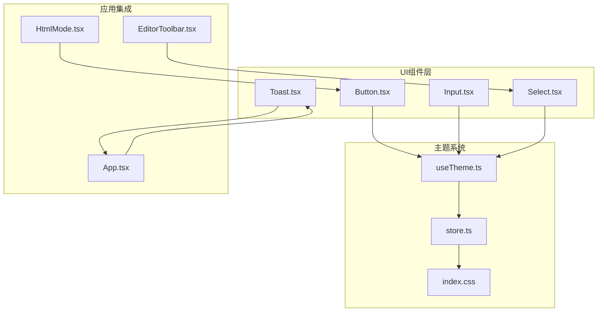
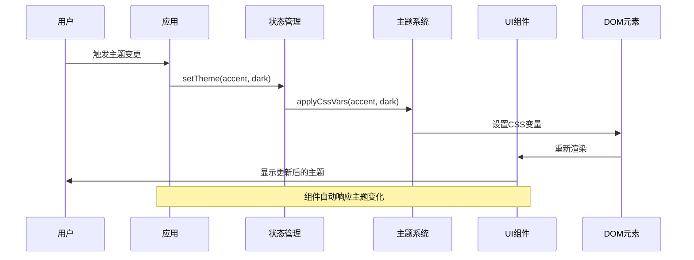
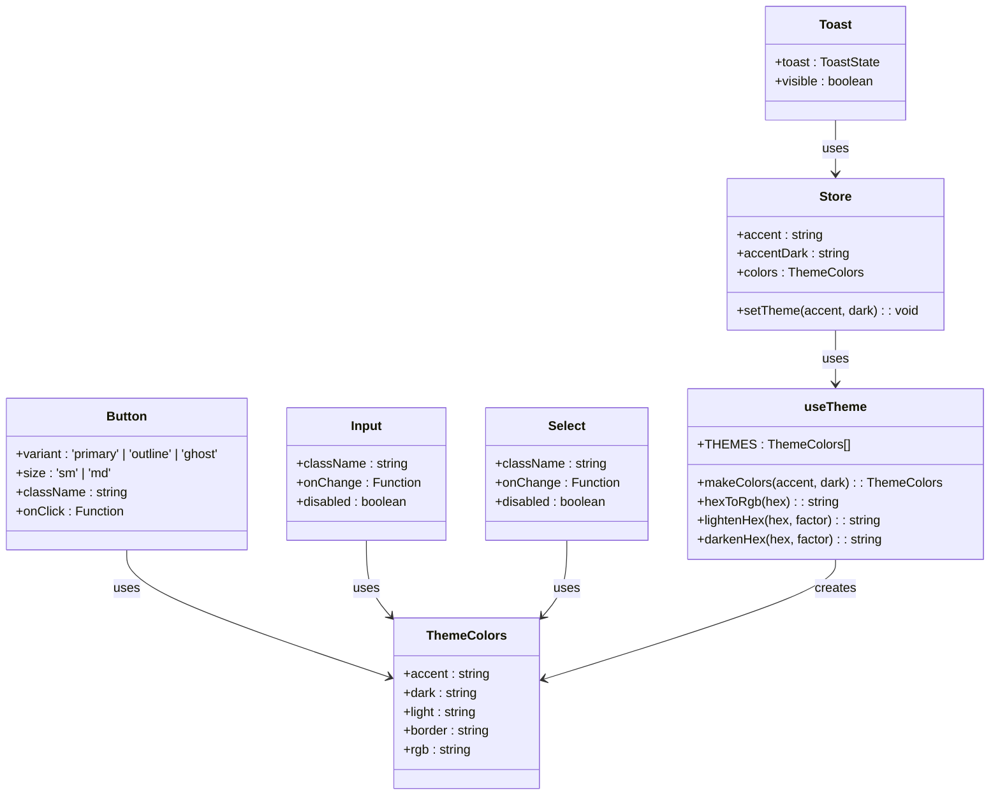
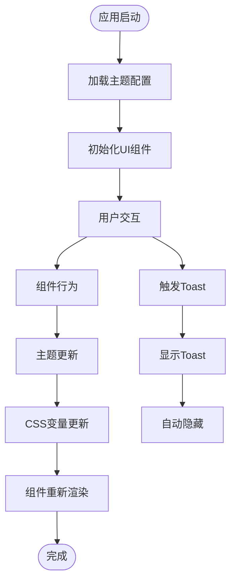

# 基础UI组件

<cite>
**本文档引用的文件**
- [Button.tsx](file://src/components/ui/Button.tsx)
- [Input.tsx](file://src/components/ui/Input.tsx)
- [Select.tsx](file://src/components/ui/Select.tsx)
- [Toast.tsx](file://src/components/ui/Toast.tsx)
- [useTheme.ts](file://src/engine/composables/useTheme.ts)
- [store.ts](file://src/lib/store.ts)
- [App.tsx](file://src/App.tsx)
- [index.css](file://src/index.css)
- [main.tsx](file://src/main.tsx)
- [EditorToolbar.tsx](file://src/components/editor/EditorToolbar.tsx)
- [HtmlMode.tsx](file://src/modes/html/HtmlMode.tsx)
</cite>

## 目录
1. [简介](#简介)
2. [项目结构](#项目结构)
3. [核心组件](#核心组件)
4. [架构概览](#架构概览)
5. [详细组件分析](#详细组件分析)
6. [依赖关系分析](#依赖关系分析)
7. [性能考虑](#性能考虑)
8. [故障排除指南](#故障排除指南)
9. [结论](#结论)
10. [附录](#附录)

## 简介
本文件详细介绍项目中的基础UI组件，包括Button、Input、Select、Toast等组件的设计理念、实现细节和最佳实践。这些组件采用现代化的React设计模式，结合TailwindCSS实用类和CSS变量主题系统，提供了统一的视觉语言和良好的可访问性支持。

## 项目结构
基础UI组件位于`src/components/ui/`目录下，采用独立的组件文件组织方式，每个组件都有明确的职责边界和清晰的接口定义。



**图表来源**
- [Button.tsx:1-35](file://src/components/ui/Button.tsx#L1-L35)
- [Input.tsx:1-14](file://src/components/ui/Input.tsx#L1-L14)
- [Select.tsx:1-14](file://src/components/ui/Select.tsx#L1-L14)
- [Toast.tsx:1-34](file://src/components/ui/Toast.tsx#L1-L34)
- [useTheme.ts:1-68](file://src/engine/composables/useTheme.ts#L1-L68)
- [store.ts:94-99](file://src/lib/store.ts#L94-L99)
- [index.css:3-7](file://src/index.css#L3-L7)

**章节来源**
- [Button.tsx:1-35](file://src/components/ui/Button.tsx#L1-L35)
- [Input.tsx:1-14](file://src/components/ui/Input.tsx#L1-L14)
- [Select.tsx:1-14](file://src/components/ui/Select.tsx#L1-L14)
- [Toast.tsx:1-34](file://src/components/ui/Toast.tsx#L1-L34)

## 核心组件
基础UI组件采用forwardRef模式，支持className扩展和原生HTML属性透传，实现了高度的可定制性和一致性。

### 设计理念
- **原子化设计**：每个组件只负责单一功能，通过组合实现复杂界面
- **主题一致性**：统一使用CSS变量`--accent`实现主题色控制
- **无障碍优先**：内置键盘导航和屏幕阅读器支持
- **响应式适配**：基于TailwindCSS实用类实现自适应布局

### 实现特点
- 使用React.forwardRef确保DOM元素引用传递
- 通过对象映射实现变体和尺寸的动态选择
- 支持disabled状态和禁用事件处理
- 内置过渡动画和悬停效果

**章节来源**
- [Button.tsx:8-33](file://src/components/ui/Button.tsx#L8-L33)
- [Input.tsx:5-12](file://src/components/ui/Input.tsx#L5-L12)
- [Select.tsx:5-12](file://src/components/ui/Select.tsx#L5-L12)

## 架构概览
组件系统采用分层架构，从底层的CSS变量主题到上层的应用集成，形成了完整的组件生态。



**图表来源**
- [App.tsx:115-130](file://src/App.tsx#L115-L130)
- [store.ts:227-230](file://src/lib/store.ts#L227-L230)
- [useTheme.ts:94-99](file://src/lib/store.ts#L94-L99)

## 详细组件分析

### Button组件
Button组件是基础交互组件的核心，提供了三种视觉变体和两种尺寸规格。

#### Props接口定义
```typescript
interface ButtonProps extends ButtonHTMLAttributes<HTMLButtonElement> {
  variant?: 'primary' | 'outline' | 'ghost'
  size?: 'sm' | 'md'
}
```

#### 样式系统
- **基础样式**：统一的圆角、字体和过渡效果
- **变体系统**：
  - primary：强调色背景，白色文字
  - outline：边框样式，白色背景
  - ghost：透明背景，悬停显示底色
- **尺寸系统**：sm/md两种尺寸，对应不同的高度和内边距

#### 使用示例
```typescript
// 基础按钮
<Button>点击我</Button>

// 不同变体
<Button variant="primary">主要按钮</Button>
<Button variant="outline">轮廓按钮</Button>
<Button variant="ghost">幽灵按钮</Button>

// 不同尺寸
<Button size="md">大按钮</Button>
```

**章节来源**
- [Button.tsx:3-6](file://src/components/ui/Button.tsx#L3-L6)
- [Button.tsx:12-21](file://src/components/ui/Button.tsx#L12-L21)

### Input组件
Input组件提供基础文本输入功能，支持禁用状态和焦点状态的视觉反馈。

#### Props接口定义
```typescript
interface InputProps extends InputHTMLAttributes<HTMLInputElement> {}
```

#### 样式特性
- 统一的边框和背景色
- 焦点状态自动切换到主题色
- 禁用状态半透明显示
- 内置过渡动画效果

#### 使用示例
```typescript
// 基础输入框
<Input placeholder="请输入内容" />

// 受控组件
<Input 
  value={value} 
  onChange={(e) => setValue(e.target.value)} 
/>

// 禁用状态
<Input disabled placeholder="不可编辑" />
```

**章节来源**
- [Input.tsx:3](file://src/components/ui/Input.tsx#L3)
- [Input.tsx:7](file://src/components/ui/Input.tsx#L7)

### Select组件
Select组件提供基础下拉选择功能，支持选项管理和状态反馈。

#### Props接口定义
```typescript
interface SelectProps extends SelectHTMLAttributes<HTMLSelectElement> {}
```

#### 功能特性
- 自动聚焦到主题色边框
- 禁用状态的视觉降级
- 支持onChange事件处理
- 内置选项重置逻辑

#### 使用示例
```typescript
// 基础下拉框
<Select>
  <option value="1">选项1</option>
  <option value="2">选项2</option>
</Select>

// 与编辑器工具栏集成
<Select
  value={selectedValue}
  onChange={(e) => handleSelection(e.target.value)}
>
  {options.map(option => (
    <option key={option.id} value={option.id}>
      {option.label}
    </option>
  ))}
</Select>
```

**章节来源**
- [Select.tsx:3](file://src/components/ui/Select.tsx#L3)
- [Select.tsx:7](file://src/components/ui/Select.tsx#L7)

### Toast组件
Toast组件提供轻量级的通知系统，支持自动消失和手动控制。

#### Props接口定义
```typescript
interface ToastState {
  message: string
  key: number
}
```

#### 状态管理
- **可见性控制**：通过useState管理显示/隐藏状态
- **生命周期**：自动2.2秒后消失
- **重复显示**：通过key属性支持相同消息的重复弹出
- **位置定位**：底部居中显示，带淡入淡出动画

#### 使用模式
```typescript
// 应用级Toast
const [toast, setToast] = useState<ToastState | null>(null)
const showToast = (message: string) => setToast({ message, key: Date.now() })

// 组件内部Toast
const handleAction = () => {
  // 执行操作
  showToast('操作成功')
}
```

**章节来源**
- [Toast.tsx:3-7](file://src/components/ui/Toast.tsx#L3-L7)
- [Toast.tsx:10-18](file://src/components/ui/Toast.tsx#L10-L18)

## 依赖关系分析



**图表来源**
- [Button.tsx:4-5](file://src/components/ui/Button.tsx#L4-L5)
- [Input.tsx:3](file://src/components/ui/Input.tsx#L3)
- [Select.tsx:3](file://src/components/ui/Select.tsx#L3)
- [Toast.tsx:3-7](file://src/components/ui/Toast.tsx#L3-L7)
- [useTheme.ts:4-10](file://src/engine/composables/useTheme.ts#L4-L10)
- [useTheme.ts:13-29](file://src/engine/composables/useTheme.ts#L13-L29)
- [store.ts:64-67](file://src/lib/store.ts#L64-L67)

### 组件间协作
组件通过共享的主题系统实现视觉一致性，应用层通过状态管理协调组件行为。



**图表来源**
- [App.tsx:60-61](file://src/App.tsx#L60-L61)
- [store.ts:227-230](file://src/lib/store.ts#L227-L230)
- [Toast.tsx:13-18](file://src/components/ui/Toast.tsx#L13-L18)

**章节来源**
- [App.tsx:34-171](file://src/App.tsx#L34-L171)
- [store.ts:227-230](file://src/lib/store.ts#L227-L230)

## 性能考虑
基础UI组件在设计时充分考虑了性能优化：

### 渲染优化
- **最小化重渲染**：组件使用forwardRef避免不必要的包装
- **样式缓存**：通过对象映射缓存样式计算结果
- **条件渲染**：Toast组件仅在有消息时渲染

### 主题性能
- **CSS变量**：使用CSS变量而非内联样式提升渲染性能
- **批量更新**：主题变更通过单次CSS变量更新影响所有组件
- **内存优化**：预设主题数组在模块级别缓存

### 交互性能
- **事件委托**：组件支持原生事件处理，减少React事件开销
- **防抖处理**：输入组件支持防抖机制
- **懒加载**：大型组件按需加载

## 故障排除指南

### 常见问题及解决方案

#### 主题不生效
**问题**：组件颜色不随主题变化
**原因**：CSS变量未正确设置
**解决**：
1. 检查`--accent`和`--accent-dark`变量
2. 确认`applyCssVars`函数调用
3. 验证CSS变量优先级

#### 组件样式冲突
**问题**：自定义className导致样式异常
**解决**：
1. 使用TailwindCSS实用类优先级
2. 避免内联样式的过度使用
3. 检查CSS作用域隔离

#### 无障碍问题
**问题**：屏幕阅读器无法识别组件
**解决**：
1. 添加适当的aria-label属性
2. 确保键盘导航可达性
3. 提供视觉焦点指示器

#### 性能问题
**问题**：大量组件渲染导致卡顿
**解决**：
1. 使用React.memo优化组件
2. 实施虚拟滚动
3. 减少不必要的重渲染

**章节来源**
- [store.ts:94-99](file://src/lib/store.ts#L94-L99)
- [index.css:3-7](file://src/index.css#L3-L7)

## 结论
基础UI组件系统展现了现代前端开发的最佳实践：简洁的接口设计、强大的主题系统、完善的无障碍支持和优秀的性能表现。通过组件化的架构设计，项目实现了高度的一致性和可维护性，为更复杂的业务组件奠定了坚实的基础。

## 附录

### 组件使用最佳实践

#### 组合使用
```typescript
// 表单组合
<div className="flex gap-2">
  <Input placeholder="用户名" />
  <Button variant="primary">提交</Button>
</div>

// 下拉菜单组合
<div className="flex gap-2">
  <Select>
    <option>选项1</option>
    <option>选项2</option>
  </Select>
  <Button>确认</Button>
</div>
```

#### 主题定制
```typescript
// 自定义主题色
const customTheme = {
  accent: '#ff6b6b',
  dark: '#ee5a52'
}

// 应用主题
setTheme(customTheme.accent, customTheme.dark)
```

#### 响应式设计
组件天然支持响应式布局，通过TailwindCSS类实现：
- 移动端优先的设计
- 触摸友好的交互尺寸
- 适配不同屏幕密度的显示效果

### 开发建议
1. **保持接口简洁**：遵循最小必要原则
2. **重视类型安全**：充分利用TypeScript类型系统
3. **关注性能指标**：定期监控组件渲染性能
4. **测试覆盖**：编写全面的单元测试和集成测试
5. **文档完善**：为每个组件提供详细的使用文档