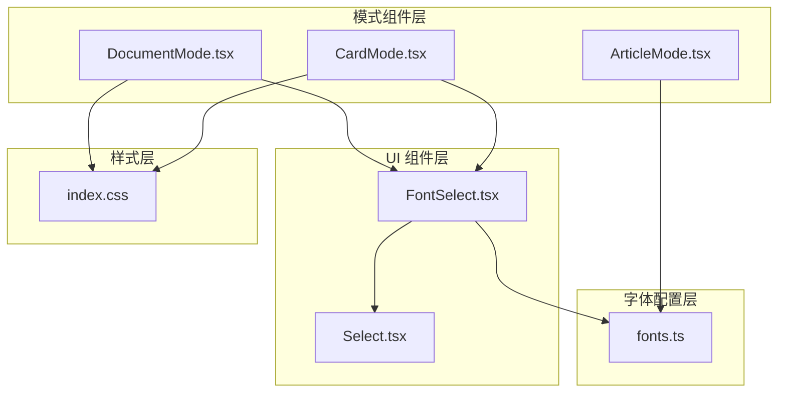
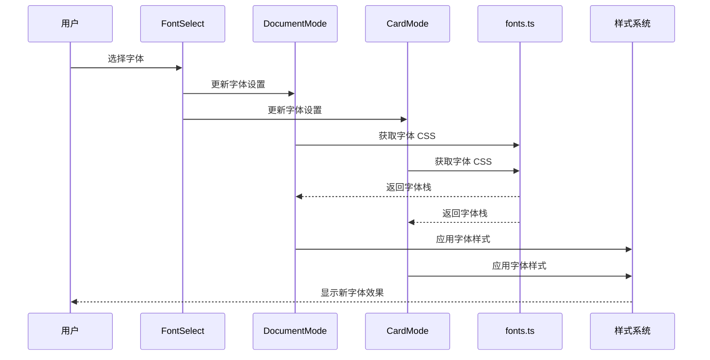
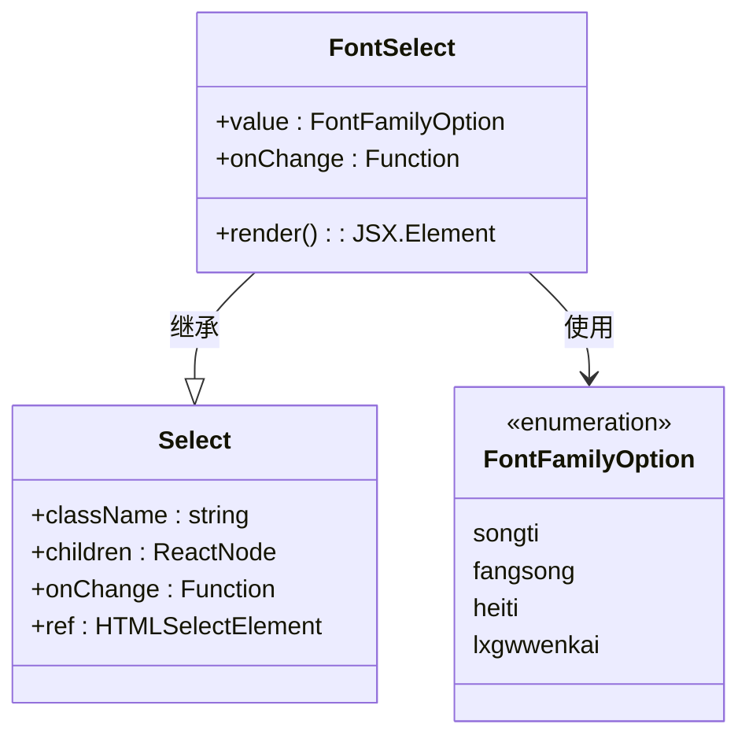
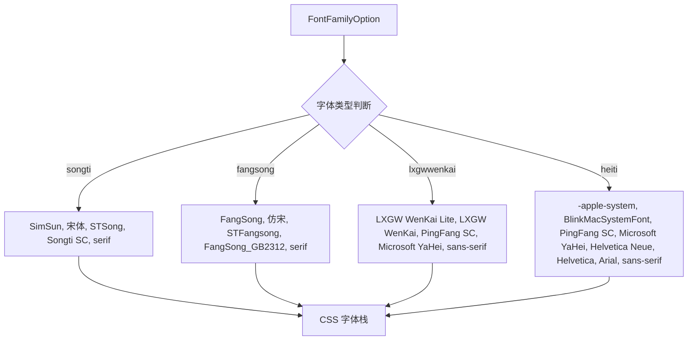
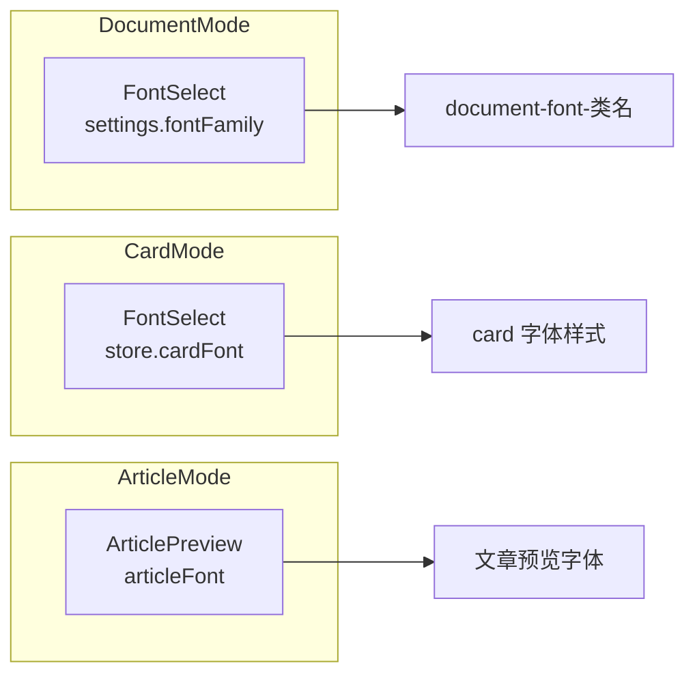
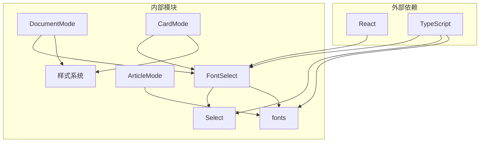

# 字体选择组件

<cite>
**本文档引用的文件**
- [FontSelect.tsx](file://src/components/ui/FontSelect.tsx)
- [fonts.ts](file://src/lib/fonts.ts)
- [Select.tsx](file://src/components/ui/Select.tsx)
- [DocumentMode.tsx](file://src/modes/document/DocumentMode.tsx)
- [CardMode.tsx](file://src/modes/card/CardMode.tsx)
- [index.css](file://src/index.css)
- [ArticleMode.tsx](file://src/modes/article/ArticleMode.tsx)
</cite>

## 目录
1. [简介](#简介)
2. [项目结构](#项目结构)
3. [核心组件](#核心组件)
4. [架构概览](#架构概览)
5. [详细组件分析](#详细组件分析)
6. [依赖关系分析](#依赖关系分析)
7. [性能考虑](#性能考虑)
8. [故障排除指南](#故障排除指南)
9. [结论](#结论)

## 简介

字体选择组件是 markdown2view 项目中的一个核心 UI 组件，用于在不同文档模式中提供字体族选择功能。该组件支持四种中文字体：宋体、仿宋、黑体和霞鹜文楷，为用户提供个性化的阅读体验。

该项目是一个现代化的 Markdown 编辑器，支持多种文档格式和导出功能，包括 PDF 导出、图片导出等。字体选择组件在整个应用中扮演着重要的角色，确保用户能够根据个人喜好和内容需求选择合适的字体。

## 项目结构

项目采用模块化架构设计，字体选择组件位于 UI 组件层，与其他核心组件协同工作：

**图表来源**
- [FontSelect.tsx:1-35](file://src/components/ui/FontSelect.tsx#L1-L35)
- [fonts.ts:1-16](file://src/lib/fonts.ts#L1-L16)
- [DocumentMode.tsx:197-200](file://src/modes/document/DocumentMode.tsx#L197-L200)
- [CardMode.tsx:281](file://src/modes/card/CardMode.tsx#L281)

**章节来源**
- [FontSelect.tsx:1-35](file://src/components/ui/FontSelect.tsx#L1-L35)
- [fonts.ts:1-16](file://src/lib/fonts.ts#L1-L16)
- [DocumentMode.tsx:1-341](file://src/modes/document/DocumentMode.tsx#L1-L341)
- [CardMode.tsx:1-378](file://src/modes/card/CardMode.tsx#L1-L378)

## 核心组件

### FontSelect 组件

FontSelect 是一个专门用于字体选择的下拉菜单组件，继承自基础 Select 组件并扩展了字体族选择功能。

**主要特性：**
- 支持四种中文字体选项
- 类型安全的字体族枚举
- 与文档模式的集成
- 响应式设计

**组件接口：**
- `value`: 当前选中的字体族（FontFamilyOption）
- `onChange`: 字体变化回调函数
- 继承 Select 组件的所有属性

**章节来源**
- [FontSelect.tsx:11-35](file://src/components/ui/FontSelect.tsx#L11-L35)

### 字体配置系统

字体配置系统提供了字体族到 CSS 字体栈的映射功能：

**支持的字体类型：**
1. 宋体 (songti) - 传统中文排版字体
2. 仿宋 (fangsong) - 仿宋体字形
3. 黑体 (heiti) - 现代无衬线字体
4. 霞鹜文楷 (lxgwwenkai) - 开源中文字体

**章节来源**
- [fonts.ts:1-16](file://src/lib/fonts.ts#L1-L16)

## 架构概览

字体选择组件在整个应用架构中的位置和交互关系：

**图表来源**
- [FontSelect.tsx:20-34](file://src/components/ui/FontSelect.tsx#L20-L34)
- [DocumentMode.tsx:197-200](file://src/modes/document/DocumentMode.tsx#L197-L200)
- [CardMode.tsx:281](file://src/modes/card/CardMode.tsx#L281)
- [fonts.ts:3-15](file://src/lib/fonts.ts#L3-L15)

## 详细组件分析

### FontSelect 组件实现

FontSelect 组件采用了组合式设计模式，通过继承 Select 基础组件来实现字体选择功能：

**图表来源**
- [FontSelect.tsx:11-35](file://src/components/ui/FontSelect.tsx#L11-L35)
- [Select.tsx:3-14](file://src/components/ui/Select.tsx#L3-L14)
- [fonts.ts:1](file://src/lib/fonts.ts#L1)

**组件实现细节：**
- 使用 TypeScript 枚举确保类型安全
- 通过 props 继承实现代码复用
- 内置字体选项常量数组
- 自动类型转换确保值的安全性

**章节来源**
- [FontSelect.tsx:1-35](file://src/components/ui/FontSelect.tsx#L1-L35)

### 字体映射机制

字体映射系统负责将抽象的字体标识转换为具体的 CSS 字体栈：

**图表来源**
- [fonts.ts:3-15](file://src/lib/fonts.ts#L3-L15)

**字体选择策略：**
- 提供中英文双语支持的字体名称
- 包含备用字体确保跨平台兼容性
- 考虑了不同操作系统和浏览器的支持情况

**章节来源**
- [fonts.ts:1-16](file://src/lib/fonts.ts#L1-L16)

### 在文档模式中的应用

FontSelect 组件在不同文档模式中的集成方式：

**图表来源**
- [DocumentMode.tsx:197-200](file://src/modes/document/DocumentMode.tsx#L197-L200)
- [CardMode.tsx:281](file://src/modes/card/CardMode.tsx#L281)
- [ArticleMode.tsx:1-55](file://src/modes/article/ArticleMode.tsx#L1-L55)

**章节来源**
- [DocumentMode.tsx:197-200](file://src/modes/document/DocumentMode.tsx#L197-L200)
- [CardMode.tsx:281](file://src/modes/card/CardMode.tsx#L281)

## 依赖关系分析

字体选择组件的依赖关系图：

**图表来源**
- [FontSelect.tsx:1-35](file://src/components/ui/FontSelect.tsx#L1-L35)
- [Select.tsx:1-14](file://src/components/ui/Select.tsx#L1-L14)
- [fonts.ts:1-16](file://src/lib/fonts.ts#L1-L16)

**依赖特点：**
- 松耦合设计，便于维护和扩展
- 类型安全的接口定义
- 最小化外部依赖

**章节来源**
- [FontSelect.tsx:1-35](file://src/components/ui/FontSelect.tsx#L1-L35)
- [Select.tsx:1-14](file://src/components/ui/Select.tsx#L1-L14)
- [fonts.ts:1-16](file://src/lib/fonts.ts#L1-L16)

## 性能考虑

### 字体加载优化

字体选择组件在性能方面的考虑：

1. **按需加载字体**：只在用户选择特定字体时才应用相应样式
2. **CSS 类缓存**：通过动态类名应用字体，避免重复计算
3. **最小化重绘**：字体切换只影响文本渲染，不影响其他布局元素

### 内存管理

- 使用 React.memo 优化重新渲染
- 避免不必要的状态更新
- 合理的事件处理绑定

## 故障排除指南

### 常见问题及解决方案

**问题1：字体显示异常**
- 检查字体是否正确安装在目标系统
- 验证 CSS 类名是否正确应用
- 确认字体栈中的备用字体可用

**问题2：字体切换无效**
- 确认 FontSelect 的 value 和 onChange 属性正确传递
- 检查父组件的状态管理逻辑
- 验证 CSS 样式是否被正确覆盖

**问题3：跨平台兼容性问题**
- 确保字体栈包含适当的备用字体
- 测试不同操作系统和浏览器的表现
- 考虑使用 web font 加载策略

**章节来源**
- [FontSelect.tsx:20-34](file://src/components/ui/FontSelect.tsx#L20-L34)
- [fonts.ts:3-15](file://src/lib/fonts.ts#L3-L15)

## 结论

字体选择组件作为 markdown2view 项目的重要组成部分，展现了优秀的软件工程实践：

1. **模块化设计**：清晰的组件边界和职责分离
2. **类型安全**：完整的 TypeScript 类型定义
3. **可扩展性**：易于添加新的字体选项
4. **用户体验**：直观的界面和流畅的交互
5. **性能优化**：合理的渲染策略和资源管理

该组件不仅满足了当前的功能需求，还为未来的功能扩展奠定了坚实的基础。通过精心设计的架构和实现，字体选择组件成为了整个应用中用户体验的重要保障。