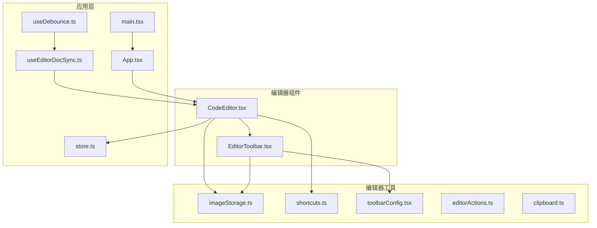
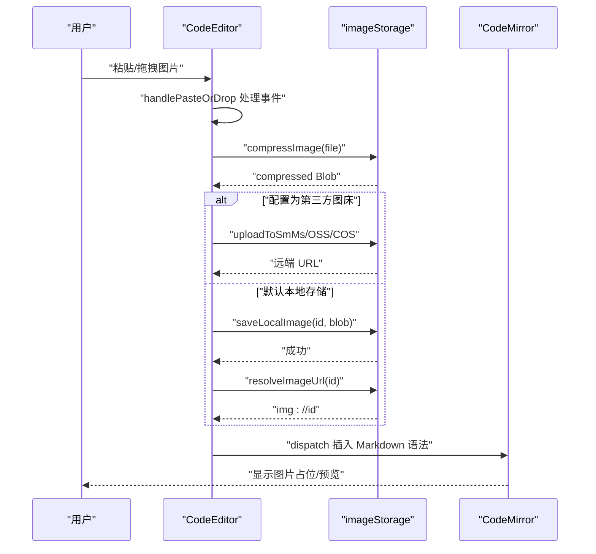
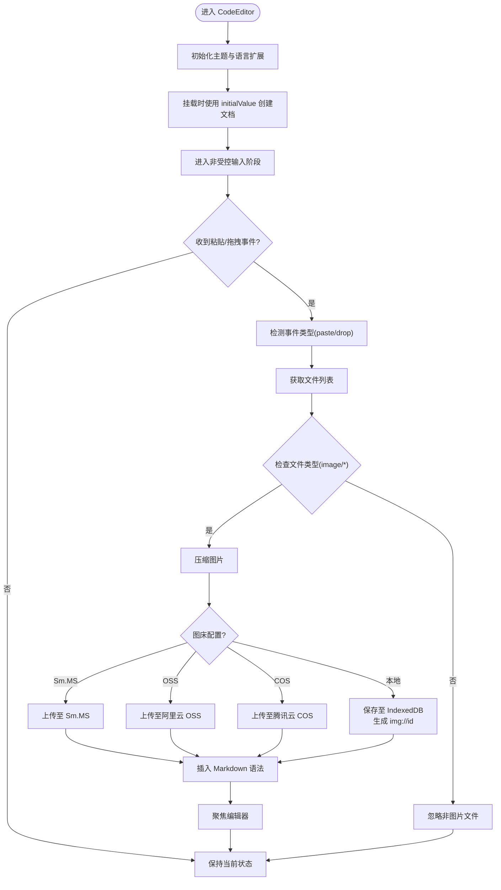
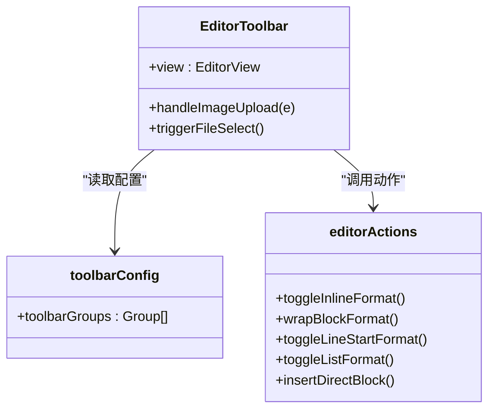
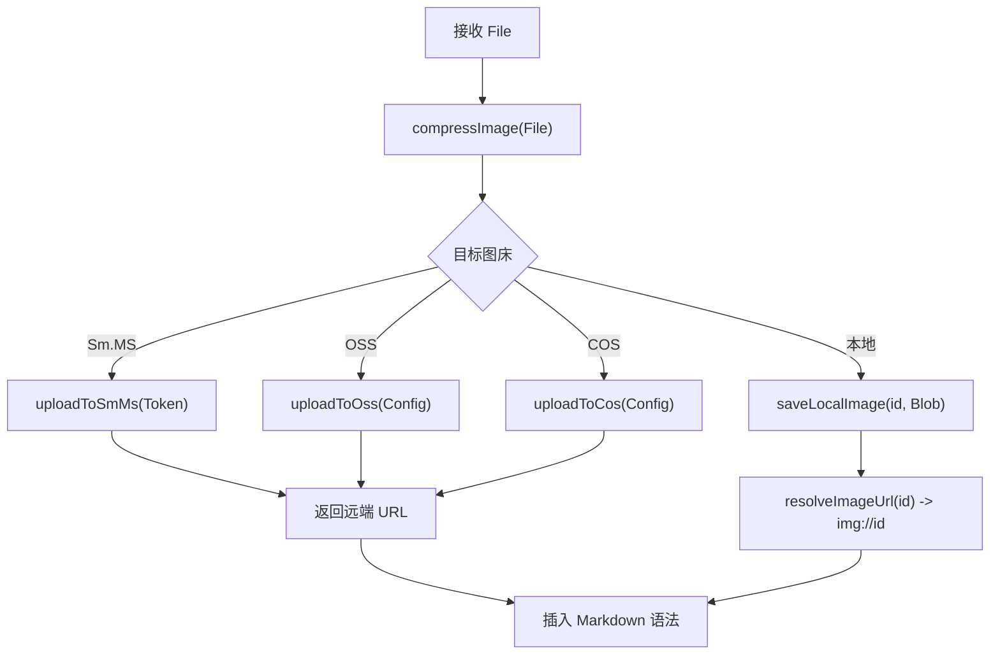
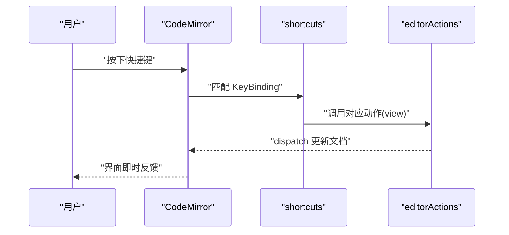
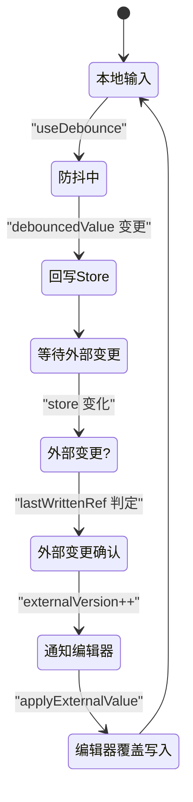
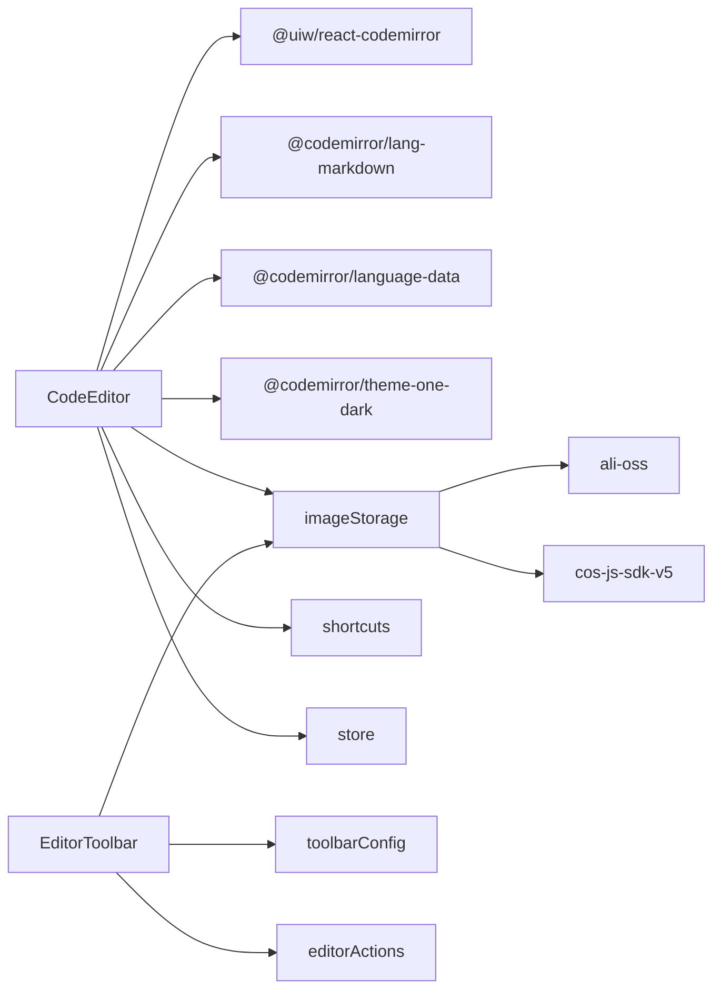

# 代码编辑器

<cite>
**本文引用的文件**
- [CodeEditor.tsx](file://src/components/editor/CodeEditor.tsx)
- [EditorToolbar.tsx](file://src/components/editor/EditorToolbar.tsx)
- [toolbarConfig.tsx](file://src/lib/editor/toolbarConfig.tsx)
- [editorActions.ts](file://src/lib/editor/editorActions.ts)
- [shortcuts.ts](file://src/lib/editor/shortcuts.ts)
- [imageStorage.ts](file://src/lib/editor/imageStorage.ts)
- [store.ts](file://src/lib/store.ts)
- [clipboard.ts](file://src/lib/clipboard.ts)
- [useEditorDocSync.ts](file://src/lib/useEditorDocSync.ts)
- [useDebounce.ts](file://src/lib/useDebounce.ts)
- [package.json](file://package.json)
- [App.tsx](file://src/App.tsx)
- [main.tsx](file://src/main.tsx)
</cite>

## 更新摘要
**所做更改**
- 新增智能粘贴/拖拽处理机制，统一处理图片粘贴与拖拽上传
- 扩展键盘快捷键系统，新增 Alt 组合的特色容器快捷键
- 改进错误处理和用户反馈机制，增强图片上传失败时的提示
- 优化图片上传流程的工具栏集成，支持拖拽位置定位

## 目录
1. [简介](#简介)
2. [项目结构](#项目结构)
3. [核心组件](#核心组件)
4. [架构总览](#架构总览)
5. [详细组件分析](#详细组件分析)
6. [依赖关系分析](#依赖关系分析)
7. [性能考量](#性能考量)
8. [故障排查指南](#故障排查指南)
9. [结论](#结论)
10. [附录](#附录)

## 简介
本文件系统性梳理代码编辑器组件的设计与实现，聚焦以下关键主题：
- CodeMirror 集成：编辑器初始化、语言支持与主题配置
- 智能图片处理：粘贴、拖拽上传与压缩存储流程
- 受控与非受控模式：避免 IME 组合输入竞态
- 扩展快捷键系统：基础格式、行内标识与特色容器快捷键
- 工具栏系统：增强的 Markdown 格式化操作支持
- 错误处理与用户反馈：改进的异常处理和提示机制
- 扩展机制：语言扩展、插件集成与自定义功能
- 性能优化：模块预加载、增量渲染与内存管理
- 配置项、API 与最佳实践

## 项目结构
编辑器相关代码主要位于 src/components/editor 与 src/lib/editor 下，配合全局状态与工具模块协同工作。

**图表来源**
- [CodeEditor.tsx:1-213](file://src/components/editor/CodeEditor.tsx#L1-L213)
- [EditorToolbar.tsx:1-120](file://src/components/editor/EditorToolbar.tsx#L1-L120)
- [imageStorage.ts:1-295](file://src/lib/editor/imageStorage.ts#L1-L295)
- [shortcuts.ts:1-63](file://src/lib/editor/shortcuts.ts#L1-L63)
- [toolbarConfig.tsx:1-238](file://src/lib/editor/toolbarConfig.tsx#L1-L238)
- [editorActions.ts:1-174](file://src/lib/editor/editorActions.ts#L1-L174)
- [clipboard.ts:1-131](file://src/lib/clipboard.ts#L1-L131)
- [store.ts:1-242](file://src/lib/store.ts#L1-L242)
- [useEditorDocSync.ts:1-50](file://src/lib/useEditorDocSync.ts#L1-L50)
- [useDebounce.ts:1-18](file://src/lib/useDebounce.ts#L1-L18)
- [App.tsx:1-172](file://src/App.tsx#L1-L172)
- [main.tsx:1-12](file://src/main.tsx#L1-L12)

**章节来源**
- [CodeEditor.tsx:1-213](file://src/components/editor/CodeEditor.tsx#L1-L213)
- [EditorToolbar.tsx:1-120](file://src/components/editor/EditorToolbar.tsx#L1-L120)
- [store.ts:1-242](file://src/lib/store.ts#L1-L242)
- [App.tsx:1-172](file://src/App.tsx#L1-L172)

## 核心组件
- CodeEditor：基于 @uiw/react-codemirror 的 Markdown/HTML 编辑器，负责初始化、语言与主题、事件绑定、智能图片粘贴/拖拽/选择上传、快捷键与外部重置同步。
- EditorToolbar：Markdown 模式下的增强工具栏，提供格式化按钮、下拉选择与图片上传入口，支持 5 个功能分组。
- toolbarConfig：工具栏配置系统，定义 5 个功能分组（标题、基础格式、列表与引用、行内标识、块级特色组件）和 23 个具体操作项。
- editorActions：编辑器核心动作库，封装行内包裹、块级包裹、行首格式切换、列表切换与直接插入等。
- imageStorage：统一的图片存储与上传能力，支持本地 IndexedDB、Sm.MS、阿里云 OSS、腾讯云 COS，并提供压缩、预加载与 URL 解析。
- shortcuts：扩展的快捷键映射，结合 editorActions 实现行内/块级格式化与特色容器插入。
- clipboard：复制富文本/HTML 时将本地图片占位符替换为 base64，保证跨应用粘贴一致性。
- store：全局状态，包含图像主机配置、模式与输入类型、平台等，支撑编辑器行为与 UI。
- useEditorDocSync：编辑器与 store 的双向同步与外部重置控制，避免回写回声与丢字。
- useDebounce：通用防抖 Hook，用于降低回写频率与渲染压力。

**章节来源**
- [CodeEditor.tsx:14-22](file://src/components/editor/CodeEditor.tsx#L14-L22)
- [EditorToolbar.tsx:8-10](file://src/components/editor/EditorToolbar.tsx#L8-L10)
- [toolbarConfig.tsx:11-24](file://src/lib/editor/toolbarConfig.tsx#L11-L24)
- [editorActions.ts:1-174](file://src/lib/editor/editorActions.ts#L1-L174)
- [imageStorage.ts:1-295](file://src/lib/editor/imageStorage.ts#L1-L295)
- [shortcuts.ts:1-63](file://src/lib/editor/shortcuts.ts#L1-L63)
- [clipboard.ts:1-131](file://src/lib/clipboard.ts#L1-L131)
- [store.ts:41-70](file://src/lib/store.ts#L41-L70)
- [useEditorDocSync.ts:1-50](file://src/lib/useEditorDocSync.ts#L1-L50)
- [useDebounce.ts:1-18](file://src/lib/useDebounce.ts#L1-L18)

## 架构总览
编辑器采用"挂载时受控、之后非受控"的策略，结合模块级语言预加载与外部重置信号，兼顾输入稳定性与性能。智能图片处理链路统一处理粘贴/拖拽/选择三种入口，支持拖拽位置定位与压缩存储/上传逻辑，最终以 Markdown 语法插入到编辑器。

**图表来源**
- [CodeEditor.tsx:109-152](file://src/components/editor/CodeEditor.tsx#L109-L152)
- [imageStorage.ts:273-294](file://src/lib/editor/imageStorage.ts#L273-L294)
- [CodeEditor.tsx:166-173](file://src/components/editor/CodeEditor.tsx#L166-L173)

## 详细组件分析

### CodeEditor 组件
- 初始化与主题
  - 使用 EditorView.theme 定义浅色主题，覆盖 gutter、活动行、滚动条、内容区域与选择背景等。
  - basicSetup 开启行号、折叠大纲与活动行高亮。
- 语言支持
  - Markdown 语言通过 @codemirror/lang-markdown 提供，支持多语言代码块高亮。
  - 代码语言数据通过模块级预加载减少运行时异步加载带来的 reconfigure 输入丢失风险。
- 智能事件处理
  - domEventHandlers 统一绑定 paste/drop 事件，实现智能图片处理。
  - handlePasteOrDrop 函数支持粘贴和拖拽两种方式，自动检测文件类型和拖拽位置。
- 扩展快捷键系统
  - keymap.of(editorShortcuts) 仅在 Markdown 模式启用，支持基础格式、行内标识和特色容器快捷键。
- 受控与非受控模式
  - 初次渲染使用 initialValue 创建文档，后续输入由 CodeMirror 自身维护，避免 React 受控全量替换导致 IME 组合输入丢字。
  - 外部重置通过 externalVersion 与 pendingExternalRef 控制，使用 requestAnimationFrame 确保编辑器创建后再写入。
- 图片预加载
  - Markdown 模式下对文档中的 img:// 占位符进行预加载，提升渲染体验。

**图表来源**
- [CodeEditor.tsx:24-33](file://src/components/editor/CodeEditor.tsx#L24-L33)
- [CodeEditor.tsx:40-46](file://src/components/editor/CodeEditor.tsx#L40-L46)
- [CodeEditor.tsx:63-70](file://src/components/editor/CodeEditor.tsx#L63-L70)
- [CodeEditor.tsx:78-84](file://src/components/editor/CodeEditor.tsx#L78-L84)
- [CodeEditor.tsx:109-152](file://src/components/editor/CodeEditor.tsx#L109-L152)

**章节来源**
- [CodeEditor.tsx:14-213](file://src/components/editor/CodeEditor.tsx#L14-L213)

### EditorToolbar 工具栏
- 功能分组
  - 按钮组：标题、基础格式、列表与引用、行内标识、块级特色组件。
  - 下拉组：行内标识与特色组件分类展示。
  - 图片上传：隐藏 file input 触发与处理，统一走压缩与上传流程。
- 行为实现
  - 通过 toolbarConfig 的 action 字段绑定 editorActions，实现格式化与容器插入。
  - 上传后以 Markdown 语法插入，并调整选择范围以便继续输入。
- 错误处理
  - 增强的错误处理机制，捕获图片上传异常并提供用户友好的错误提示。

**图表来源**
- [EditorToolbar.tsx:12-119](file://src/components/editor/EditorToolbar.tsx#L12-L119)
- [toolbarConfig.tsx:32-237](file://src/lib/editor/toolbarConfig.tsx#L32-L237)
- [editorActions.ts:4-173](file://src/lib/editor/editorActions.ts#L4-L173)

**章节来源**
- [EditorToolbar.tsx:12-119](file://src/components/editor/EditorToolbar.tsx#L12-L119)
- [toolbarConfig.tsx:32-237](file://src/lib/editor/toolbarConfig.tsx#L32-L237)

### 工具栏配置系统（toolbarConfig）
- 配置结构
  - ToolbarItem：定义单个工具栏项目的属性（id、label、icon、shortcut、action）。
  - ToolbarGroup：定义工具栏分组（id、name、type、items）。
- 功能分组
  - 标题组（headers）：支持 H1-H3 标题格式切换。
  - 基础格式组（inline-basic）：加粗、斜体、下划线、删除线、行内代码等。
  - 列表与引用组（lists）：无序列表、有序列表、任务列表、引用区块、横线。
  - 行内标识组（inline-custom）：柔光重点、渐变背景、胶囊文字、加重强调、引言大字等。
  - 块级特色组件组（components）：步骤容器、高亮标注、突发要闻、互动提醒、行动呼吁、对比容器、时间轴、轮播图等。
- 图标系统
  - 使用 SvgIcon 组件统一 SVG 图标的尺寸和样式。
  - 按钮组使用简洁的文本图标，下拉组使用选项格式显示。

**章节来源**
- [toolbarConfig.tsx:11-24](file://src/lib/editor/toolbarConfig.tsx#L11-L24)
- [toolbarConfig.tsx:32-237](file://src/lib/editor/toolbarConfig.tsx#L32-L237)

### 编辑器动作库（editorActions）
- 行内包裹：支持对称与非对称标签，自动判断包裹状态并切换。
- 块级包裹：在选区前后插入自定义容器标签，支持占位符。
- 行首格式：标题与引用的切换与规范化。
- 列表切换：多行列表前缀批量切换，支持任务列表。
- 直接插入：如分割线等块级元素的快速插入。

**章节来源**
- [editorActions.ts:1-174](file://src/lib/editor/editorActions.ts#L1-L174)

### 图片存储与上传（imageStorage）
- 压缩
  - 使用 Canvas 将图片限制最大宽度并以 JPEG 输出，质量可配置。
- 本地存储
  - IndexedDB 存放 Blob，提供保存、读取、URL 解析与预加载。
- 第三方图床
  - Sm.MS：Token 授权直传，支持重复图检测。
  - 阿里云 OSS：动态加载 SDK，生成随机文件名并返回 URL。
  - 腾讯云 COS：动态加载 SDK，返回 Location。
- Markdown 编译
  - 将 img://img_xxx 替换为 base64 Data URL，便于导出与复制。

**图表来源**
- [imageStorage.ts:58-101](file://src/lib/editor/imageStorage.ts#L58-L101)
- [imageStorage.ts:142-217](file://src/lib/editor/imageStorage.ts#L142-L217)

**章节来源**
- [imageStorage.ts:1-295](file://src/lib/editor/imageStorage.ts#L1-L295)

### 扩展快捷键系统（shortcuts）
- 基础格式快捷键
  - Mod-b：加粗（**）
  - Mod-i：斜体（*）
  - Mod-u：下划线（__）
  - Mod-e：行内代码（`）
- 行内标识快捷键
  - Mod-Shift-x：删除线（~~）
  - Mod-Shift-h：柔光重点（::）
  - Mod-Shift-g：渐变背景（==）
  - Mod-Shift-c：胶囊文字（!!）
  - Mod-Shift-e：加重强调（^^）
  - Mod-Shift-ArrowUp：上标（^）
  - Mod-Shift-ArrowDown：下标（~）
  - Mod-Shift-l：引言大字（<lead>）
- 块级结构快捷键
  - Mod-1 至 Mod-4：标题层级（# 至 ####）
  - Mod-Shift-8：无序列表（- ）
  - Mod-Shift-7：有序列表（1. ）
  - Mod-Shift-9：任务列表（- [ ] ）
  - Mod-Shift-.：引用区块（> ）
  - Mod-Shift--：分割线（---）
- 特色容器快捷键（新增）
  - Alt-s：步骤容器（<steps>）
  - Alt-c：高亮标注（> [TIP] ）
  - Alt-b：突发要闻（<breaking>）
  - Alt-e：互动提醒（<engage>）
  - Alt-a：行动呼吁（<cta>）
  - Alt-v：对比容器（<compare>）
  - Alt-t：时间轴（<timeline>）
  - Alt-r：轮播图（<slider>）
- 链接快速插入
  - Mod-k：选中文本后插入形如 [text](url) 的链接模板。

**图表来源**
- [shortcuts.ts:10-62](file://src/lib/editor/shortcuts.ts#L10-L62)
- [editorActions.ts:4-173](file://src/lib/editor/editorActions.ts#L4-L173)

**章节来源**
- [shortcuts.ts:1-63](file://src/lib/editor/shortcuts.ts#L1-L63)
- [editorActions.ts:1-174](file://src/lib/editor/editorActions.ts#L1-L174)

### 复制粘贴增强（clipboard）
- 复制富文本：将 img:// 与 blob: 占位符替换为 base64，优先使用 ClipboardItem，降级到 execCommand。
- 复制 HTML 源码：同样编译本地图片为 base64 后输出。

**章节来源**
- [clipboard.ts:1-131](file://src/lib/clipboard.ts#L1-L131)

### 状态与同步（store 与 useEditorDocSync）
- store
  - 统一管理图像主机配置（activeType、smms、oss、cos）、模式、输入类型、平台等。
- useEditorDocSync
  - 本地输入防抖后回写 store，避免回写回声导致丢字。
  - 外部变更（示例恢复/版本刷新）通过 externalVersion 通知编辑器覆盖文档。

**图表来源**
- [useEditorDocSync.ts:20-49](file://src/lib/useEditorDocSync.ts#L20-L49)
- [store.ts:68-70](file://src/lib/store.ts#L68-L70)

**章节来源**
- [store.ts:68-70](file://src/lib/store.ts#L68-L70)
- [useEditorDocSync.ts:1-50](file://src/lib/useEditorDocSync.ts#L1-L50)

## 依赖关系分析
- 外部依赖
  - @uiw/react-codemirror、@codemirror/lang-markdown、@codemirror/language-data、@codemirror/theme-one-dark
  - ali-oss、cos-js-sdk-v5
- 内部依赖
  - 编辑器组件依赖工具模块与状态模块；工具模块之间解耦，通过函数契约协作。

**图表来源**
- [package.json:13-31](file://package.json#L13-L31)
- [CodeEditor.tsx:1-6](file://src/components/editor/CodeEditor.tsx#L1-L6)
- [EditorToolbar.tsx:1-6](file://src/components/editor/EditorToolbar.tsx#L1-L6)

**章节来源**
- [package.json:13-31](file://package.json#L13-L31)

## 性能考量
- 模块预加载
  - 代码语言数据在编辑器挂载前完成预加载，避免运行时异步加载触发 reconfigure 导致输入丢失与闪烁。
- 增量渲染与输入稳定性
  - "挂载时受控、之后非受控"策略，避免 React 受控全量替换引发的 IME 组合输入竞态。
- 外部重置优化
  - 使用 pendingExternalRef 与 requestAnimationFrame，确保编辑器创建后再写入，减少不必要的 dispatch。
- 智能图片处理
  - Canvas 压缩限制最大宽度，降低网络与存储压力；本地图片通过 IndexedDB 与 Object URL 缓存，减少重复读取。
- 防抖与回写
  - useDebounce 降低回写频率，useEditorDocSync 识别回写回声，避免丢字与脏标记误判。
- 事件处理优化
  - 统一的粘贴/拖拽事件处理器，避免重复绑定和内存泄漏。

**章节来源**
- [CodeEditor.tsx:40-46](file://src/components/editor/CodeEditor.tsx#L40-L46)
- [CodeEditor.tsx:63-70](file://src/components/editor/CodeEditor.tsx#L63-L70)
- [CodeEditor.tsx:78-84](file://src/components/editor/CodeEditor.tsx#L78-L84)
- [imageStorage.ts:58-101](file://src/lib/editor/imageStorage.ts#L58-L101)
- [useEditorDocSync.ts:15-49](file://src/lib/useEditorDocSync.ts#L15-L49)

## 故障排查指南
- 图片上传失败
  - 检查图床配置是否正确（Token/Region/Bucket 等）。
  - 查看浏览器控制台错误信息，确认第三方 SDK 是否加载成功。
  - 确认图片格式是否为支持的 image/* 类型。
- 粘贴/拖拽无效
  - 确认事件处理器已绑定（paste/drop）。
  - 检查文件类型是否为 image/*。
  - 对于拖拽，确认拖拽坐标转换为编辑器位置的逻辑正常。
- IME 输入丢字
  - 确认未使用 React 受控 value 全量替换；编辑器应处于"挂载时受控、之后非受控"模式。
- 外部重置不生效
  - 确认 externalVersion 是否递增，编辑器是否已创建并执行 applyExternalValue。
- 快捷键不响应
  - 确认编辑器处于 Markdown 模式。
  - 检查快捷键组合是否正确（Mod 代表 Ctrl/Cmd，Alt 代表 Alt）。
- 复制粘贴图片缺失
  - 检查本地图片占位符是否被正确编译为 base64。
- 工具栏按钮失效
  - 确认 EditorView 实例已正确传递给 EditorToolbar。
  - 检查 toolbarConfig 中的动作函数是否正确绑定。

**章节来源**
- [CodeEditor.tsx:109-152](file://src/components/editor/CodeEditor.tsx#L109-L152)
- [imageStorage.ts:142-217](file://src/lib/editor/imageStorage.ts#L142-L217)
- [clipboard.ts:1-131](file://src/lib/clipboard.ts#L1-L131)
- [useEditorDocSync.ts:30-36](file://src/lib/useEditorDocSync.ts#L30-L36)

## 结论
该编辑器通过合理的架构设计与工程化手段，在保证输入稳定性的同时提供了丰富的编辑体验。其模块化工具链与清晰的扩展点，使得语言支持、快捷键、工具栏系统与图片处理等功能易于维护与演进。新增的智能粘贴/拖拽处理、扩展的键盘快捷键系统和改进的错误处理机制显著提升了用户体验和系统的健壮性。

## 附录

### 配置选项与 API
- CodeEditor 属性
  - value: 编辑器初始内容（挂载时受控）
  - onChange: 编辑器内容变更回调
  - externalVersion: 外部重置信号（递增以强制覆盖文档）
  - onScrollerReady/onViewReady: 编辑器滚动容器与 EditorView 生命周期回调
  - language: 'markdown' | 'html'
- 图像主机配置（store 中）
  - activeType: 'local' | 'smms' | 'oss' | 'cos'
  - smms.token
  - oss.{region, accessKeyId, accessKeySecret, bucket}
  - cos.{SecretId, SecretKey, Bucket, Region}
- 工具栏配置
  - toolbarGroups: 工具栏分组数组，包含 5 个功能分组
  - ToolbarItem: 工具栏项目接口，包含 id、label、icon、shortcut、action 属性

**章节来源**
- [CodeEditor.tsx:14-22](file://src/components/editor/CodeEditor.tsx#L14-L22)
- [store.ts:43-52](file://src/lib/store.ts#L43-L52)
- [toolbarConfig.tsx:11-24](file://src/lib/editor/toolbarConfig.tsx#L11-L24)

### 最佳实践
- 使用 externalVersion 触发外部重置，避免直接修改受控 value。
- 在 Markdown 模式下启用快捷键与工具栏，HTML 模式禁用 Markdown 专属快捷键。
- 图片上传前先压缩，合理设置最大宽度与质量，平衡清晰度与体积。
- 本地图片建议使用 img:// 占位符并在需要时编译为 base64，提升跨应用兼容性。
- 对于第三方图床，优先使用 Token 授权或安全凭证，避免泄露。
- 利用工具栏的分组组织提高 Markdown 编辑效率，合理使用快捷键与工具栏按钮。
- 定期清理 IndexedDB 中的临时图片，避免存储空间过度占用。
- 增强错误处理，提供用户友好的错误提示信息。
- 支持拖拽位置定位，提升图片插入的精确性。