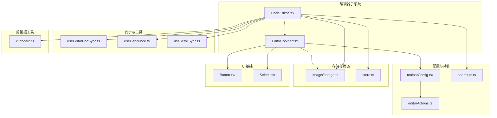
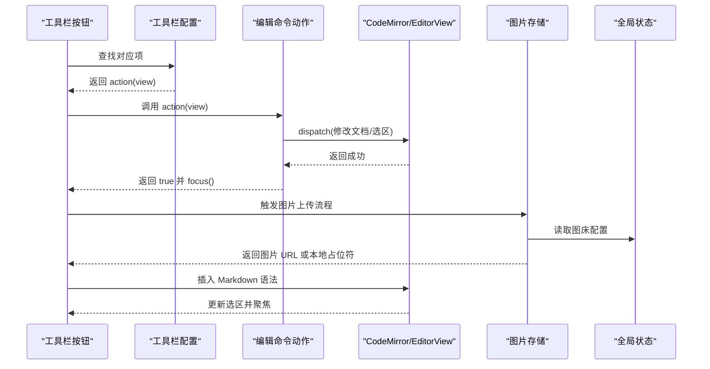
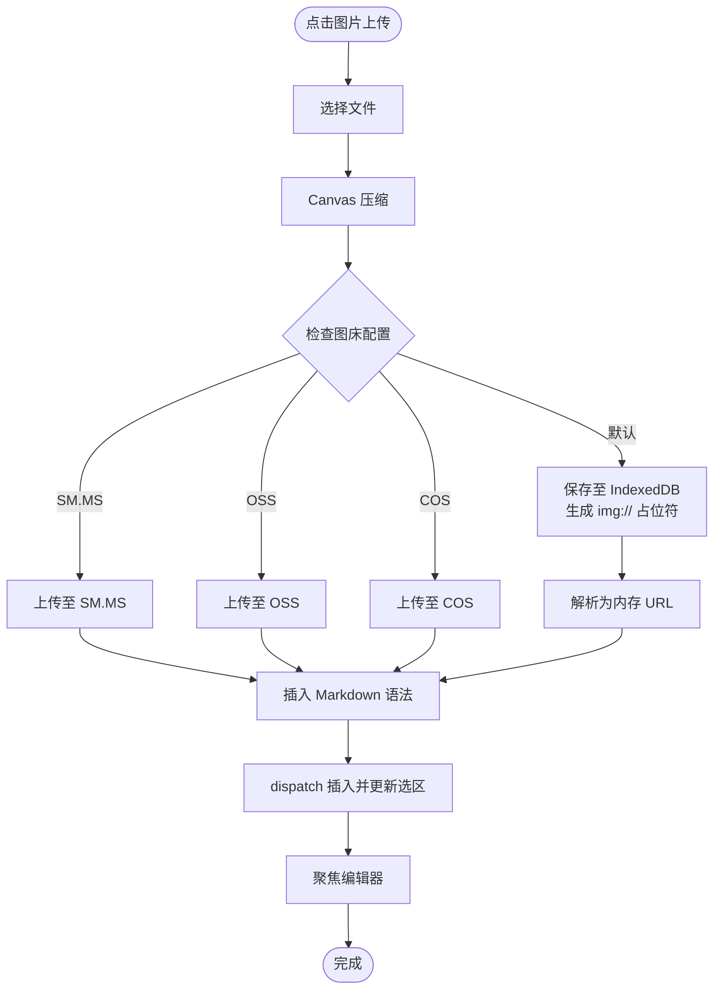
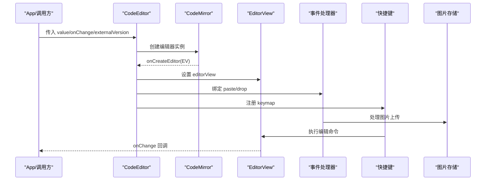
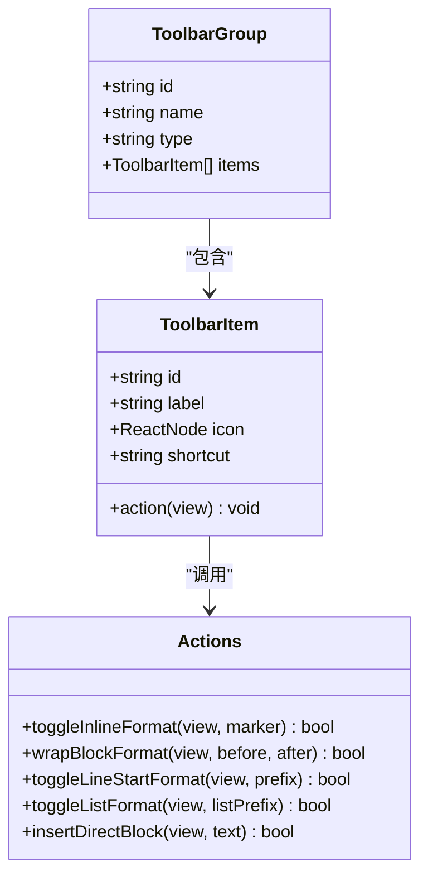
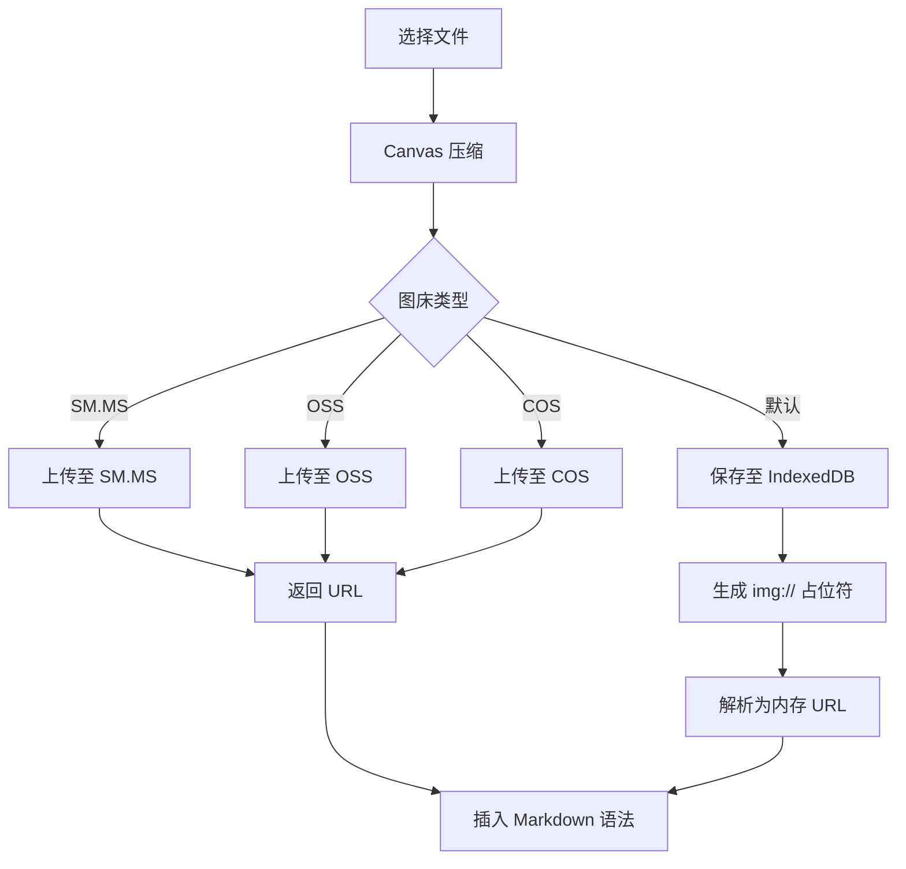
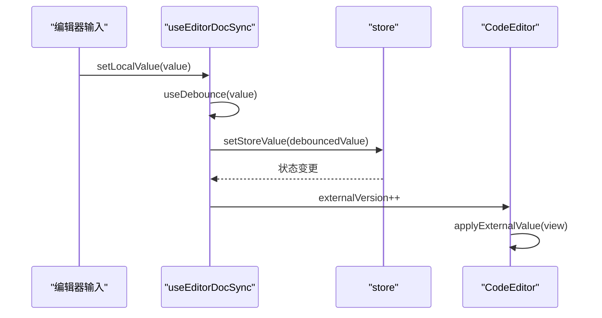
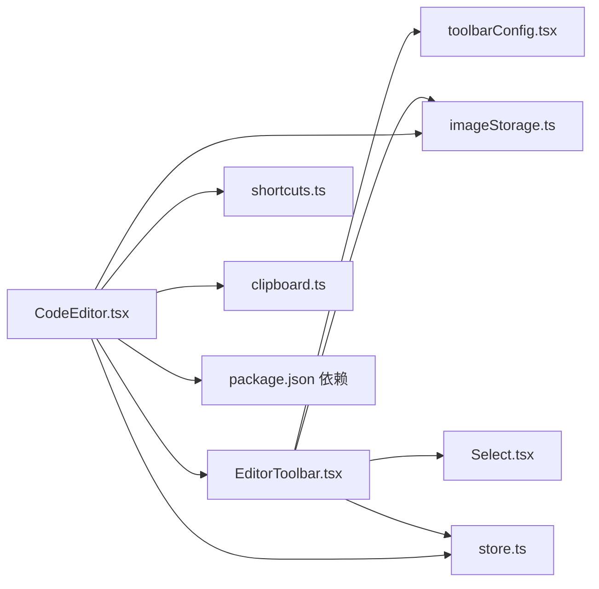

# 编辑器工具栏

<cite>
**本文档引用的文件**
- [EditorToolbar.tsx](file://src/components/editor/EditorToolbar.tsx)
- [CodeEditor.tsx](file://src/components/editor/CodeEditor.tsx)
- [toolbarConfig.tsx](file://src/lib/editor/toolbarConfig.tsx)
- [editorActions.ts](file://src/lib/editor/editorActions.ts)
- [shortcuts.ts](file://src/lib/editor/shortcuts.ts)
- [imageStorage.ts](file://src/lib/editor/imageStorage.ts)
- [clipboard.ts](file://src/lib/clipboard.ts)
- [store.ts](file://src/lib/store.ts)
- [useEditorDocSync.ts](file://src/lib/useEditorDocSync.ts)
- [useDebounce.ts](file://src/lib/useDebounce.ts)
- [useScrollSync.ts](file://src/lib/useScrollSync.ts)
- [Button.tsx](file://src/components/ui/Button.tsx)
- [Select.tsx](file://src/components/ui/Select.tsx)
- [package.json](file://package.json)
</cite>

## 更新摘要
**所做更改**
- 新增图片上传集成系统的完整文档说明
- 更新配置驱动的按钮/下拉框系统架构分析
- 增强键盘快捷键支持与智能粘贴/拖拽处理功能说明
- 完善工具栏与编辑器的交互机制与状态同步策略
- 补充无障碍访问与键盘导航的详细实现

## 目录
1. [简介](#简介)
2. [项目结构](#项目结构)
3. [核心组件](#核心组件)
4. [架构总览](#架构总览)
5. [详细组件分析](#详细组件分析)
6. [依赖关系分析](#依赖关系分析)
7. [性能考量](#性能考量)
8. [故障排查指南](#故障排查指南)
9. [结论](#结论)
10. [附录](#附录)

## 简介
本文件系统性梳理"编辑器工具栏"组件的设计与实现，涵盖工具栏的架构与布局、命令按钮功能与实现原理、与 CodeMirror 编辑器的交互机制（命令执行、状态同步、选区处理）、响应式设计与适配策略、可扩展性设计（自定义命令与功能模块）、样式定制与主题适配、无障碍访问与键盘导航、以及与编辑器状态的双向绑定与性能优化策略。

**更新** 本次更新重点关注新增的图片上传集成、配置驱动的按钮/下拉框系统、键盘快捷键支持、智能粘贴/拖拽处理等核心功能模块。

## 项目结构
工具栏位于编辑器子系统中，与编辑器视图紧密协作，并通过统一的状态管理与图片存储能力提供上传、压缩、本地落盘与云端上传等能力。关键文件分布如下：
- 组件层：编辑器与工具栏
  - [CodeEditor.tsx](file://src/components/editor/CodeEditor.tsx)
  - [EditorToolbar.tsx](file://src/components/editor/EditorToolbar.tsx)
- 配置与动作层：工具栏分组、图标、快捷键与编辑命令
  - [toolbarConfig.tsx](file://src/lib/editor/toolbarConfig.tsx)
  - [editorActions.ts](file://src/lib/editor/editorActions.ts)
  - [shortcuts.ts](file://src/lib/editor/shortcuts.ts)
- 存储与状态层：图片上传、本地 IndexedDB、全局状态
  - [imageStorage.ts](file://src/lib/editor/imageStorage.ts)
  - [store.ts](file://src/lib/store.ts)
- 同步与工具层：编辑器文档同步、防抖、滚动同步
  - [useEditorDocSync.ts](file://src/lib/useEditorDocSync.ts)
  - [useDebounce.ts](file://src/lib/useDebounce.ts)
  - [useScrollSync.ts](file://src/lib/useScrollSync.ts)
- UI 基础组件：通用按钮与下拉选择
  - [Button.tsx](file://src/components/ui/Button.tsx)
  - [Select.tsx](file://src/components/ui/Select.tsx)
- 剪贴板工具层：智能复制与粘贴处理
  - [clipboard.ts](file://src/lib/clipboard.ts)
- 依赖声明
  - [package.json](file://package.json)

**图表来源**
- [CodeEditor.tsx:1-173](file://src/components/editor/CodeEditor.tsx#L1-L173)
- [EditorToolbar.tsx:1-119](file://src/components/editor/EditorToolbar.tsx#L1-L119)
- [toolbarConfig.tsx:1-237](file://src/lib/editor/toolbarConfig.tsx#L1-L237)
- [editorActions.ts:1-174](file://src/lib/editor/editorActions.ts#L1-L174)
- [shortcuts.ts:1-62](file://src/lib/editor/shortcuts.ts#L1-L62)
- [imageStorage.ts:1-294](file://src/lib/editor/imageStorage.ts#L1-L294)
- [store.ts:1-242](file://src/lib/store.ts#L1-L242)
- [useEditorDocSync.ts:1-50](file://src/lib/useEditorDocSync.ts#L1-L50)
- [useDebounce.ts:1-18](file://src/lib/useDebounce.ts#L1-L18)
- [useScrollSync.ts:1-68](file://src/lib/useScrollSync.ts#L1-L68)
- [Button.tsx:1-35](file://src/components/ui/Button.tsx#L1-L35)
- [Select.tsx](file://src/components/ui/Select.tsx)
- [clipboard.ts:1-100](file://src/lib/clipboard.ts#L1-L100)

**章节来源**
- [CodeEditor.tsx:1-173](file://src/components/editor/CodeEditor.tsx#L1-L173)
- [EditorToolbar.tsx:1-119](file://src/components/editor/EditorToolbar.tsx#L1-L119)
- [toolbarConfig.tsx:1-237](file://src/lib/editor/toolbarConfig.tsx#L1-L237)
- [editorActions.ts:1-174](file://src/lib/editor/editorActions.ts#L1-L174)
- [shortcuts.ts:1-62](file://src/lib/editor/shortcuts.ts#L1-L62)
- [imageStorage.ts:1-294](file://src/lib/editor/imageStorage.ts#L1-L294)
- [store.ts:1-242](file://src/lib/store.ts#L1-L242)
- [useEditorDocSync.ts:1-50](file://src/lib/useEditorDocSync.ts#L1-L50)
- [useDebounce.ts:1-18](file://src/lib/useDebounce.ts#L1-L18)
- [useScrollSync.ts:1-68](file://src/lib/useScrollSync.ts#L1-L68)
- [Button.tsx:1-35](file://src/components/ui/Button.tsx#L1-L35)
- [Select.tsx](file://src/components/ui/Select.tsx)
- [clipboard.ts:1-100](file://src/lib/clipboard.ts#L1-L100)
- [package.json:13-31](file://package.json#L13-L31)

## 核心组件
- 工具栏组件：负责渲染按钮组与下拉菜单、处理图片上传、触发编辑命令、与编辑器视图进行交互。
- 编辑器组件：承载 CodeMirror 实例，绑定事件与快捷键，处理图片粘贴/拖拽，控制主题与扩展。
- 工具栏配置：集中定义按钮组、图标、快捷键与命令映射。
- 编辑命令动作：封装对 EditorView 的 dispatch 操作，统一处理选区与插入逻辑。
- 图片存储：提供本地 IndexedDB 存储、Canvas 压缩、多平台上传（SM.MS、OSS、COS）与占位符解析。
- 全局状态：集中管理图床配置、主题、模式与内容版本等。
- 剪贴板工具：提供智能复制功能，支持本地图片编译为 base64。

**更新** 新增剪贴板工具层，提供智能复制与粘贴处理能力。

**章节来源**
- [EditorToolbar.tsx:12-119](file://src/components/editor/EditorToolbar.tsx#L12-L119)
- [CodeEditor.tsx:14-173](file://src/components/editor/CodeEditor.tsx#L14-L173)
- [toolbarConfig.tsx:11-237](file://src/lib/editor/toolbarConfig.tsx#L11-L237)
- [editorActions.ts:1-174](file://src/lib/editor/editorActions.ts#L1-L174)
- [imageStorage.ts:1-294](file://src/lib/editor/imageStorage.ts#L1-L294)
- [store.ts:43-92](file://src/lib/store.ts#L43-L92)
- [clipboard.ts:1-100](file://src/lib/clipboard.ts#L1-L100)

## 架构总览
工具栏与编辑器通过 props 传递 EditorView 实例，工具栏按钮直接调用配置中定义的 action，这些 action 以 EditorView 为唯一输入，执行 dispatch 修改文档与选区，并保持焦点。图片上传路径贯穿工具栏与编辑器，二者共享 imageStorage 与 store 中的图床配置。

**图表来源**
- [EditorToolbar.tsx:52-54](file://src/components/editor/EditorToolbar.tsx#L52-L54)
- [toolbarConfig.tsx:16](file://src/lib/editor/toolbarConfig.tsx#L16)
- [editorActions.ts:4-51](file://src/lib/editor/editorActions.ts#L4-L51)
- [imageStorage.ts:273-294](file://src/lib/editor/imageStorage.ts#L273-L294)
- [store.ts:43-70](file://src/lib/store.ts#L43-L70)

## 详细组件分析

### 工具栏组件（EditorToolbar）
- 结构与布局
  - 使用 Flex 布局，按钮组之间以竖线分隔，移动端隐藏部分分隔线。
  - 支持两类分组：按钮组与下拉菜单组。
  - 提供"上传图片"附加功能，内部隐藏文件输入框，点击按钮触发选择。
- 命令执行
  - 按钮组：点击即调用 item.action(view)，并将焦点返回给编辑器。
  - 下拉菜单组：选中项后执行 item.action(view)，随后聚焦编辑器。
- 选区与插入
  - 所有命令均基于 EditorView.state.selection.main 获取选区范围，使用 view.dispatch 完成插入或替换。
- 图片上传
  - 读取本地文件，先进行 Canvas 压缩，再根据 store 中的 imageHostConfig 选择上传策略：
    - SM.MS：需要 token。
    - 阿里云 OSS：需要 region/accessKey/bucket 等。
    - 腾讯云 COS：需要 SecretId/SecretKey/Bucket/Region。
    - 默认：保存到 IndexedDB，生成 img:// 占位符，解析为内存 Object URL。
  - 成功后以 Markdown 语法插入到当前选区位置，并更新选区锚点。

**图表来源**
- [EditorToolbar.tsx:17-37](file://src/components/editor/EditorToolbar.tsx#L17-L37)
- [imageStorage.ts:273-294](file://src/lib/editor/imageStorage.ts#L273-L294)
- [store.ts:43-70](file://src/lib/store.ts#L43-L70)

**章节来源**
- [EditorToolbar.tsx:12-119](file://src/components/editor/EditorToolbar.tsx#L12-L119)
- [imageStorage.ts:1-294](file://src/lib/editor/imageStorage.ts#L1-L294)
- [store.ts:43-70](file://src/lib/store.ts#L43-L70)

### 编辑器组件（CodeEditor）
- 生命周期与受控策略
  - 初始值受控：仅在创建文档时使用 initialValue，之后由编辑器自身维护，避免受控全量替换导致输入法组合输入丢字。
  - 外部重置：通过 externalVersion 信号触发命令式写入，保证在编辑器未就绪时挂起并在就绪后补齐。
- 事件与快捷键
  - DOM 事件处理器：处理粘贴与拖拽事件，统一走图片上传流程。
  - 快捷键：基于 shortcuts.ts 注册键位绑定，调用 editorActions 中的动作函数。
- 主题与扩展
  - 使用 EditorView.theme 定义浅色主题。
  - 动态语言扩展：按需加载常用语言描述，避免运行时异步加载导致的重新配置与输入丢失。
- 图片粘贴/拖拽
  - 从剪贴板或拖拽区域提取文件，走与工具栏一致的上传与插入流程。

**图表来源**
- [CodeEditor.tsx:154-173](file://src/components/editor/CodeEditor.tsx#L154-L173)
- [CodeEditor.tsx:109-152](file://src/components/editor/CodeEditor.tsx#L109-L152)
- [CodeEditor.tsx:155-157](file://src/components/editor/CodeEditor.tsx#L155-L157)
- [shortcuts.ts:10-62](file://src/lib/editor/shortcuts.ts#L10-L62)

**章节来源**
- [CodeEditor.tsx:14-173](file://src/components/editor/CodeEditor.tsx#L14-L173)
- [shortcuts.ts:1-62](file://src/lib/editor/shortcuts.ts#L1-L62)
- [imageStorage.ts:1-294](file://src/lib/editor/imageStorage.ts#L1-L294)

### 工具栏配置与命令动作
- 工具栏配置（toolbarConfig.tsx）
  - 定义 ToolbarGroup 与 ToolbarItem，包含 id、label、icon、shortcut、action。
  - 按钮组：标题、基础格式、列表与引用、行内标识、块级特色组件。
  - 下拉菜单组：行内标识与块级特色组件。
- 编辑命令动作（editorActions.ts）
  - toggleInlineFormat：切换行内包裹格式，支持对称与非对称标签。
  - wrapBlockFormat：包裹块级标签，支持占位符。
  - toggleLineStartFormat：切换行首前缀（标题、引用）。
  - toggleListFormat：切换列表类型（无序、有序、任务列表）。
  - insertDirectBlock：插入块级横线等固定文本。
- 快捷键（shortcuts.ts）
  - 基于 @uiw/react-codemirror 的 KeyBinding，统一调用 editorActions。

**图表来源**
- [toolbarConfig.tsx:11-24](file://src/lib/editor/toolbarConfig.tsx#L11-L24)
- [editorActions.ts:1-174](file://src/lib/editor/editorActions.ts#L1-L174)

**章节来源**
- [toolbarConfig.tsx:72-237](file://src/lib/editor/toolbarConfig.tsx#L72-L237)
- [editorActions.ts:1-174](file://src/lib/editor/editorActions.ts#L1-L174)
- [shortcuts.ts:10-62](file://src/lib/editor/shortcuts.ts#L10-L62)

### 图片存储与上传
- 本地存储：IndexedDB 对象存储 images，支持保存 Blob、读取 Blob、生成内存 Object URL 缓存。
- 压缩：Canvas 压缩 JPEG，最大宽度可配置，默认质量 0.7。
- 上传：SM.MS（需要 token）、阿里云 OSS（动态加载 SDK）、腾讯云 COS（动态加载 SDK）。
- 占位符：img://img_... 本地占位符，预加载时解析为内存 URL，导出时可转为 base64 Data URL。

**图表来源**
- [imageStorage.ts:273-294](file://src/lib/editor/imageStorage.ts#L273-L294)
- [imageStorage.ts:142-217](file://src/lib/editor/imageStorage.ts#L142-L217)
- [EditorToolbar.tsx:17-37](file://src/components/editor/EditorToolbar.tsx#L17-L37)

**章节来源**
- [imageStorage.ts:1-294](file://src/lib/editor/imageStorage.ts#L1-L294)
- [EditorToolbar.tsx:17-37](file://src/components/editor/EditorToolbar.tsx#L17-L37)

### 编辑器状态同步与双向绑定
- useEditorDocSync：本地输入防抖后回写 store，识别回写回声避免丢字；外部变更时递增 externalVersion 通知编辑器覆盖文档。
- store：集中管理文章/文档/卡片/HTML 文本、模式、输入类型、平台、主题、图床配置等。
- 性能：防抖减少写入频率，外部版本号避免不必要的全文替换。

**图表来源**
- [useEditorDocSync.ts:15-49](file://src/lib/useEditorDocSync.ts#L15-L49)
- [store.ts:163-241](file://src/lib/store.ts#L163-L241)
- [CodeEditor.tsx:87-98](file://src/components/editor/CodeEditor.tsx#L87-L98)

**章节来源**
- [useEditorDocSync.ts:1-50](file://src/lib/useEditorDocSync.ts#L1-L50)
- [store.ts:43-92](file://src/lib/store.ts#L43-L92)
- [CodeEditor.tsx:87-98](file://src/components/editor/CodeEditor.tsx#L87-L98)

### 智能粘贴与拖拽处理
- 粘贴处理：从剪贴板提取文件，自动判断图片类型，调用 uploadImageFile 进行上传与插入。
- 拖拽处理：支持拖拽图片文件，计算拖拽坐标对应的编辑器位置，精确插入图片。
- 统一接口：paste 和 drop 事件都通过 handlePasteOrDrop 统一处理，确保行为一致性。

**新增功能** 完整的智能粘贴与拖拽处理机制，提供无缝的图片导入体验。

**章节来源**
- [CodeEditor.tsx:109-152](file://src/components/editor/CodeEditor.tsx#L109-L152)
- [imageStorage.ts:273-294](file://src/lib/editor/imageStorage.ts#L273-L294)

### 剪贴板工具与智能复制
- 复制纯文本：支持现代 Clipboard API，降级到 execCommand 方案。
- 富文本复制：保留内联样式，自动编译本地图片为 base64，确保跨应用粘贴兼容性。
- 图片编译：将 blob: 或 img:// 占位符 URL 编译为 base64 数据，解决本地图片粘贴问题。

**新增功能** 增强的剪贴板工具层，提供智能复制与粘贴处理能力。

**章节来源**
- [clipboard.ts:1-100](file://src/lib/clipboard.ts#L1-L100)

## 依赖关系分析
- 组件依赖
  - CodeEditor 依赖 EditorToolbar、imageStorage、shortcuts、store、clipboard。
  - EditorToolbar 依赖 toolbarConfig、imageStorage、store、Select 组件。
- 外部依赖
  - @uiw/react-codemirror、codemirror、@codemirror/language-data、ali-oss、cos-js-sdk-v5 等。

**图表来源**
- [CodeEditor.tsx:6,8,9,10,11,12:6-12](file://src/components/editor/CodeEditor.tsx#L6-L12)
- [EditorToolbar.tsx:2,3,4,5:2-5](file://src/components/editor/EditorToolbar.tsx#L2-L5)
- [package.json:13-31](file://package.json#L13-L31)

**章节来源**
- [CodeEditor.tsx:1-173](file://src/components/editor/CodeEditor.tsx#L1-L173)
- [EditorToolbar.tsx:1-119](file://src/components/editor/EditorToolbar.tsx#L1-L119)
- [package.json:13-31](file://package.json#L13-L31)

## 性能考量
- 输入稳定性：编辑器采用"初始受控、之后非受控"的策略，避免受控全量替换与 IME 组合输入竞态。
- 语言数据预加载：在编辑器挂载前完成语言数据加载，减少运行时异步加载带来的重新配置与输入丢失风险。
- 防抖写入：本地输入经防抖后再写入 store，降低频繁写入与回写回声造成的抖动。
- 图片处理：Canvas 压缩与 IndexedDB 缓存减少网络与渲染压力。
- 事件处理：粘贴/拖拽统一走图片上传流程，避免重复处理与状态错乱。
- 剪贴板优化：智能复制机制避免不必要的图片编译，提升复制性能。

**更新** 新增剪贴板优化策略，提升整体性能表现。

**章节来源**
- [CodeEditor.tsx:63-69](file://src/components/editor/CodeEditor.tsx#L63-L69)
- [useEditorDocSync.ts:15-49](file://src/lib/useEditorDocSync.ts#L15-L49)
- [imageStorage.ts:58-137](file://src/lib/editor/imageStorage.ts#L58-L137)
- [clipboard.ts:32-61](file://src/lib/clipboard.ts#L32-L61)

## 故障排查指南
- 图片上传失败
  - 检查图床配置是否正确（token、region、bucket、SecretId/SecretKey 等）。
  - 确认网络连通性与跨域设置。
  - 查看控制台错误信息与弹窗提示。
- 本地图片无法显示
  - 确认 IndexedDB 是否可用，占位符是否已解析为内存 URL。
  - 预加载逻辑是否在语言切换或初始化时执行。
- 快捷键无效
  - 确认编辑器处于 markdown 模式，快捷键仅在该模式注册。
  - 检查键位冲突与浏览器扩展影响。
- 输入法组合输入丢字
  - 确保编辑器未处于受控全量替换模式，遵循"初始受控、之后非受控"的策略。
- 外部重置未生效
  - 确认 externalVersion 是否递增，编辑器是否已创建并执行 applyExternalValue。
- 粘贴/拖拽图片失败
  - 检查文件类型是否为图片，确认 uploadImageFile 函数正常工作。
  - 验证图片上传配置与网络连接。
- 剪贴板复制异常
  - 确认浏览器支持 Clipboard API，检查权限设置。
  - 验证本地图片编译过程是否成功。

**更新** 新增粘贴/拖拽图片失败与剪贴板复制异常的故障排查指导。

**章节来源**
- [EditorToolbar.tsx:31-37](file://src/components/editor/EditorToolbar.tsx#L31-L37)
- [imageStorage.ts:273-294](file://src/lib/editor/imageStorage.ts#L273-L294)
- [CodeEditor.tsx:109-152](file://src/components/editor/CodeEditor.tsx#L109-L152)
- [shortcuts.ts:10-62](file://src/lib/editor/shortcuts.ts#L10-L62)
- [useEditorDocSync.ts:15-49](file://src/lib/useEditorDocSync.ts#L15-L49)
- [clipboard.ts:64-100](file://src/lib/clipboard.ts#L64-L100)

## 结论
工具栏通过清晰的配置与动作分离、与编辑器的紧密耦合、完善的图片上传与存储体系，提供了稳定、可扩展且高性能的编辑体验。其响应式布局与可配置的命令集，使得在不同屏幕尺寸与使用场景下均能保持良好的可用性与一致性。

**更新** 新增的图片上传集成、配置驱动的按钮/下拉框系统、键盘快捷键支持、智能粘贴/拖拽处理等核心功能，进一步增强了工具栏的实用性与用户体验。

## 附录

### 响应式设计与适配策略
- 工具栏使用 Flex 布局，按钮组在小屏设备上隐藏部分分隔线，保证紧凑与可读性。
- 通过 Tailwind 类控制间距与高度，确保在不同分辨率下的视觉一致性。
- 下拉菜单组件在移动端提供更好的交互体验。

**更新** 下拉菜单组件的响应式适配策略。

**章节来源**
- [EditorToolbar.tsx:44-95](file://src/components/editor/EditorToolbar.tsx#L44-L95)
- [Select.tsx](file://src/components/ui/Select.tsx)

### 可扩展性设计（自定义命令与功能模块）
- 新增按钮组：在 toolbarConfig.tsx 中新增 ToolbarGroup，定义 items 与 action。
- 新增下拉菜单项：在 dropdown 类型组中追加 ToolbarItem。
- 新增快捷键：在 shortcuts.ts 中添加 KeyBinding 条目，调用现有或新增的 editorActions。
- 新增图片上传策略：在 imageStorage.ts 中扩展上传函数，并在 EditorToolbar 中分支处理。
- 新增剪贴板功能：通过 clipboard.ts 扩展复制粘贴能力。

**更新** 新增剪贴板功能的可扩展性设计说明。

**章节来源**
- [toolbarConfig.tsx:72-237](file://src/lib/editor/toolbarConfig.tsx#L72-L237)
- [shortcuts.ts:10-62](file://src/lib/editor/shortcuts.ts#L10-L62)
- [imageStorage.ts:273-294](file://src/lib/editor/imageStorage.ts#L273-L294)
- [EditorToolbar.tsx:63-73](file://src/components/editor/EditorToolbar.tsx#L63-L73)
- [clipboard.ts:1-100](file://src/lib/clipboard.ts#L1-L100)

### 样式定制与主题适配
- 工具栏基础样式：边框、背景、间距与文字颜色，使用 Tailwind 类实现。
- 主题变量：通过 CSS 变量与 store 中的颜色配置实现主题切换。
- 编辑器主题：使用 EditorView.theme 定义浅色主题，支持 gutter、selection、activeLine 等样式。
- 图标系统：SVG 图标组件化，支持自定义图标与主题适配。

**更新** 新增 SVG 图标系统与主题适配说明。

**章节来源**
- [EditorToolbar.tsx:44,72,100:44-100](file://src/components/editor/EditorToolbar.tsx#L44-L100)
- [store.ts:94-99](file://src/lib/store.ts#L94-L99)
- [CodeEditor.tsx:24-33](file://src/components/editor/CodeEditor.tsx#L24-L33)
- [toolbarConfig.tsx:26-30](file://src/lib/editor/toolbarConfig.tsx#L26-L30)

### 无障碍访问与键盘导航
- 工具栏按钮具备 title 属性，展示标签与快捷键提示。
- 快捷键覆盖常用编辑操作，提升键盘可达性。
- 编辑器焦点管理：所有命令执行后主动聚焦，便于连续操作。
- 下拉菜单支持键盘导航与屏幕阅读器访问。
- 图片上传按钮提供语义化标题与状态提示。

**更新** 新增下拉菜单与图片上传按钮的无障碍访问支持说明。

**章节来源**
- [EditorToolbar.tsx:56,103,108:56-108](file://src/components/editor/EditorToolbar.tsx#L56-L108)
- [shortcuts.ts:10-62](file://src/lib/editor/shortcuts.ts#L10-L62)
- [editorActions.ts:49,70,116,158,171:49-171](file://src/lib/editor/editorActions.ts#L49-L171)
- [Select.tsx](file://src/components/ui/Select.tsx)

### 配置驱动的按钮/下拉框系统
- 统一配置格式：ToolbarGroup 定义分组结构，ToolbarItem 定义具体按钮。
- 动态渲染：根据配置动态生成按钮组与下拉菜单。
- 快捷键集成：配置中直接定义快捷键，自动绑定到相应命令。
- 图标系统：支持 SVG 图标组件化，提供统一的图标风格。
- 扩展性：支持新增分组类型与按钮类型，保持向后兼容。

**新增章节** 完整的配置驱动系统架构分析。

**章节来源**
- [toolbarConfig.tsx:11-237](file://src/lib/editor/toolbarConfig.tsx#L11-L237)
- [EditorToolbar.tsx:45-95](file://src/components/editor/EditorToolbar.tsx#L45-L95)
- [toolbarConfig.tsx:26-30](file://src/lib/editor/toolbarConfig.tsx#L26-L30)