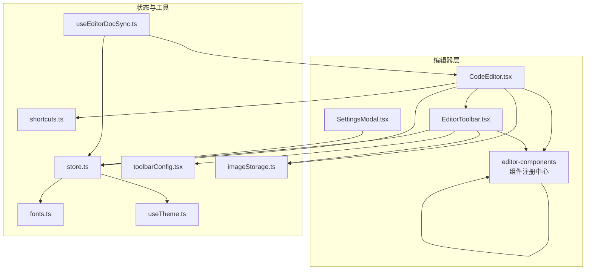
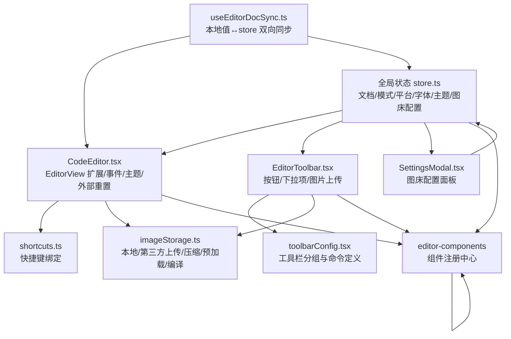
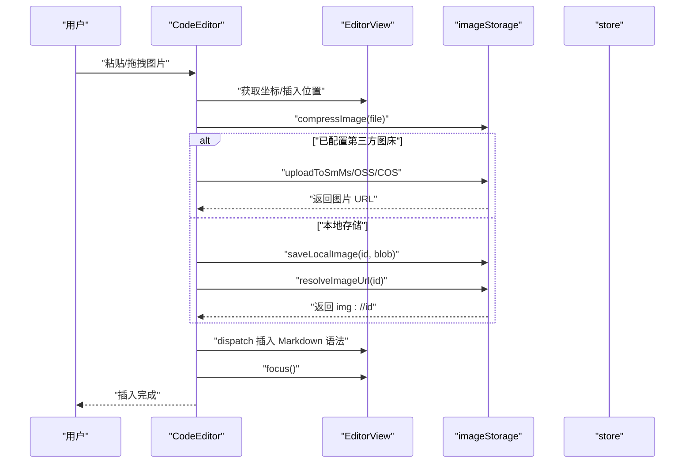
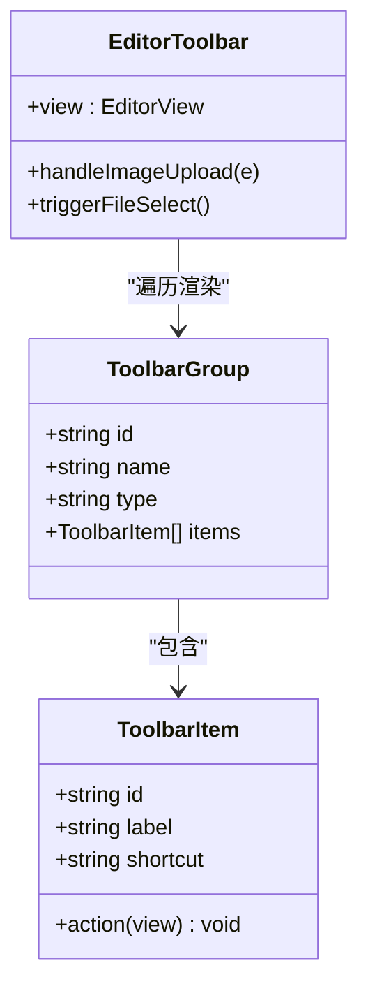
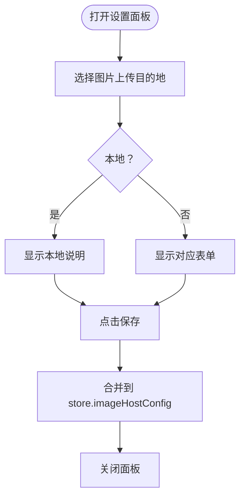
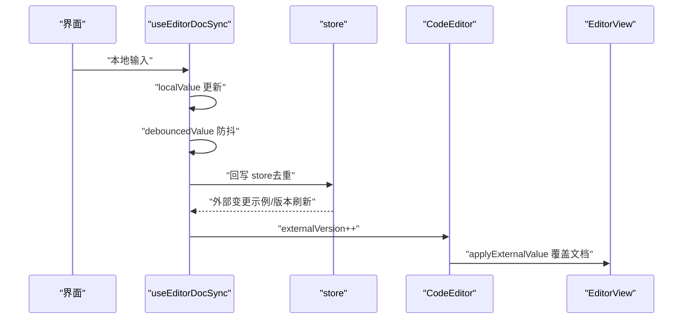
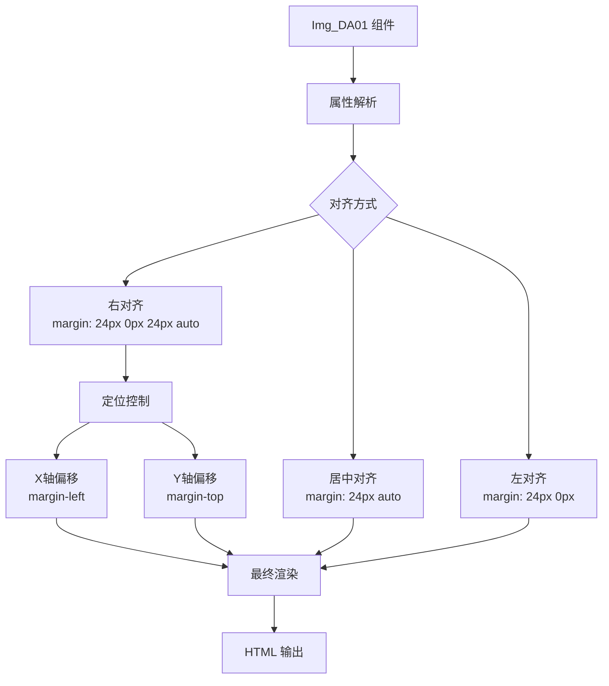
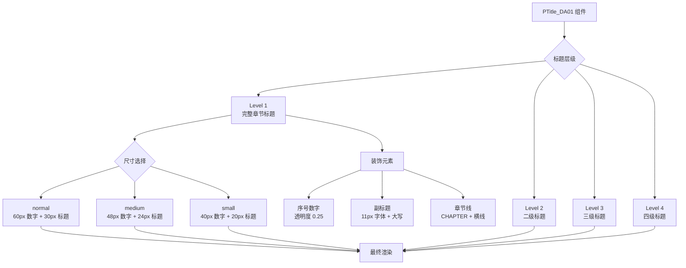
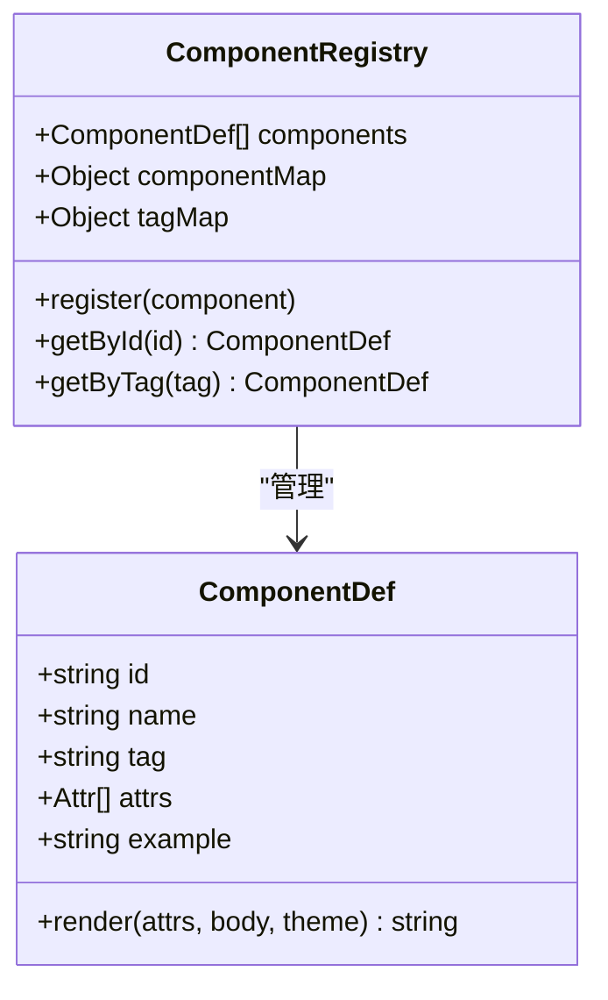
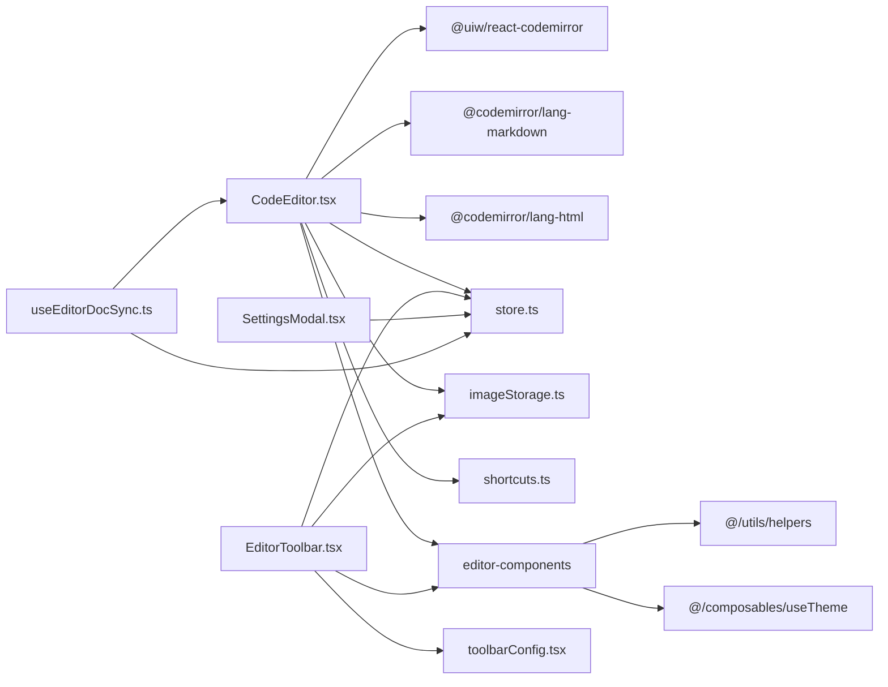

# 编辑器组件

<cite>
**本文档引用的文件**
- [CodeEditor.tsx](file://src/components/editor/CodeEditor.tsx)
- [EditorToolbar.tsx](file://src/components/editor/EditorToolbar.tsx)
- [SettingsModal.tsx](file://src/components/editor/SettingsModal.tsx)
- [store.ts](file://src/lib/store.ts)
- [useEditorDocSync.ts](file://src/lib/useEditorDocSync.ts)
- [shortcuts.ts](file://src/lib/editor/shortcuts.ts)
- [toolbarConfig.tsx](file://src/lib/editor/toolbarConfig.tsx)
- [imageStorage.ts](file://src/lib/editor/imageStorage.ts)
- [fonts.ts](file://src/lib/fonts.ts)
- [useTheme.ts](file://src/engine/composables/useTheme.ts)
- [Img_DA01.ts](file://r-markdown/src/editor-components/Img_DA01.ts)
- [PTitle_DA01.ts](file://r-markdown/src/editor-components/PTitle_DA01.ts)
- [index.ts](file://r-markdown/src/editor-components/index.ts)
</cite>

## 更新摘要
**所做更改**
- 新增 Img_DA01 图像组件的详细文档说明
- 新增 PTitle_DA01 段落标题组件的完整功能介绍
- 更新编辑器组件架构，包含新增的图像和标题组件
- 增强定位控制、对齐选项和 CSS 样式属性支持说明
- 更新组件注册中心和工具栏配置以支持新组件

## 目录
1. [简介](#简介)
2. [项目结构](#项目结构)
3. [核心组件](#核心组件)
4. [架构总览](#架构总览)
5. [详细组件分析](#详细组件分析)
6. [新增编辑器组件](#新增编辑器组件)
7. [依赖关系分析](#依赖关系分析)
8. [性能考量](#性能考量)
9. [故障排查指南](#故障排查指南)
10. [结论](#结论)
11. [附录](#附录)

## 简介
本文件系统性梳理编辑器组件体系，涵盖 CodeEditor 的 CodeMirror 集成、语法高亮、自动补全与快捷键支持；EditorToolbar 的工具栏架构与命令执行机制；SettingsModal 的配置面板设计；以及组件间通信与数据流；并总结性能优化策略、可扩展性设计与最佳实践。

**更新** 新增了 Img_DA01 图像组件和 PTitle_DA01 段落标题组件，增强了编辑器的定位控制、对齐选项和 CSS 样式属性支持能力。

## 项目结构
编辑器相关代码主要位于 src/components/editor 与 src/lib/editor 下，并通过全局状态 store 进行跨组件协调。关键文件职责如下：
- CodeEditor：基于 @uiw/react-codemirror 的编辑器容器，负责语言扩展、主题、事件绑定、图片粘贴/拖拽处理与外部重置信号。
- EditorToolbar：工具栏，按分组组织按钮与下拉项，统一调度编辑命令。
- SettingsModal：图片上传与图床配置面板，集中管理本地与第三方图床参数。
- store：Zustand 全局状态，包含 Markdown 文档、渲染模式、平台预设、字体、主题与图床配置等。
- useEditorDocSync：编辑器与 store 的双向同步钩子，解决回写回声与外部重置。
- shortcuts：编辑器快捷键绑定，映射到 editorActions。
- toolbarConfig：工具栏分组与命令定义，统一图标、快捷键提示与动作。
- imageStorage：图片上传与本地存储（IndexedDB）、压缩、预加载与编译为内联 Data URL。
- fonts/useTheme：字体族与主题颜色工具。
- **新增** editor-components：编辑器组件注册中心，包含多种专用组件如图像、标题等。

**图表来源**
- [CodeEditor.tsx:1-245](file://src/components/editor/CodeEditor.tsx#L1-L245)
- [EditorToolbar.tsx:1-153](file://src/components/editor/EditorToolbar.tsx#L1-L153)
- [SettingsModal.tsx:1-191](file://src/components/editor/SettingsModal.tsx#L1-L191)
- [store.ts:1-242](file://src/lib/store.ts#L1-L242)
- [useEditorDocSync.ts:1-50](file://src/lib/useEditorDocSync.ts#L1-L50)
- [shortcuts.ts:1-63](file://src/lib/editor/shortcuts.ts#L1-L63)
- [toolbarConfig.tsx:1-238](file://src/lib/editor/toolbarConfig.tsx#L1-L238)
- [imageStorage.ts:1-259](file://src/lib/editor/imageStorage.ts#L1-L259)
- [fonts.ts:1-16](file://src/lib/fonts.ts#L1-L16)
- [useTheme.ts:1-68](file://src/engine/composables/useTheme.ts#L1-L68)
- [index.ts:1-85](file://r-markdown/src/editor-components/index.ts#L1-L85)

**章节来源**
- [CodeEditor.tsx:1-245](file://src/components/editor/CodeEditor.tsx#L1-L245)
- [EditorToolbar.tsx:1-153](file://src/components/editor/EditorToolbar.tsx#L1-L153)
- [SettingsModal.tsx:1-191](file://src/components/editor/SettingsModal.tsx#L1-L191)
- [store.ts:1-242](file://src/lib/store.ts#L1-L242)
- [useEditorDocSync.ts:1-50](file://src/lib/useEditorDocSync.ts#L1-L50)
- [shortcuts.ts:1-63](file://src/lib/editor/shortcuts.ts#L1-L63)
- [toolbarConfig.tsx:1-238](file://src/lib/editor/toolbarConfig.tsx#L1-L238)
- [imageStorage.ts:1-259](file://src/lib/editor/imageStorage.ts#L1-L259)
- [fonts.ts:1-16](file://src/lib/fonts.ts#L1-L16)
- [useTheme.ts:1-68](file://src/engine/composables/useTheme.ts#L1-L68)
- [index.ts:1-85](file://r-markdown/src/editor-components/index.ts#L1-L85)

## 核心组件
- CodeEditor
  - 语言扩展：根据 language 选择 markdown 或 html；markdown 模式下预加载常用代码语言描述，避免运行时异步导致的重新配置与输入丢失。
  - 主题与样式：内置 light 主题，配合行包裹、活动行高亮与 gutter。
  - 事件绑定：注册粘贴/拖拽图片事件处理器；按需注入快捷键 keymap。
  - 外部重置：通过 externalVersion 触发命令式覆盖编辑器文档，避免受控 value 导致的输入法竞态。
  - 图片处理：支持本地 IndexedDB、Sm.Ms、阿里云 OSS、腾讯云 COS；粘贴/拖拽与工具栏上传共享同一处理逻辑。
  - **新增** 组件支持：集成 editor-components 注册中心，支持多种专用编辑器组件。
- EditorToolbar
  - 结构化分组：标题、基础格式、列表与引用、行内标识、块级特色组件。
  - 动作执行：每个按钮/下拉项绑定 EditorView 上的 action，执行后自动聚焦。
  - 图片上传：隐藏 file input，点击"上传图片"触发选择并走统一上传流程。
  - **新增** 组件工具：支持新增编辑器组件的工具栏集成。
- SettingsModal
  - 图床目的地：本地、Sm.Ms、OSS、COS 四种类型切换。
  - 参数表单：按目的地显示对应字段，保存时合并到 store 的 imageHostConfig。
  - 提示信息：针对本地模式的注意事项与第三方图床使用指引。

**章节来源**
- [CodeEditor.tsx:19-245](file://src/components/editor/CodeEditor.tsx#L19-L245)
- [EditorToolbar.tsx:15-153](file://src/components/editor/EditorToolbar.tsx#L15-L153)
- [SettingsModal.tsx:6-191](file://src/components/editor/SettingsModal.tsx#L6-L191)

## 架构总览
编辑器组件围绕 CodeMirror EditorView 展开，通过全局 store 协调文档内容、渲染模式、平台预设、字体与主题；工具栏与快捷键统一调度编辑命令；图片上传与本地存储解耦于业务逻辑；**新增** 编辑器组件通过注册中心统一管理。

**图表来源**
- [store.ts:54-92](file://src/lib/store.ts#L54-L92)
- [useEditorDocSync.ts:20-49](file://src/lib/useEditorDocSync.ts#L20-L49)
- [CodeEditor.tsx:53-244](file://src/components/editor/CodeEditor.tsx#L53-L244)
- [EditorToolbar.tsx:19-152](file://src/components/editor/EditorToolbar.tsx#L19-L152)
- [SettingsModal.tsx:11-190](file://src/components/editor/SettingsModal.tsx#L11-L190)
- [imageStorage.ts:4-259](file://src/lib/editor/imageStorage.ts#L4-L259)
- [shortcuts.ts:10-62](file://src/lib/editor/shortcuts.ts#L10-L62)
- [toolbarConfig.tsx:32-237](file://src/lib/editor/toolbarConfig.tsx#L32-L237)
- [index.ts:38-85](file://r-markdown/src/editor-components/index.ts#L38-L85)

## 详细组件分析

### CodeEditor 组件分析
- 语言与语法高亮
  - markdown 模式：使用 @codemirror/lang-markdown，基础语言为 markdownLanguage，并注入预加载的 codeLanguages，减少首次渲染抖动。
  - html 模式：使用 @codemirror/lang-html。
- 主题与样式
  - lightTheme：定义背景、gutters、活动行、滚动条、内容区与选择背景等。
  - 基本设置：行号、折叠 gutter、活动行高亮。
- 事件与快捷键
  - domEventHandlers：处理粘贴与拖拽事件，统一走图片上传流程。
  - keymap：将 shortcuts 映射注入编辑器，仅在 markdown 模式启用。
- 外部重置与输入稳定性
  - 初始值采用 initial value，之后由 CodeMirror 自身维护文档，避免受控 value 导致的输入法竞态。
  - externalVersion 作为外部重置信号，创建 EditorView 后若存在挂起的外部变更，则在下一帧应用覆盖。
- 图片处理
  - 支持 Sm.Ms、OSS、COS 与本地 IndexedDB；粘贴/拖拽与工具栏上传共享 compressImage、saveLocalImage、resolveImageUrl、uploadToSmMs、uploadToOss、uploadToCos。
- **新增** 组件集成
  - 集成 editor-components 注册中心，支持多种专用编辑器组件的渲染与编辑。

**图表来源**
- [CodeEditor.tsx:115-184](file://src/components/editor/CodeEditor.tsx#L115-L184)
- [imageStorage.ts:58-137](file://src/lib/editor/imageStorage.ts#L58-L137)

**章节来源**
- [CodeEditor.tsx:29-244](file://src/components/editor/CodeEditor.tsx#L29-L244)
- [imageStorage.ts:4-259](file://src/lib/editor/imageStorage.ts#L4-L259)

### EditorToolbar 组件分析
- 结构与分组
  - toolbarGroups 定义多个分组：标题、基础格式、列表与引用、行内标识、块级特色组件。
  - 每个分组可为 buttons 或 dropdown，下拉项支持快捷键提示。
- 命令执行机制
  - 每个按钮/下拉项绑定 action(view)，执行后自动 focus。
  - 图片上传通过隐藏 file input 触发，统一走 imageStorage 流程。
- 自定义扩展方法
  - 新增按钮：在对应分组 items 中添加 ToolbarItem，提供 id、label、icon、shortcut、action。
  - 新增下拉项：在 dropdown 分组中添加 ToolbarItem。
  - 新增分组：新增 ToolbarGroup 并加入 toolbarGroups。
- **新增** 组件工具集成
  - 支持新增编辑器组件的工具栏按钮和下拉菜单项。

**图表来源**
- [toolbarConfig.tsx:11-24](file://src/lib/editor/toolbarConfig.tsx#L11-L24)
- [EditorToolbar.tsx:19-152](file://src/components/editor/EditorToolbar.tsx#L19-L152)

**章节来源**
- [EditorToolbar.tsx:19-152](file://src/components/editor/EditorToolbar.tsx#L19-L152)
- [toolbarConfig.tsx:32-237](file://src/lib/editor/toolbarConfig.tsx#L32-L237)

### SettingsModal 组件分析
- 目的地选择
  - 本地、Sm.Ms、OSS、COS 四种类型，点击切换 activeType。
- 参数表单
  - Sm.Ms：token。
  - OSS：region、accessKeyId、accessKeySecret、bucket。
  - COS：SecretId、SecretKey、Bucket、Region。
- 写入策略
  - 临时状态仅在保存时合并到 store 的 imageHostConfig。
- 使用提示
  - 针对本地模式给出注意事项与第三方图床使用指引。

**图表来源**
- [SettingsModal.tsx:11-190](file://src/components/editor/SettingsModal.tsx#L11-L190)
- [store.ts:43-70](file://src/lib/store.ts#L43-L70)

**章节来源**
- [SettingsModal.tsx:11-190](file://src/components/editor/SettingsModal.tsx#L11-L190)
- [store.ts:179-181](file://src/lib/store.ts#L179-L181)

### 组件间通信与数据流
- 编辑器与 store 的双向同步
  - useEditorDocSync 提供 localValue、debouncedValue、externalVersion 与 setLocalValue。
  - 当 store 变化（示例恢复/版本刷新）时，通过 externalVersion 通知 CodeEditor 覆盖文档，避免回写回声导致丢字。
  - 本地输入经防抖后回写 store，避免冗余写入与误标 dirty。
- 工具栏与编辑器
  - EditorToolbar 接收 EditorView 实例，所有命令均通过 view.dispatch 执行。
- 图床配置
  - SettingsModal 修改 store 的 imageHostConfig，影响 CodeEditor 与 EditorToolbar 的图片上传行为。
- **新增** 组件注册中心
  - editor-components 通过 index.ts 统一导出和索引所有组件，支持按 id 和 tag 快速查找。

**图表来源**
- [useEditorDocSync.ts:20-49](file://src/lib/useEditorDocSync.ts#L20-L49)
- [CodeEditor.tsx:84-103](file://src/components/editor/CodeEditor.tsx#L84-L103)
- [store.ts:194-214](file://src/lib/store.ts#L194-L214)

**章节来源**
- [useEditorDocSync.ts:15-49](file://src/lib/useEditorDocSync.ts#L15-L49)
- [CodeEditor.tsx:68-103](file://src/components/editor/CodeEditor.tsx#L68-L103)
- [store.ts:179-181](file://src/lib/store.ts#L179-L181)

## 新增编辑器组件

### Img_DA01 图像组件
Img_DA01 是一个功能丰富的图像组件，提供了强大的定位控制、对齐选项和 CSS 样式属性支持。

#### 组件特性
- **编辑器语法**：``
- **属性支持**：
  - src：图片地址（支持 base64、网络 URL、本地路径）
  - alt：替代文本
  - width：宽度，默认 100%
  - height：高度，默认 auto
  - radius：圆角，默认 8px
  - fit：裁切方式，默认 cover
  - align：容器水平对齐方式：left、center、right，默认 left
  - left：X轴偏移（margin-left），正值向右、负值向左
  - top：Y轴偏移（margin-top），正值向下、负值向上

#### 渲染机制
- **定位控制**：支持精确的 X/Y 轴偏移控制，实现复杂的布局效果
- **对齐选项**：提供 left、center、right 三种容器对齐方式
- **CSS 样式**：完全基于内联样式，支持完整的 CSS 属性控制
- **响应式设计**：宽度支持百分比和固定像素值

**图表来源**
- [Img_DA01.ts:96-125](file://r-markdown/src/editor-components/Img_DA01.ts#L96-L125)

**章节来源**
- [Img_DA01.ts:1-127](file://r-markdown/src/editor-components/Img_DA01.ts#L1-L127)

### PTitle_DA01 段落标题组件
PTitle_DA01 是一个功能强大的段落标题组件，支持多种层级和样式变体。

#### 组件特性
- **编辑器语法**：支持多种写法，包括完整的属性语法和简化的标题内容语法
- **Markdown 自动转换**：支持 # 到 #### 的自动转换
- **属性支持**：
  - num：序号，如 01、02
  - title：标题文字（优先于 body 内容）
  - subtitle：副标题文字
  - color：标题文字颜色
  - num-color：序号数字颜色
  - subtitle-color：副标题颜色
  - level：层级（1-4）
  - size：尺寸（仅 level=1 有效：normal、medium、small）
  - prefix：标题前缀图标
  - suffix：标题后缀图标
  - hide：隐藏元素（num、line）

#### 渲染机制
- **层级支持**：支持 1-4 级标题，对应 H1-H4
- **尺寸变体**：level=1 时支持 normal、medium、small 三种尺寸
- **装饰元素**：支持序号数字、副标题、章节线等装饰元素
- **主题集成**：自动使用主题色作为默认强调色

**图表来源**
- [PTitle_DA01.ts:115-244](file://r-markdown/src/editor-components/PTitle_DA01.ts#L115-L244)

**章节来源**
- [PTitle_DA01.ts:1-246](file://r-markdown/src/editor-components/PTitle_DA01.ts#L1-L246)

### 组件注册中心
编辑器组件通过统一的注册中心进行管理，支持组件的动态加载和查找。

#### 组件注册机制
- **命名规范**：`{组件类型}_{D}{类型字母}{样式编号}`
- **组件接口**：统一的 ComponentDef 接口定义
- **索引系统**：支持按 id 和 tag 快速查找组件
- **动态导入**：支持组件的延迟加载

**图表来源**
- [index.ts:20-36](file://r-markdown/src/editor-components/index.ts#L20-L36)
- [index.ts:80-85](file://r-markdown/src/editor-components/index.ts#L80-L85)

**章节来源**
- [index.ts:1-85](file://r-markdown/src/editor-components/index.ts#L1-L85)

## 依赖关系分析
- 组件耦合
  - CodeEditor 依赖 store 的 imageHostConfig、shortcuts 与 imageStorage；EditorToolbar 依赖 toolbarConfig 与 store 的 imageHostConfig；SettingsModal 直接修改 store 的 imageHostConfig。
  - **新增** CodeEditor 依赖 editor-components 注册中心，支持多种专用组件。
- 外部依赖
  - @uiw/react-codemirror：编辑器核心。
  - @codemirror/lang-markdown、@codemirror/lang-html：语言扩展。
  - ali-oss、cos-js-sdk-v5：第三方上传（动态引入）。
  - IndexedDB：本地图片存储。
  - **新增** 编辑器组件依赖 @/utils/helpers 和 @/composables/useTheme。
- 可能的循环依赖
  - 未发现直接循环依赖；工具链通过 store 解耦。

**图表来源**
- [CodeEditor.tsx:1-27](file://src/components/editor/CodeEditor.tsx#L1-L27)
- [EditorToolbar.tsx:1-6](file://src/components/editor/EditorToolbar.tsx#L1-L6)
- [SettingsModal.tsx:1-5](file://src/components/editor/SettingsModal.tsx#L1-L5)
- [useEditorDocSync.ts:1-3](file://src/lib/useEditorDocSync.ts#L1-L3)
- [Img_DA01.ts:1-2](file://r-markdown/src/editor-components/Img_DA01.ts#L1-L2)
- [PTitle_DA01.ts:1-2](file://r-markdown/src/editor-components/PTitle_DA01.ts#L1-L2)

**章节来源**
- [CodeEditor.tsx:1-27](file://src/components/editor/CodeEditor.tsx#L1-L27)
- [EditorToolbar.tsx:1-6](file://src/components/editor/EditorToolbar.tsx#L1-L6)
- [SettingsModal.tsx:1-5](file://src/components/editor/SettingsModal.tsx#L1-L5)
- [useEditorDocSync.ts:1-3](file://src/lib/useEditorDocSync.ts#L1-L3)
- [Img_DA01.ts:1-2](file://r-markdown/src/editor-components/Img_DA01.ts#L1-L2)
- [PTitle_DA01.ts:1-2](file://r-markdown/src/editor-components/PTitle_DA01.ts#L1-L2)

## 性能考量
- 增量渲染与输入稳定性
  - 初始值受控、之后非受控，避免受控 value 导致的全文替换与输入法竞态。
  - externalVersion 仅在外部变更时递增，编辑器内部输入不触发覆盖。
- 语言扩展预加载
  - 在编辑器挂载前完成语言数据加载，减少运行时异步 reconfigure。
- 图片处理优化
  - Canvas 压缩与内存 Object URL 缓存，降低带宽与渲染压力。
  - 预加载 Markdown 中的本地图片，减少首屏闪烁。
- 防抖与回写去重
  - useEditorDocSync 防抖后回写 store，避免频繁写入；通过 lastWrittenRef 识别回声，防止丢字。
- DOM 事件与扩展注入
  - 仅在需要时注入 keymap 与 domEventHandlers，减少不必要的扩展开销。
- **新增** 组件渲染优化
  - 编辑器组件采用内联样式渲染，避免额外的样式计算开销。
  - 组件属性解析在渲染时进行，支持动态样式调整。

**章节来源**
- [CodeEditor.tsx:68-112](file://src/components/editor/CodeEditor.tsx#L68-L112)
- [imageStorage.ts:58-137](file://src/lib/editor/imageStorage.ts#L58-L137)
- [useEditorDocSync.ts:15-49](file://src/lib/useEditorDocSync.ts#L15-L49)

## 故障排查指南
- 图片粘贴/拖拽无效
  - 检查是否为图片类型；确认 EditorView 是否可用；查看控制台错误。
  - 若使用第三方图床，检查 token/region/bucket 等配置是否正确。
- 本地图片无法显示
  - 确认 IndexedDB 是否可用；检查 localImageUrls 缓存；尝试预加载。
- 快捷键不生效
  - 确认当前语言为 markdown；检查 keymap 是否注入。
- 外部重置未生效
  - 确认 externalVersion 是否递增；检查 pendingExternalRef 与 applyExternalValue 的执行时机。
- 配置保存后未生效
  - 确认 SettingsModal 已点击保存；检查 store 的 imageHostConfig 是否更新。
- **新增** 编辑器组件问题
  - 检查组件是否正确注册到 editor-components；
  - 确认组件的 tag 名称是否与编辑器语法匹配；
  - 验证组件属性是否符合要求。

**章节来源**
- [CodeEditor.tsx:115-184](file://src/components/editor/CodeEditor.tsx#L115-L184)
- [imageStorage.ts:109-137](file://src/lib/editor/imageStorage.ts#L109-L137)
- [SettingsModal.tsx:33-52](file://src/components/editor/SettingsModal.tsx#L33-L52)
- [store.ts:179-181](file://src/lib/store.ts#L179-L181)

## 结论
编辑器组件通过 CodeMirror 提供稳定的基础能力，结合工具栏与快捷键实现高效编辑体验；通过全局状态与同步钩子保证数据一致性；通过多图床与本地存储满足不同场景需求；**新增** 的 Img_DA01 图像组件和 PTitle_DA01 段落标题组件进一步增强了编辑器的功能性和灵活性，提供了强大的定位控制、对齐选项和 CSS 样式属性支持。整体设计具备良好的可扩展性与性能表现。

## 附录
- 快捷键一览（部分）
  - 基础格式：加粗、斜体、下划线、行内代码、删除线、柔光重点、渐变背景、胶囊文字、加重强调、上/下标、引言大字。
  - 结构与列表：标题层级、无序/有序/任务列表、引用区块、分割线。
  - 特色容器：步骤、高亮标注、突发要闻、互动提醒、行动呼吁、对比、时间轴、轮播图。
  - 链接：选中文本后快速包裹为链接。
- **新增** 编辑器组件一览
  - Img_DA01：图像组件，支持定位控制、对齐选项和 CSS 样式属性
  - PTitle_DA01：段落标题组件，支持多层级和多种样式变体

**章节来源**
- [shortcuts.ts:10-62](file://src/lib/editor/shortcuts.ts#L10-L62)
- [Img_DA01.ts:7-20](file://r-markdown/src/editor-components/Img_DA01.ts#L7-L20)
- [PTitle_DA01.ts:7-30](file://r-markdown/src/editor-components/PTitle_DA01.ts#L7-L30)