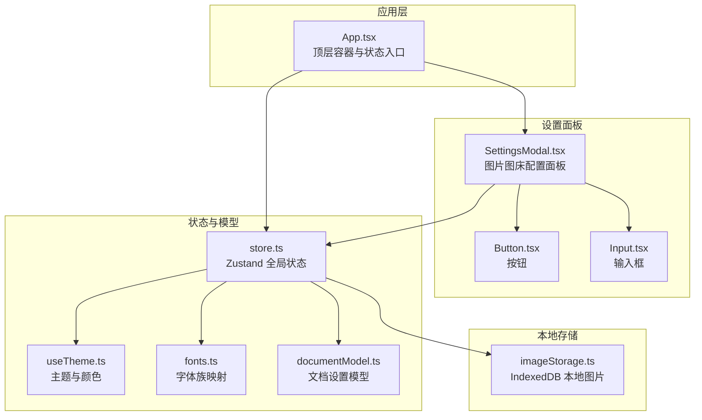
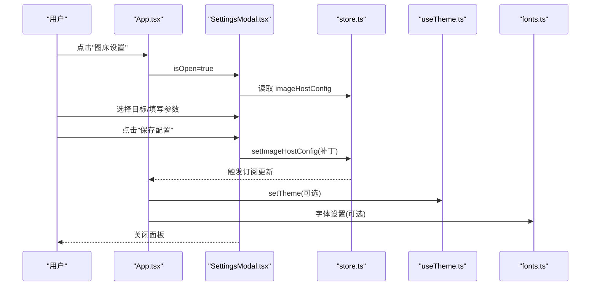
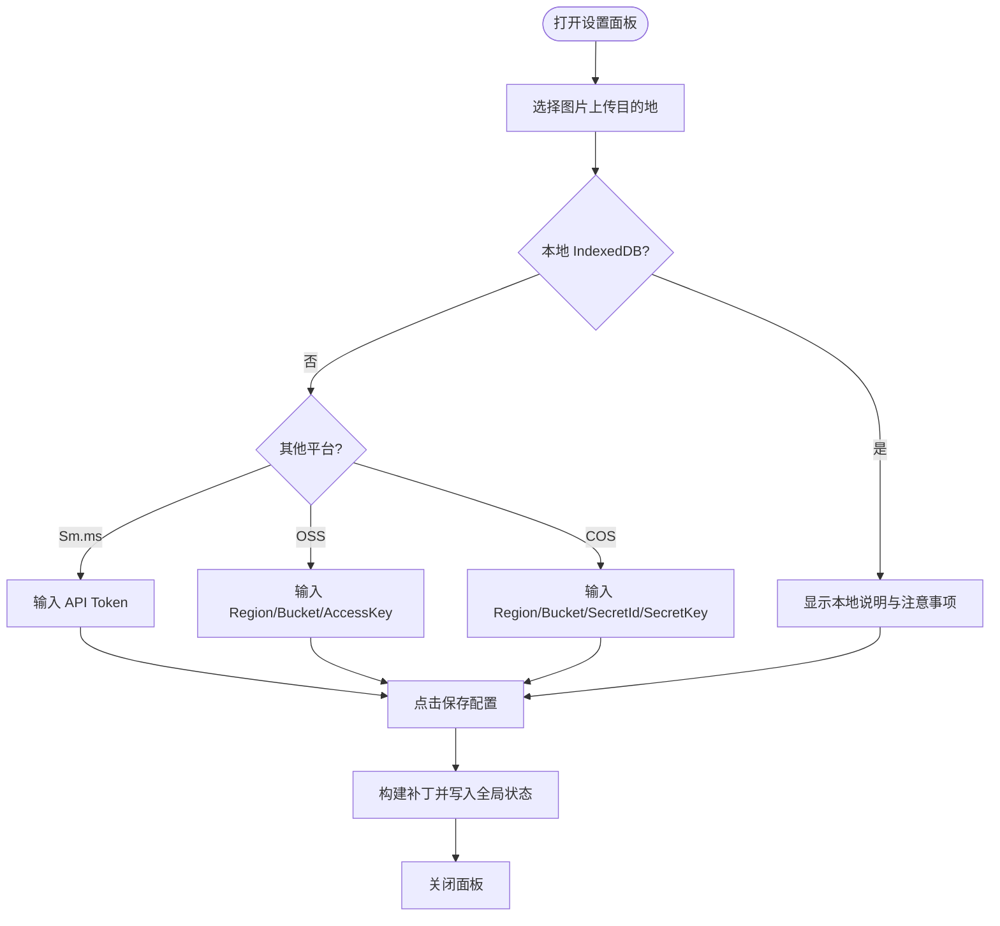
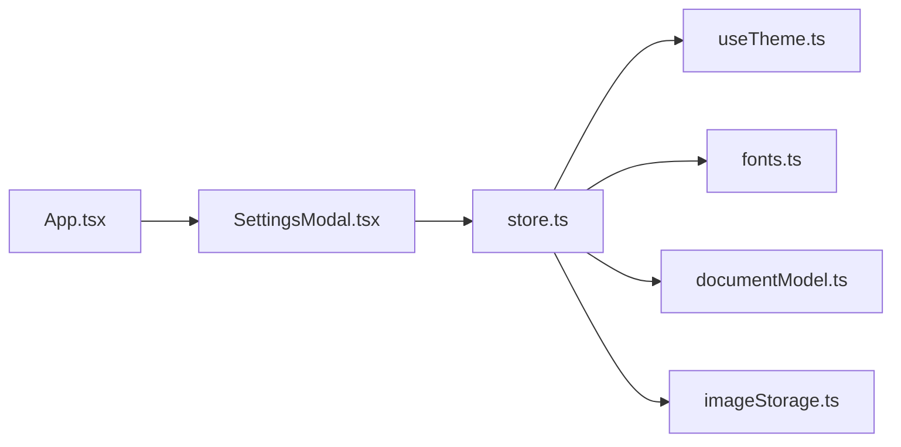

# 设置面板

<cite>
**本文引用的文件**
- [SettingsModal.tsx](file://src/components/editor/SettingsModal.tsx)
- [store.ts](file://src/lib/store.ts)
- [App.tsx](file://src/App.tsx)
- [useTheme.ts](file://src/engine/composables/useTheme.ts)
- [fonts.ts](file://src/lib/fonts.ts)
- [documentModel.ts](file://src/modes/document/documentModel.ts)
- [Button.tsx](file://src/components/ui/Button.tsx)
- [Input.tsx](file://src/components/ui/Input.tsx)
- [imageStorage.ts](file://src/lib/editor/imageStorage.ts)
- [imageStorage.test.ts](file://src/lib/editor/imageStorage.test.ts)
</cite>

## 更新摘要
**变更内容**
- 新增图片存储后端配置选项：SM.MS、阿里云OSS、腾讯云COS
- 增强验证和错误处理机制，包括输入验证、异常捕获和用户反馈
- 完善的错误处理策略，支持多种图床服务的故障转移
- 详细的配置参数说明和使用指导

## 目录
1. [简介](#简介)
2. [项目结构](#项目结构)
3. [核心组件](#核心组件)
4. [架构总览](#架构总览)
5. [详细组件分析](#详细组件-analysis)
6. [依赖关系分析](#依赖关系分析)
7. [性能考量](#性能考量)
8. [故障排查指南](#故障排查指南)
9. [结论](#结论)
10. [附录](#附录)

## 简介
本文件系统性梳理"设置面板"组件的设计与实现，涵盖以下方面：
- 界面与交互：模态框的打开/关闭、层级管理、操作反馈
- 设置项分类与组织：图片图床配置、主题与颜色、字体与文档偏好
- 数据绑定机制：状态同步、默认值处理、持久化存储
- 验证与错误处理：输入校验策略与容错
- 响应式与多端适配：移动端与桌面端体验
- 扩展开发指南：新增设置项与自定义配置
- 性能优化与体验建议：防抖、懒加载、最小重绘

## 项目结构
设置面板位于编辑器子模块，通过全局状态管理器集中维护配置，UI 采用原子化组件组合。



**图表来源**
- [App.tsx:56-167](file://src/App.tsx#L56-L167)
- [SettingsModal.tsx:11-191](file://src/components/editor/SettingsModal.tsx#L11-L191)
- [store.ts:163-242](file://src/lib/store.ts#L163-L242)
- [useTheme.ts:1-68](file://src/engine/composables/useTheme.ts#L1-L68)
- [fonts.ts:1-16](file://src/lib/fonts.ts#L1-L16)
- [documentModel.ts:30-66](file://src/modes/document/documentModel.ts#L30-L66)
- [imageStorage.ts:1-80](file://src/lib/editor/imageStorage.ts#L1-L80)

**章节来源**
- [App.tsx:56-167](file://src/App.tsx#L56-L167)
- [SettingsModal.tsx:11-191](file://src/components/editor/SettingsModal.tsx#L11-L191)
- [store.ts:163-242](file://src/lib/store.ts#L163-L242)

## 核心组件
- 设置面板（图片图床配置）
  - 负责选择图片上传目的地（本地 IndexedDB、Sm.ms、阿里云 OSS、腾讯云 COS）
  - 提供各平台所需的密钥与参数输入
  - 保存时合并补丁并写入全局状态
- 全局状态管理（Zustand）
  - 统一维护图片图床配置、主题、字体、文档设置等
  - 支持持久化与迁移逻辑
- UI 原子组件
  - Button、Input 提供一致的交互与样式契约

**章节来源**
- [SettingsModal.tsx:11-191](file://src/components/editor/SettingsModal.tsx#L11-L191)
- [store.ts:43-92](file://src/lib/store.ts#L43-L92)
- [Button.tsx:8-35](file://src/components/ui/Button.tsx#L8-L35)
- [Input.tsx:5-14](file://src/components/ui/Input.tsx#L5-L14)

## 架构总览
设置面板与应用整体通过顶层容器进行集成，状态通过 Zustand 管理并持久化到本地存储。



**图表来源**
- [App.tsx:93-100](file://src/App.tsx#L93-L100)
- [SettingsModal.tsx:33-52](file://src/components/editor/SettingsModal.tsx#L33-L52)
- [store.ts:179-181](file://src/lib/store.ts#L179-L181)
- [useTheme.ts:58-67](file://src/engine/composables/useTheme.ts#L58-L67)
- [fonts.ts:3-15](file://src/lib/fonts.ts#L3-L15)

## 详细组件分析

### 设置面板（图片图床配置）
- 打开/关闭与层级
  - 通过父组件状态控制 isOpen，使用固定定位与背景遮罩，z-index 确保层级高于内容
  - 关闭按钮与取消按钮均触发 onClose，确保状态回退
- 交互与数据流
  - 使用局部状态暂存用户输入，保存时合并补丁写入全局状态
  - 目的地切换通过按钮组选择，动态渲染对应表单区域
- 表单区域
  - 本地：提示本地 IndexedDB 存储与注意事项
  - Sm.ms：API Token 输入（密码类型）
  - OSS：Region、Bucket、AccessKey ID/Secret
  - COS：Region、Bucket、SecretId/SecretKey
- 样式与交互
  - 使用 Button 与 Input 组件，统一尺寸与状态
  - 选中态通过边框与强调色体现



**图表来源**
- [SettingsModal.tsx:76-178](file://src/components/editor/SettingsModal.tsx#L76-L178)
- [SettingsModal.tsx:33-52](file://src/components/editor/SettingsModal.tsx#L33-L52)

**章节来源**
- [SettingsModal.tsx:11-191](file://src/components/editor/SettingsModal.tsx#L11-L191)
- [Button.tsx:8-35](file://src/components/ui/Button.tsx#L8-L35)
- [Input.tsx:5-14](file://src/components/ui/Input.tsx#L5-L14)

### 全局状态与持久化（store.ts）
- 状态结构
  - 图片图床配置：activeType 与各平台参数
  - 主题与颜色：accent、accentDark、colors
  - 字体：文章与卡片字体族
  - 文档设置：分页、页边距、页眉页脚、标题居中、段落缩进等
- 默认值与迁移
  - 默认图片图床为本地
  - 从历史键迁移文章、卡片、HTML、模式、字体、文档设置与主题
- 更新与持久化
  - setImageHostConfig 以补丁方式合并
  - setTheme 应用 CSS 变量并更新颜色
  - updateDocumentSettings 合并文档设置
  - persist 中间件将状态持久化到本地存储

```mermaid
classDiagram
class AppState {
+articleMarkdown : string
+documentMarkdown : string
+cardMarkdown : string
+html : string
+mode : RenderMode
+inputType : InputType
+platform : PlatformPreset
+documentSettings : DocumentSettings
+articleFont : FontFamilyOption
+cardFont : FontFamilyOption
+accent : string
+accentDark : string
+colors : ThemeColors
+imageHostConfig : ImageHostConfig
+setImageHostConfig(config)
+setArticleMarkdown(md)
+setDocumentMarkdown(md)
+setCardMarkdown(md)
+setHtml(html)
+syncDemoContent(demos)
+restoreDemo(mode, demos)
+setMode(mode)
+setInputType(type)
+setPlatform(platform)
+updateDocumentSettings(patch)
+setArticleFont(f)
+setCardFont(f)
+setTheme(accent, dark)
}
class ImageHostConfig {
+activeType : ImageHostType
+smms? : { token : string }
+oss? : { region : string; accessKeyId : string; accessKeySecret : string; bucket : string }
+cos? : { SecretId : string; SecretKey : string; Bucket : string; Region : string }
}
AppState --> ImageHostConfig : "持有"
```

**图表来源**
- [store.ts:54-92](file://src/lib/store.ts#L54-L92)
- [store.ts:43-48](file://src/lib/store.ts#L43-L48)

**章节来源**
- [store.ts:163-242](file://src/lib/store.ts#L163-L242)
- [store.ts:101-156](file://src/lib/store.ts#L101-L156)

### 主题与字体（useTheme.ts、fonts.ts）
- 主题
  - 预设主题色数组，提供主色与深色
  - 生成 ThemeColors（含 light、border、rgb）
  - setTheme 应用 CSS 变量并更新颜色
- 字体
  - 字体族枚举与 CSS 映射
  - 文档模式下可选择字体族与字号缩放

**章节来源**
- [useTheme.ts:13-29](file://src/engine/composables/useTheme.ts#L13-L29)
- [useTheme.ts:58-67](file://src/engine/composables/useTheme.ts#L58-L67)
- [fonts.ts:1-16](file://src/lib/fonts.ts#L1-L16)

### 文档设置（documentModel.ts）
- 文档设置项
  - 页面尺寸、页边距、页眉页脚文本
  - 主题风格、字体族、字号缩放
  - 标题居中、段落首行缩进
- 默认值
  - 提供合理默认值，便于快速上手
- 与设置面板的关系
  - 文档设置独立于图片图床配置，但同属全局状态
  - 文档模式组件通过 updateDocumentSettings 修改设置

**章节来源**
- [documentModel.ts:30-66](file://src/modes/document/documentModel.ts#L30-L66)

### 本地图片存储（imageStorage.ts）
- 本地 IndexedDB 存储
  - 保存图片 Blob、读取图片 Blob
  - Canvas 压缩图片（限制宽度、质量）
- 与设置面板的关联
  - 当选择本地作为图床时，图片以本地方式存储
  - 用于本地预览与导出友好
- 图床上传与验证
  - 支持多种图床服务：Sm.ms、阿里云 OSS、腾讯云 COS
  - 包含完整的错误处理和验证机制
  - 提供图片压缩和格式转换功能

**章节来源**
- [imageStorage.ts:25-80](file://src/lib/editor/imageStorage.ts#L25-L80)
- [imageStorage.ts:140-294](file://src/lib/editor/imageStorage.ts#L140-294)

## 依赖关系分析
- 组件耦合
  - SettingsModal 依赖 store 的图片图床配置与 setter
  - App 作为容器负责打开/关闭面板状态
  - Button、Input 为通用 UI 组件，低耦合高内聚
- 状态耦合
  - store.ts 统一管理主题、字体、文档设置与图片图床配置
  - 文档模式组件通过 updateDocumentSettings 与 store 交互
- 外部依赖
  - IndexedDB 用于本地图片存储
  - localStorage 用于状态持久化
  - 第三方 SDK：ali-oss、cos-js-sdk-v5



**图表来源**
- [App.tsx:56-167](file://src/App.tsx#L56-L167)
- [SettingsModal.tsx:11-191](file://src/components/editor/SettingsModal.tsx#L11-L191)
- [store.ts:163-242](file://src/lib/store.ts#L163-L242)

**章节来源**
- [store.ts:163-242](file://src/lib/store.ts#L163-L242)

## 性能考量
- 状态更新粒度
  - 图片图床配置使用补丁合并，避免全量替换
  - 文档设置同样采用补丁合并，减少不必要的重渲染
- 渲染优化
  - 模态框仅在 isOpen 为真时渲染，减少空节点
  - 选择目的地后按需渲染对应表单区域
- 存储与 IO
  - 本地图片存储使用 IndexedDB，避免内存压力
  - 图片压缩在 Canvas 上完成，限制最大宽度与质量
- 持久化策略
  - 使用 persist 中间件，避免频繁序列化大对象
  - 迁移逻辑仅在必要时读取历史键
- 异步处理
  - 图床上传采用异步处理，避免阻塞主线程
  - 动态加载第三方 SDK，减少初始包体积

## 故障排查指南
- 无法保存配置
  - 检查补丁构建是否包含所需字段
  - 确认 setImageHostConfig 是否被调用
- 本地图片无法显示
  - 确认 IndexedDB 是否可用
  - 检查保存与读取流程是否成功
- 主题色不生效
  - setTheme 是否正确应用 CSS 变量
  - 检查持久化后的状态是否正确
- 字体显示异常
  - 字体族映射是否正确
  - 文档模式下的字体设置是否生效
- 图床上传失败
  - 检查网络连接和 API 密钥有效性
  - 确认图床服务的可用性和配额限制
  - 查看浏览器控制台的详细错误信息

**章节来源**
- [SettingsModal.tsx:33-52](file://src/components/editor/SettingsModal.tsx#L33-L52)
- [store.ts:179-181](file://src/lib/store.ts#L179-L181)
- [imageStorage.ts:25-53](file://src/lib/editor/imageStorage.ts#L25-L53)

## 结论
设置面板以简洁直观的方式管理图片图床配置，结合全局状态与持久化，实现了良好的一致性与可恢复性。通过补丁合并与按需渲染，兼顾了性能与可维护性。新增的 SM.MS、阿里云 OSS、腾讯云 COS 支持进一步增强了应用的实用性。完善的验证和错误处理机制确保了用户操作的可靠性。后续可在现有基础上扩展更多设置项，并保持一致的交互与数据流。

## 附录

### 设置项分类与组织
- 图片图床配置
  - 目的地选择：本地、Sm.ms、OSS、COS
  - 参数：Token、Region、Bucket、AccessKey 等
- 主题与颜色
  - 预设主题色切换
  - CSS 变量应用
- 字体与文档偏好
  - 字体族选择
  - 文档设置（页边距、页眉页脚、标题居中、段落缩进、字号缩放）

**章节来源**
- [SettingsModal.tsx:76-178](file://src/components/editor/SettingsModal.tsx#L76-L178)
- [useTheme.ts:13-29](file://src/engine/composables/useTheme.ts#L13-L29)
- [fonts.ts:1-16](file://src/lib/fonts.ts#L1-L16)
- [documentModel.ts:30-66](file://src/modes/document/documentModel.ts#L30-L66)

### 数据绑定机制
- 状态同步
  - 局部状态暂存用户输入，保存时一次性写入全局状态
- 默认值处理
  - 图片图床默认本地
  - 文档设置默认值来自模型
- 持久化存储
  - persist 中间件将状态写入本地存储
  - 迁移逻辑兼容历史键

**章节来源**
- [SettingsModal.tsx:15-52](file://src/components/editor/SettingsModal.tsx#L15-L52)
- [store.ts:179-181](file://src/lib/store.ts#L179-L181)
- [store.ts:101-156](file://src/lib/store.ts#L101-L156)

### 验证与错误处理
- 输入验证
  - 本地：无参数校验，仅提示注意事项
  - Sm.ms：Token 必填
  - OSS/COS：必填参数齐全
- 错误处理
  - IndexedDB 异常捕获与日志输出
  - JSON 解析失败时忽略并保留默认值
  - 图床上传失败时的降级处理
  - 图片压缩失败时的回退机制

**章节来源**
- [SettingsModal.tsx:111-178](file://src/components/editor/SettingsModal.tsx#L111-L178)
- [imageStorage.ts:49-53](file://src/lib/editor/imageStorage.ts#L49-L53)
- [store.ts:136-141](file://src/lib/store.ts#L136-L141)

### 响应式与多端适配
- 布局
  - 使用网格布局与弹性间距，适配不同屏幕尺寸
  - 模态框最大宽度与内边距确保在窄屏下可滚动
- 交互
  - 按钮与输入框在移动端具备合适的触控尺寸
  - 背景遮罩与动画提升反馈

**章节来源**
- [SettingsModal.tsx:54-189](file://src/components/editor/SettingsModal.tsx#L54-L189)

### 扩展开发指南
- 新增设置项步骤
  - 在 store.ts 中扩展 AppState 接口与默认值
  - 在 SettingsModal.tsx 中添加对应 UI 与状态绑定
  - 在 App.tsx 或对应模式组件中接入
- 自定义配置选项
  - 保持补丁合并策略，避免全量替换
  - 使用原子化组件（Button、Input）统一风格
  - 注意持久化键名与迁移逻辑
- 图床服务扩展
  - 在 imageStorage.ts 中添加新的上传函数
  - 更新 ImageHostConfig 类型定义
  - 实现相应的错误处理和验证逻辑

**章节来源**
- [store.ts:54-92](file://src/lib/store.ts#L54-L92)
- [SettingsModal.tsx:11-191](file://src/components/editor/SettingsModal.tsx#L11-L191)
- [imageStorage.ts:262-294](file://src/lib/editor/imageStorage.ts#L262-L294)

### 测试与验证
- 单元测试覆盖
  - IndexedDB 读写操作的测试
  - 图片压缩功能的测试
  - Markdown 图片编译的测试
- 集成测试
  - 图床上传流程的端到端测试
  - 错误场景的模拟测试
  - 性能基准测试

**章节来源**
- [imageStorage.test.ts:68-97](file://src/lib/editor/imageStorage.test.ts#L68-L97)