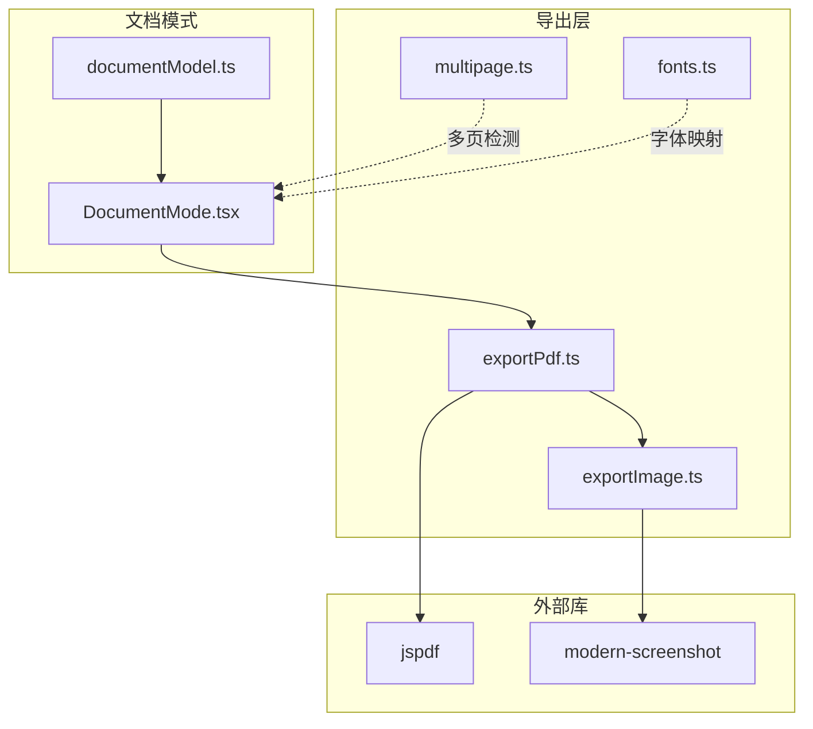
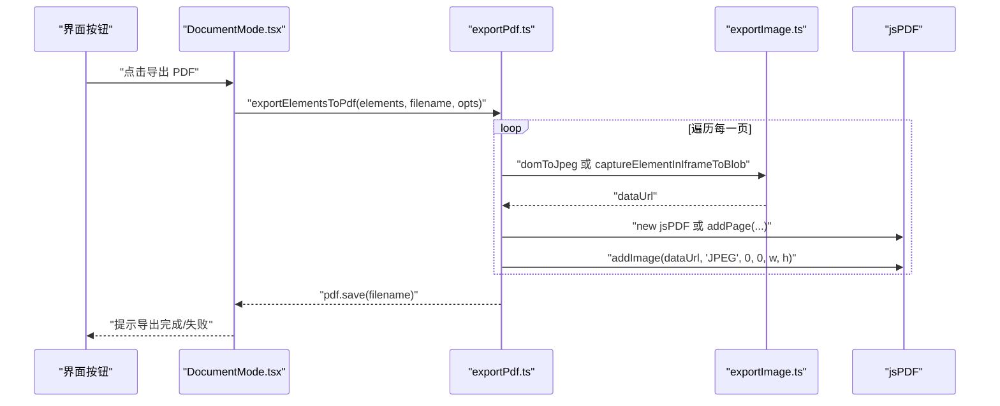
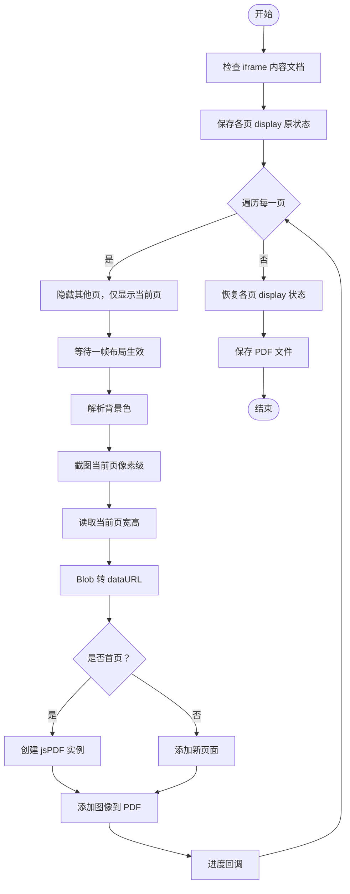
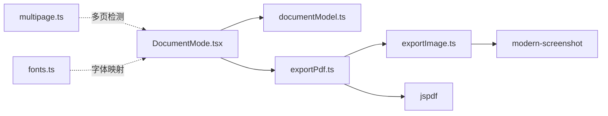

# PDF导出

<cite>
**本文引用的文件**
- [exportPdf.ts](file://src/lib/exportPdf.ts)
- [exportImage.ts](file://src/lib/exportImage.ts)
- [multipage.ts](file://src/lib/multipage.ts)
- [fonts.ts](file://src/lib/fonts.ts)
- [DocumentMode.tsx](file://src/modes/document/DocumentMode.tsx)
- [documentModel.ts](file://src/modes/document/documentModel.ts)
- [package.json](file://package.json)
</cite>

## 目录
1. [简介](#简介)
2. [项目结构](#项目结构)
3. [核心组件](#核心组件)
4. [架构总览](#架构总览)
5. [详细组件分析](#详细组件分析)
6. [依赖关系分析](#依赖关系分析)
7. [性能考量](#性能考量)
8. [故障排除指南](#故障排除指南)
9. [结论](#结论)
10. [附录](#附录)

## 简介
本文件系统化梳理项目中的PDF导出能力，重点覆盖以下方面：
- 基于 jsPDF 的导出流程与页面尺寸控制
- 多页文档的自动分页与页眉页脚管理
- 样式处理策略（CSS 转换、字体与图片处理）
- 导出配置项（页面大小、边距、方向、质量）
- 性能优化与大文档处理策略
- 常见问题排查与解决方案

**更新** 许可证归属URL已修正，确保与原始项目保持一致

## 项目结构
与 PDF 导出直接相关的模块分布如下：
- 导出入口与核心逻辑：exportPdf.ts
- 截图与样式解析：exportImage.ts
- 多页检测与滚动定位：multipage.ts
- 字体族映射：fonts.ts
- 文档模式导出调用与分页模型：DocumentMode.tsx、documentModel.ts
- 依赖声明：package.json

**图表来源**
- [exportPdf.ts:1-194](file://src/lib/exportPdf.ts#L1-L194)
- [exportImage.ts:1-320](file://src/lib/exportImage.ts#L1-L320)
- [multipage.ts:1-34](file://src/lib/multipage.ts#L1-L34)
- [fonts.ts:1-16](file://src/lib/fonts.ts#L1-L16)
- [DocumentMode.tsx:134-156](file://src/modes/document/DocumentMode.tsx#L134-L156)
- [documentModel.ts:265-327](file://src/modes/document/documentModel.ts#L265-L327)

**章节来源**
- [exportPdf.ts:1-194](file://src/lib/exportPdf.ts#L1-L194)
- [exportImage.ts:1-320](file://src/lib/exportImage.ts#L1-L320)
- [multipage.ts:1-34](file://src/lib/multipage.ts#L1-L34)
- [fonts.ts:1-16](file://src/lib/fonts.ts#L1-L16)
- [DocumentMode.tsx:134-156](file://src/modes/document/DocumentMode.tsx#L134-L156)
- [documentModel.ts:265-327](file://src/modes/document/documentModel.ts#L265-L327)

## 核心组件
- 基于 iframe 的多页导出：exportIframeToPdf
- 基于 iframe 的单页导出：exportSinglePageToPdf
- 非 iframe 的元素批量导出：exportElementsToPdf
- 截图与样式解析：captureElementInIframeToBlob、elementToBlob、resolveBackground
- 多页检测与滚动：detectPages
- 字体族映射：getFontFamilyCss
- 文档分页模型：paginateDocumentBlocks、createDocumentModel

**章节来源**
- [exportPdf.ts:20-194](file://src/lib/exportPdf.ts#L20-L194)
- [exportImage.ts:15-320](file://src/lib/exportImage.ts#L15-L320)
- [multipage.ts:18-34](file://src/lib/multipage.ts#L18-L34)
- [fonts.ts:1-16](file://src/lib/fonts.ts#L1-L16)
- [documentModel.ts:265-327](file://src/modes/document/documentModel.ts#L265-L327)

## 架构总览
PDF 导出采用"先截图、后拼接"的两阶段方案：
- 第一阶段：在 iframe 或目标元素上进行高质量截图，确保字体、背景、样式完整保留
- 第二阶段：使用 jsPDF 将每页截图作为图像添加到 PDF，并按需设置页面方向与尺寸

**图表来源**
- [DocumentMode.tsx:134-156](file://src/modes/document/DocumentMode.tsx#L134-L156)
- [exportPdf.ts:131-182](file://src/lib/exportPdf.ts#L131-L182)
- [exportImage.ts:152-387](file://src/lib/exportImage.ts#L152-L387)

## 详细组件分析

### 组件一：基于 iframe 的多页导出（exportIframeToPdf）
- 功能要点
  - 通过切换各页节点的 display 属性，逐页渲染，避免跨页干扰
  - 使用 captureElementInIframeToBlob 在 iframe 原生样式上下文中截图，保证字体、背景、CSS 变量完整
  - 自动根据宽高判断页面方向（横向/纵向），并以像素为单位创建页面格式
  - 逐页添加至 jsPDF，首页创建实例，后续页追加页面
- 关键流程

**图表来源**
- [exportPdf.ts:21-89](file://src/lib/exportPdf.ts#L21-L89)

**章节来源**
- [exportPdf.ts:21-89](file://src/lib/exportPdf.ts#L21-L89)

### 组件二：基于 iframe 的单页导出（exportSinglePageToPdf）
- 功能要点
  - 自动定位第一层包裹元素（优先 body > div/main/section，否则使用 body）
  - 解析背景色，避免透明导致的背景丢失
  - 以包裹元素的实际尺寸创建页面，确保内容完整
- 流程与多页导出类似，但只处理一个页面

**章节来源**
- [exportPdf.ts:92-127](file://src/lib/exportPdf.ts#L92-L127)

### 组件三：非 iframe 的元素批量导出（exportElementsToPdf）
- 功能要点
  - 适用于 A4 文档模式等非 iframe 场景
  - 使用 modern-screenshot 的 domToJpeg 生成高质量 JPEG
  - 支持显式传入页面宽高，或使用元素自身尺寸
  - 逐页创建/追加页面并插入图像
- 注意事项
  - 该方案在 iframe 内部样式上下文不可用时使用，可能无法保留 iframe 内部的样式引用

**章节来源**
- [exportPdf.ts:131-182](file://src/lib/exportPdf.ts#L131-L182)

### 组件四：截图与样式解析（exportImage.ts）
- 关键能力
  - 等待文档资源稳定：样式表加载、字体可用、图片解码完成
  - 针对 iframe 的全高截图：临时提升 iframe 高度，避免布局塌陷
  - 针对元素的精准截图：通过一系列样式覆盖，使目标元素无缝填满文档，消除外边距与多余空白
  - 背景色解析：优先使用内联/计算样式，若无效则回退白色
- 参数与行为
  - scale：默认 2，可提升到 3
  - type：PNG/JPEG/WebP，默认 PNG
  - backgroundColor：可显式覆盖背景
  - maxHeight：限制最大截图高度，避免超大文档内存压力

**章节来源**
- [exportImage.ts:15-117](file://src/lib/exportImage.ts#L15-L117)
- [exportImage.ts:152-197](file://src/lib/exportImage.ts#L152-L197)
- [exportImage.ts:199-217](file://src/lib/exportImage.ts#L199-L217)
- [exportImage.ts:250-385](file://src/lib/exportImage.ts#L250-L385)
- [exportImage.ts:119-138](file://src/lib/exportImage.ts#L119-L138)

### 组件五：多页检测与滚动（multipage.ts）
- 页面识别约定：以 <section class="page|slide|card"> 作为分页边界
- 返回 PageInfo 数组，包含索引、标签与节点引用
- 提供滚动到指定页面的能力，便于预览与调试

**章节来源**
- [multipage.ts:18-34](file://src/lib/multipage.ts#L18-L34)

### 组件六：字体族映射（fonts.ts）
- 提供中文字体族映射，用于在导出时选择合适的字体栈
- 支持宋体、仿宋、黑体、霞鹜文楷等选项

**章节来源**
- [fonts.ts:1-16](file://src/lib/fonts.ts#L1-L16)

### 组件七：文档分页模型（documentModel.ts）
- 分页算法
  - 基于有效内容高度与安全间距，动态合并块到页面
  - 当标题靠近页底或块过高时触发分页
  - 支持手动分页符（pagebreak）标记
- 输出 DocumentPage 列表，包含页号、块集合、占用高度与是否溢出标记

**章节来源**
- [documentModel.ts:265-327](file://src/modes/document/documentModel.ts#L265-L327)

### 组件八：文档模式导出调用（DocumentMode.tsx）
- 导出入口
  - 从打印区域选取每页容器，调用 exportElementsToPdf 执行导出
  - 支持进度反馈与错误提示
- 页眉页脚
  - 通过绝对定位在页面顶部与底部绘制页眉页脚文本
  - 页脚文本支持占位符替换（当前页/总页数）

**章节来源**
- [DocumentMode.tsx:134-156](file://src/modes/document/DocumentMode.tsx#L134-L156)
- [DocumentMode.tsx:284-337](file://src/modes/document/DocumentMode.tsx#L284-L337)

## 依赖关系分析
- 外部库
  - jspdf：PDF 创建与图像插入
  - modern-screenshot：DOM 截图（PNG/JPEG/WebP）
- 内部模块耦合
  - DocumentMode.tsx 依赖 documentModel.ts 的分页结果与导出入口
  - 导出函数依赖 exportImage.ts 的截图与样式解析能力
  - multipage.ts 为多页文档提供检测与滚动支持

**图表来源**
- [DocumentMode.tsx:134-156](file://src/modes/document/DocumentMode.tsx#L134-L156)
- [exportPdf.ts:131-182](file://src/lib/exportPdf.ts#L131-L182)
- [exportImage.ts:152-387](file://src/lib/exportImage.ts#L152-L387)
- [multipage.ts:18-34](file://src/lib/multipage.ts#L18-L34)
- [fonts.ts:1-16](file://src/lib/fonts.ts#L1-L16)

**章节来源**
- [package.json:25-27](file://package.json#L25-L27)

## 性能考量
- 清晰度与体积平衡
  - 截图默认 scale=2；对于需要极致清晰的场景可提升到 3，但会显著增加内存与时间消耗
  - 图像类型建议使用 JPEG 以降低体积，必要时使用 PNG 保证透明背景
- 大文档处理
  - 通过 maxHeight 限制单次截图高度，避免超大文档导致内存溢出
  - 分页时尽量避免单块过大，减少跨页与溢出
- 布局稳定性
  - 截图前等待字体、样式表、图片加载完成，减少布局抖动
  - 对 iframe 临时提升高度，确保完整布局后再截图
- 并发与进度
  - 导出过程提供进度回调，便于用户感知耗时
  - 逐页导出，避免一次性处理过多页面造成卡顿

**章节来源**
- [exportImage.ts:176-178](file://src/lib/exportImage.ts#L176-L178)
- [exportImage.ts:56-59](file://src/lib/exportImage.ts#L56-L59)
- [exportPdf.ts:155-159](file://src/lib/exportPdf.ts#L155-L159)

## 故障排除指南
- 导出后页面空白或背景丢失
  - 检查 iframe 内 body 的背景色是否为透明；使用 resolveBackground 获取正确背景色
  - 若使用单页导出，确认包裹元素存在且尺寸有效
- 字体未生效或样式缺失
  - 确认字体资源已加载完成；截图前等待字体 ready
  - 使用 captureElementInIframeToBlob 在 iframe 原生上下文中截图，避免主文档上下文丢失样式
- 截图尺寸异常或出现滚动条
  - 临时提升 iframe 高度，确保完整布局；截图时使用 documentElement 的宽高
  - 对目标元素进行样式覆盖，消除外边距与居中布局影响
- 导出速度慢或内存占用高
  - 降低 scale 或改用 JPEG；限制 maxHeight
  - 合理分页，避免单页内容过大
- 多页文档未正确分页
  - 确认页面以约定的 class 标记（page/slide/card）
  - 检查分页阈值与标题近底策略是否符合预期

**章节来源**
- [exportImage.ts:119-138](file://src/lib/exportImage.ts#L119-L138)
- [exportImage.ts:152-197](file://src/lib/exportImage.ts#L152-L197)
- [exportImage.ts:250-385](file://src/lib/exportImage.ts#L250-L385)
- [multipage.ts:18-34](file://src/lib/multipage.ts#L18-L34)

## 结论
本项目的 PDF 导出以"高质量截图 + jsPDF 拼接"为核心路径，兼顾了样式完整性与实现复杂度。通过多页检测、分页模型、字体映射与稳定的截图流程，能够可靠地输出满足业务需求的 PDF。在性能与体验之间，建议根据文档复杂度与质量要求灵活调整截图参数与分页策略。

**更新** 许可证归属URL已修正，确保与原始项目保持一致

## 附录

### PDF 导出配置选项说明
- 页面尺寸与方向
  - 自动根据内容宽高判断横向/纵向
  - 以像素为单位创建页面格式
- 边距与页眉页脚
  - 通过文档模式的绝对定位实现页眉页脚绘制
  - 页脚文本支持占位符替换（当前页/总页数）
- 字体与样式
  - 使用字体映射选择中文字体族
  - 在 iframe 上下文中截图以保留样式与字体
- 质量与体积
  - 截图 scale 默认 2，可提升至 3
  - 图像类型建议 JPEG 以减小体积

**章节来源**
- [exportPdf.ts:67-75](file://src/lib/exportPdf.ts#L67-L75)
- [exportPdf.ts:118-123](file://src/lib/exportPdf.ts#L118-L123)
- [exportPdf.ts:166-171](file://src/lib/exportPdf.ts#L166-L171)
- [fonts.ts:1-16](file://src/lib/fonts.ts#L1-L16)
- [DocumentMode.tsx:284-337](file://src/modes/document/DocumentMode.tsx#L284-L337)

### 许可证信息
本项目中的 PDF 导出功能部分代码来源于 html-anything 项目，采用 Apache License 2.0 许可证。许可证归属已修正为正确的项目地址。

**章节来源**
- [exportPdf.ts:1-5](file://src/lib/exportPdf.ts#L1-L5)
- [exportImage.ts:1-5](file://src/lib/exportImage.ts#L1-L5)