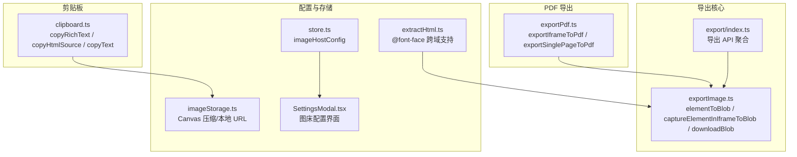
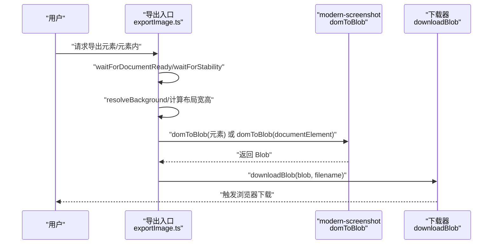
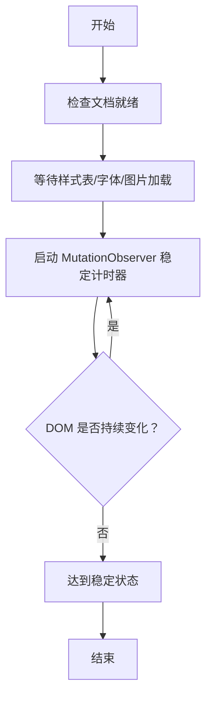
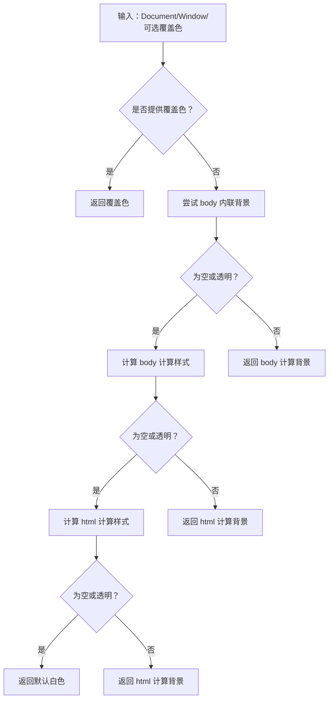
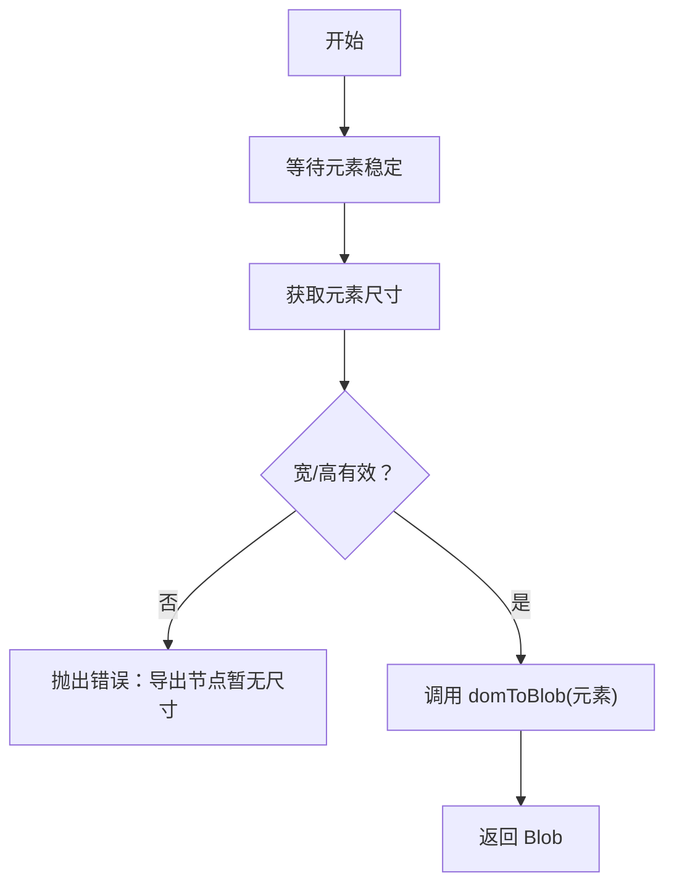
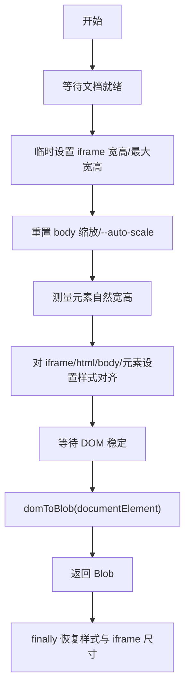
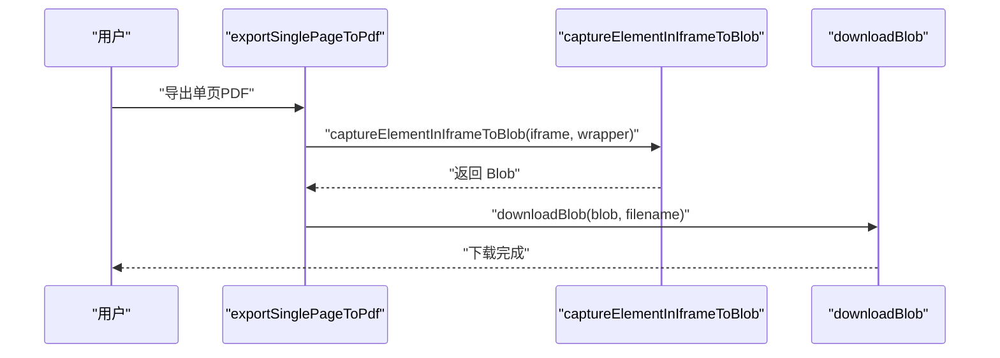
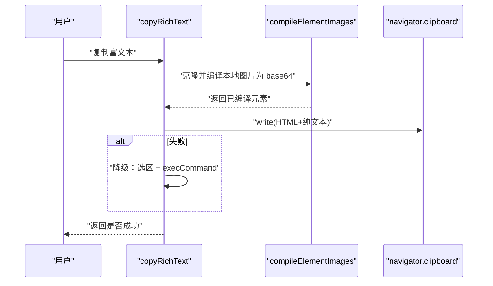
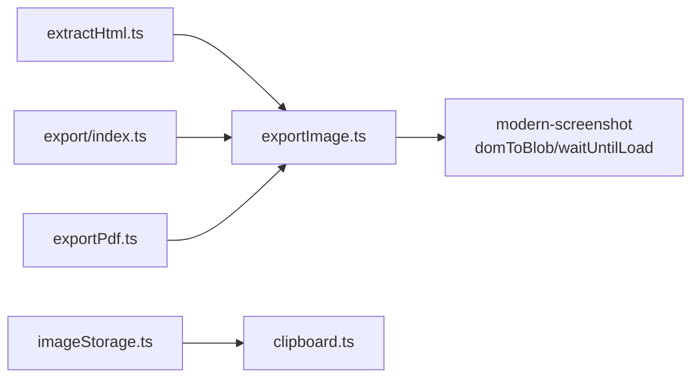

# 图片导出

<cite>
**本文引用的文件**
- [exportImage.ts](file://src/lib/exportImage.ts)
- [clipboard.ts](file://src/lib/clipboard.ts)
- [export/index.ts](file://src/lib/export/index.ts)
- [exportPdf.ts](file://src/lib/exportPdf.ts)
- [store.ts](file://src/lib/store.ts)
- [SettingsModal.tsx](file://src/components/editor/SettingsModal.tsx)
- [EditorToolbar.tsx](file://src/components/editor/EditorToolbar.tsx)
- [imageStorage.ts](file://src/lib/editor/imageStorage.ts)
- [extractHtml.ts](file://src/lib/extractHtml.ts)
</cite>

## 更新摘要
**所做更改**
- 移除了废弃的 iframeToBlob 和 downloadIframeAsImage 函数相关文档
- 更新了导出API文档，反映当前可用的函数接口
- 修正了许可证归属URL信息
- 更新了架构图和组件分析，移除了已删除的功能

## 目录
1. [简介](#简介)
2. [项目结构](#项目结构)
3. [核心组件](#核心组件)
4. [架构总览](#架构总览)
5. [详细组件分析](#详细组件分析)
6. [依赖关系分析](#依赖关系分析)
7. [性能考量](#性能考量)
8. [故障排除指南](#故障排除指南)
9. [结论](#结论)
10. [附录](#附录)

## 简介
本文件系统性阐述 markdown2view 的图片导出能力，重点围绕以下方面：
- 使用 modern-screenshot 库进行 DOM 元素捕获、Canvas 渲染与图像生成的技术细节
- 图片导出的质量控制机制：分辨率、压缩与格式选择（PNG/JPEG/WebP）
- 剪贴板集成：将图片复制到剪贴板的技术实现与浏览器兼容性处理
- 导出配置项详解：画布尺寸、背景色、透明度与质量参数
- 大图导出的内存优化策略与性能权衡
- 导出失败的故障排除与错误处理机制

## 项目结构
与图片导出相关的关键模块分布如下：
- 导出核心：exportImage.ts 提供元素截图、下载与元素内截图入口
- 剪贴板：clipboard.ts 提供富文本/HTML/文本复制能力
- 导出聚合：export/index.ts 汇总导出 API
- PDF 导出：exportPdf.ts 使用 captureElementInIframeToBlob 能力生成 PDF
- 存储与配置：store.ts 与 SettingsModal.tsx 管理图床配置
- 图片存储与压缩：imageStorage.ts 提供 Canvas 压缩与本地 URL 解析
- HTML 提取：extractHtml.ts 注入跨域支持以提升截图稳定性

**图表来源**
- [exportImage.ts:140-169](file://src/lib/exportImage.ts#L140-L169)
- [export/index.ts:1-3](file://src/lib/export/index.ts#L1-L3)
- [exportPdf.ts:21-89](file://src/lib/exportPdf.ts#L21-L89)
- [clipboard.ts:4-131](file://src/lib/clipboard.ts#L4-L131)
- [store.ts:41-52](file://src/lib/store.ts#L41-L52)
- [SettingsModal.tsx:11-52](file://src/components/editor/SettingsModal.tsx#L11-L52)
- [imageStorage.ts:76-120](file://src/lib/editor/imageStorage.ts#L76-L120)
- [extractHtml.ts:54-54](file://src/lib/extractHtml.ts#L54-L54)

**章节来源**
- [exportImage.ts:140-169](file://src/lib/exportImage.ts#L140-L169)
- [export/index.ts:1-3](file://src/lib/export/index.ts#L1-L3)
- [exportPdf.ts:21-89](file://src/lib/exportPdf.ts#L21-L89)
- [clipboard.ts:4-131](file://src/lib/clipboard.ts#L4-L131)
- [store.ts:41-52](file://src/lib/store.ts#L41-L52)
- [SettingsModal.tsx:11-52](file://src/components/editor/SettingsModal.tsx#L11-L52)
- [imageStorage.ts:76-120](file://src/lib/editor/imageStorage.ts#L76-L120)
- [extractHtml.ts:54-54](file://src/lib/extractHtml.ts#L54-L54)

## 核心组件
- 导出选项类型 ImageOpts：定义缩放比例、输出类型（PNG/JPEG/WebP）、背景色与最大高度
- DOM 就绪等待：waitForDocumentReady 与 waitForStability 确保字体、样式、图片加载完成并达到稳定
- 背景色解析：resolveBackground 优先使用显式背景色，否则从 body/html 计算，兜底白色
- 元素截图：elementToBlob 获取元素尺寸后截图
- 元素内截图：captureElementInIframeToBlob 通过临时样式对齐 iframe/html/body/目标元素，保证截图与元素尺寸一致
- 下载：downloadBlob 统一触发下载并释放对象 URL
- PDF 导出：exportIframeToPdf 和 exportSinglePageToPdf 使用 captureElementInIframeToBlob 生成 PDF

**章节来源**
- [exportImage.ts:16-21](file://src/lib/exportImage.ts#L16-L21)
- [exportImage.ts:61-117](file://src/lib/exportImage.ts#L61-L117)
- [exportImage.ts:119-138](file://src/lib/exportImage.ts#L119-L138)
- [exportImage.ts:140-158](file://src/lib/exportImage.ts#L140-L158)
- [exportImage.ts:183-318](file://src/lib/exportImage.ts#L183-L318)
- [exportImage.ts:160-169](file://src/lib/exportImage.ts#L160-L169)
- [exportPdf.ts:21-89](file://src/lib/exportPdf.ts#L21-L89)

## 架构总览
图片导出的整体流程：等待 DOM 稳定 → 计算布局尺寸 → 设置背景色与缩放 → 调用 modern-screenshot 的 domToBlob → 生成 Blob → 下载或进一步处理（PDF）。

**图表来源**
- [exportImage.ts:61-117](file://src/lib/exportImage.ts#L61-L117)
- [exportImage.ts:140-158](file://src/lib/exportImage.ts#L140-L158)
- [exportImage.ts:183-318](file://src/lib/exportImage.ts#L183-L318)
- [exportImage.ts:160-169](file://src/lib/exportImage.ts#L160-L169)

## 详细组件分析

### 组件A：DOM 就绪与稳定性检测
- waitForDocumentReady：等待文档 readyState 完成、样式表加载完成、字体可用、图片 decode 成功，并再次等待 DOM 变动稳定
- waitForStability：基于 MutationObserver 与帧渲染，持续监测 DOM 变化，超过阈值判定稳定
- 作用：避免截图时字体未加载、图片未解码、布局未稳定导致的失真或截断

**图表来源**
- [exportImage.ts:61-117](file://src/lib/exportImage.ts#L61-L117)
- [exportImage.ts:27-59](file://src/lib/exportImage.ts#L27-L59)

**章节来源**
- [exportImage.ts:61-117](file://src/lib/exportImage.ts#L61-L117)
- [exportImage.ts:27-59](file://src/lib/exportImage.ts#L27-L59)

### 组件B：背景色解析与透明度处理
- resolveBackground：按显式覆盖优先，其次内联样式，再计算 getComputedStyle，最后兜底白色
- 透明度策略：若显式透明或 rgba(0,0,0,0)，则不覆盖背景，交由浏览器默认背景色
- 影响：确保截图背景符合预期，避免 PNG/WebP 透明导致的视觉差异

**图表来源**
- [exportImage.ts:119-138](file://src/lib/exportImage.ts#L119-L138)

**章节来源**
- [exportImage.ts:119-138](file://src/lib/exportImage.ts#L119-L138)

### 组件C：元素截图（局部）
- 关键步骤：等待元素稳定，获取元素自然尺寸，调用 domToBlob
- 注意：元素无尺寸时抛错，需确保元素已渲染

**图表来源**
- [exportImage.ts:140-158](file://src/lib/exportImage.ts#L140-L158)

**章节来源**
- [exportImage.ts:140-158](file://src/lib/exportImage.ts#L140-L158)

### 组件D：元素内截图（精准裁切）
- 核心原理：临时重置缩放与自适应，将 iframe、html、body、目标元素全部对齐到元素自然尺寸，消除 margin/padding/flex 居中等干扰，再对 documentElement 截图
- 优势：截图与元素尺寸完全一致，保留全局样式与 CSS 变量
- 回滚：finally 中恢复所有临时样式

**图表来源**
- [exportImage.ts:183-318](file://src/lib/exportImage.ts#L183-L318)

**章节来源**
- [exportImage.ts:183-318](file://src/lib/exportImage.ts#L183-L318)

### 组件E：下载与PDF导出
- downloadBlob：统一触发下载并释放对象 URL
- exportIframeToPdf：将 iframe 中的多页内容导出为 PDF
- exportSinglePageToPdf：将 iframe 中的单页内容导出为 PDF

**图表来源**
- [exportPdf.ts:92-123](file://src/lib/exportPdf.ts#L92-L123)
- [exportImage.ts:160-169](file://src/lib/exportImage.ts#L160-L169)

**章节来源**
- [exportPdf.ts:21-89](file://src/lib/exportPdf.ts#L21-L89)
- [exportPdf.ts:92-123](file://src/lib/exportPdf.ts#L92-L123)
- [exportImage.ts:160-169](file://src/lib/exportImage.ts#L160-L169)

### 组件F：剪贴板集成
- copyText：优先使用 Clipboard API，失败时降级为 textarea + execCommand
- copyRichText：克隆元素，将本地图片（blob:/img://）编译为 base64，构造 HTML+纯文本 ClipboardItem，优先 Clipboard API，失败回退 execCommand
- copyHtmlSource：将元素内图片编译为 base64 后复制 HTML 源码

**图表来源**
- [clipboard.ts:64-100](file://src/lib/clipboard.ts#L64-L100)
- [clipboard.ts:32-61](file://src/lib/clipboard.ts#L32-L61)

**章节来源**
- [clipboard.ts:4-131](file://src/lib/clipboard.ts#L4-L131)

## 依赖关系分析
- 导出核心依赖 modern-screenshot 的 domToBlob 与 waitUntilLoad
- HTML 提取模块为 @font-face 注入跨域属性，提升字体嵌入成功率
- 图片存储模块提供 Canvas 压缩与本地 URL 解析，配合剪贴板将本地图片编译为 base64
- 导出聚合模块统一导出 API，便于上层组件调用

**图表来源**
- [exportImage.ts:7-7](file://src/lib/exportImage.ts#L7-L7)
- [exportPdf.ts:7-7](file://src/lib/exportPdf.ts#L7-L7)
- [extractHtml.ts:54-54](file://src/lib/extractHtml.ts#L54-L54)
- [imageStorage.ts:104-120](file://src/lib/editor/imageStorage.ts#L104-L120)
- [export/index.ts:1-1](file://src/lib/export/index.ts#L1-L1)

**章节来源**
- [exportImage.ts:7-7](file://src/lib/exportImage.ts#L7-L7)
- [exportPdf.ts:7-7](file://src/lib/exportPdf.ts#L7-L7)
- [extractHtml.ts:54-54](file://src/lib/extractHtml.ts#L54-L54)
- [imageStorage.ts:104-120](file://src/lib/editor/imageStorage.ts#L104-L120)
- [export/index.ts:1-1](file://src/lib/export/index.ts#L1-L1)

## 性能考量
- 缩放比例（scale）：默认 2，可按需调整；更高缩放带来更清晰图像但显著增加内存占用与生成时间
- 最大高度（maxHeight）：默认安全上限约为 16000/scale，避免超大图导致内存溢出
- 跨域字体与资源：extractHtml.ts 注入跨域属性，减少截图失败与重复网络请求
- 缓存策略：modern-screenshot 的 fetch.cache 设为 force-cache，降低重复资源加载
- 大图优化建议：
  - 优先使用元素内截图，避免一次性渲染整页
  - 适当降低 scale 或分段导出
  - 使用 WebP（若目标平台支持）以获得更好压缩比
  - 导出后及时释放对象 URL，避免内存泄漏

## 故障排除指南
- 截图失败（空 Blob）
  - 检查元素是否可见且有尺寸（元素截图）
  - 确认 iframe 已就绪、内容已渲染（元素内截图）
  - 等待字体/图片/样式表加载完成（waitForDocumentReady）
  - 减小 scale 或设置 maxHeight 以避免内存不足
- 背景异常
  - 显式指定 backgroundColor 覆盖 resolveBackground 的默认行为
  - 若需要透明背景，确保输出类型为 PNG/WebP（JPEG 不支持透明）
- 剪贴板失败
  - 浏览器可能阻止非 HTTPS 或非用户手势触发的剪贴板访问
  - 降级路径：使用 textarea + execCommand
- 图床与本地图片
  - 本地图片为虚拟链接，复制 HTML 到某些平台可能导致图片失效
  - 建议配置图床（SM.MS、OSS、COS）或使用 Canvas 压缩后 base64 内联

**章节来源**
- [exportImage.ts:140-158](file://src/lib/exportImage.ts#L140-L158)
- [exportImage.ts:183-318](file://src/lib/exportImage.ts#L183-L318)
- [exportImage.ts:119-138](file://src/lib/exportImage.ts#L119-L138)
- [clipboard.ts:4-27](file://src/lib/clipboard.ts#L4-L27)
- [SettingsModal.tsx:100-109](file://src/components/editor/SettingsModal.tsx#L100-L109)

## 结论
本项目通过 modern-screenshot 实现了稳定、高质量的图片导出能力，结合完善的 DOM 就绪与稳定性检测、背景色解析、元素内精准裁切与统一下载机制，覆盖了从局部到整页、从静态到长图、从本地到云端的多种导出需求。配合剪贴板与图床配置，用户可在不同平台与场景下高效完成内容分享与归档。

## 附录

### 图片导出配置选项说明
- scale：缩放比例，默认 2，越大越清晰但内存与耗时越高
- type：输出类型，默认 PNG，可选 JPEG/WebP
- backgroundColor：背景色覆盖，默认从页面解析，透明将保持透明
- maxHeight：最大高度（像素），受 scale 影响的安全上限

**章节来源**
- [exportImage.ts:16-21](file://src/lib/exportImage.ts#L16-L21)
- [exportImage.ts:176-178](file://src/lib/exportImage.ts#L176-L178)