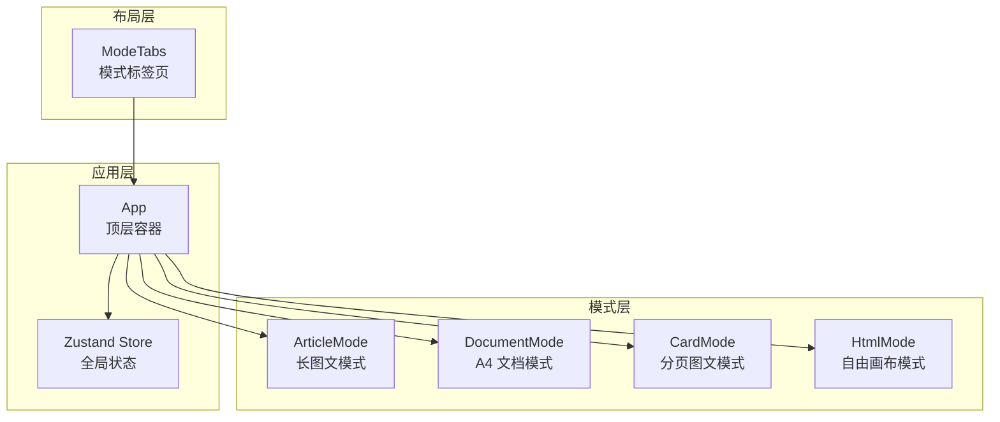
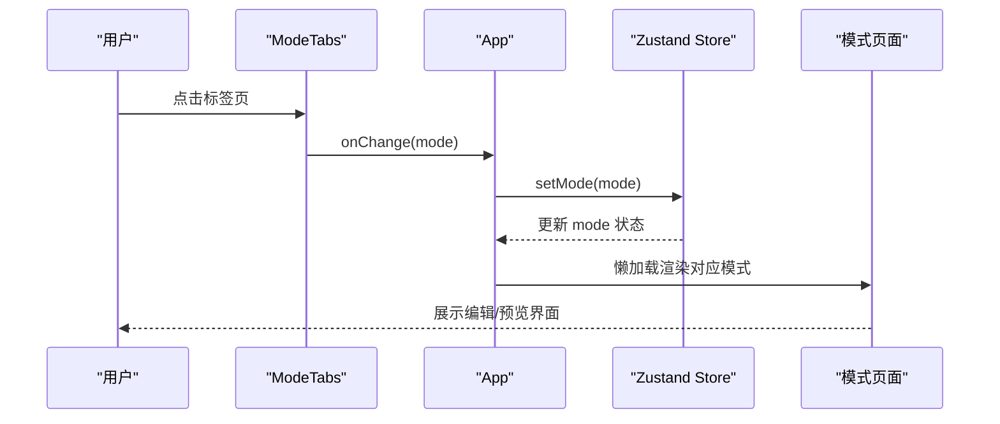
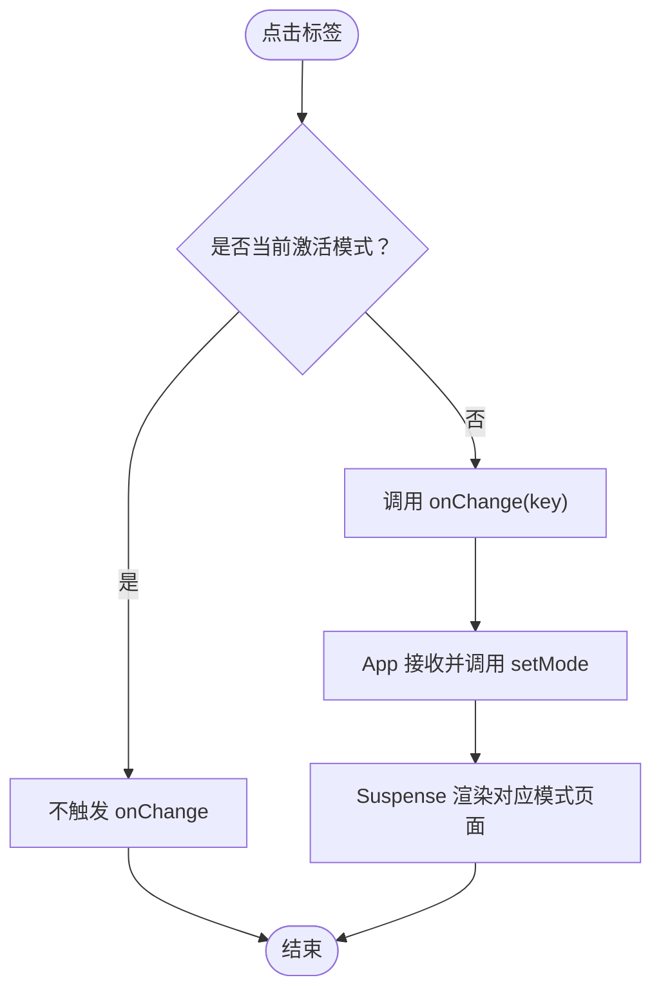
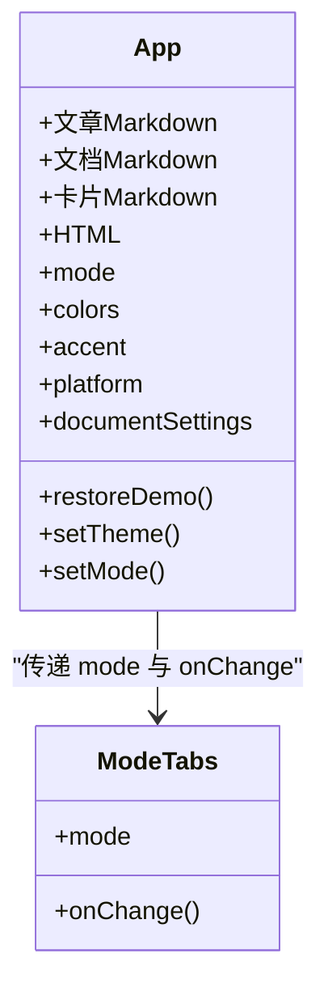
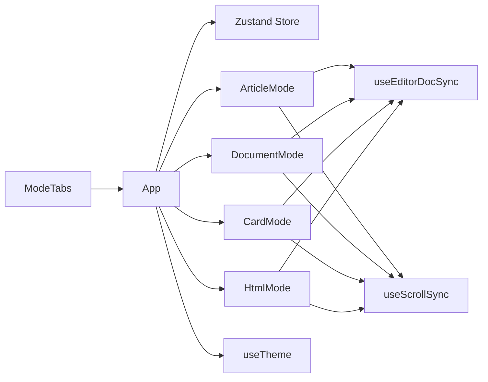

# 布局组件

<cite>
**本文引用的文件**
- [ModeTabs.tsx](file://src/components/layout/ModeTabs.tsx)
- [App.tsx](file://src/App.tsx)
- [store.ts](file://src/lib/store.ts)
- [useTheme.ts](file://src/engine/composables/useTheme.ts)
- [index.css](file://src/index.css)
- [ArticleMode.tsx](file://src/modes/article/ArticleMode.tsx)
- [CardMode.tsx](file://src/modes/card/CardMode.tsx)
- [DocumentMode.tsx](file://src/modes/document/DocumentMode.tsx)
- [HtmlMode.tsx](file://src/modes/html/HtmlMode.tsx)
- [useEditorDocSync.ts](file://src/lib/useEditorDocSync.ts)
- [useScrollSync.ts](file://src/lib/useScrollSync.ts)
- [Button.tsx](file://src/components/ui/Button.tsx)
</cite>

## 目录
1. [简介](#简介)
2. [项目结构](#项目结构)
3. [核心组件](#核心组件)
4. [架构总览](#架构总览)
5. [详细组件分析](#详细组件分析)
6. [依赖关系分析](#依赖关系分析)
7. [性能考量](#性能考量)
8. [故障排查指南](#故障排查指南)
9. [结论](#结论)
10. [附录](#附录)

## 简介
本文件聚焦于布局组件，特别是 ModeTabs 标签页组件的设计与实现，系统阐述其在应用架构中的作用、标签页切换逻辑、状态管理与用户体验优化策略，并扩展到整体布局体系在响应式设计与屏幕适配方面的实践。同时给出配置选项、自定义能力与使用示例，帮助开发者在不同场景下正确配置与集成这些组件。

## 项目结构
布局组件位于 src/components/layout 目录，ModeTabs 是顶层导航中的模式切换入口，配合全局状态管理与各模式页面共同构成工作台的整体布局。

图表来源
- [ModeTabs.tsx:15-41](file://src/components/layout/ModeTabs.tsx#L15-L41)
- [App.tsx:35-171](file://src/App.tsx#L35-L171)
- [store.ts:54-92](file://src/lib/store.ts#L54-L92)

章节来源
- [ModeTabs.tsx:1-42](file://src/components/layout/ModeTabs.tsx#L1-L42)
- [App.tsx:1-172](file://src/App.tsx#L1-L172)
- [store.ts:1-242](file://src/lib/store.ts#L1-L242)

## 核心组件
- ModeTabs：提供四种渲染模式的标签页切换，负责 UI 展示与回调触发。
- App：顶层容器，聚合状态、主题、模式切换与各模式页面懒加载渲染。
- Zustand Store：集中管理文章、文档、卡片、HTML 的内容与模式、平台、字体、主题等状态。
- 各模式页面：ArticleMode、DocumentMode、CardMode、HtmlMode，分别承载对应模式的编辑与预览体验。

章节来源
- [ModeTabs.tsx:15-41](file://src/components/layout/ModeTabs.tsx#L15-L41)
- [App.tsx:35-171](file://src/App.tsx#L35-L171)
- [store.ts:54-92](file://src/lib/store.ts#L54-L92)

## 架构总览
ModeTabs 通过 onChange 回调与 App 的 setMode 联动，驱动全局 mode 状态变化，从而触发 Suspense 包裹下的模式页面懒加载渲染。全局状态由 Zustand 提供，主题通过 CSS 变量注入，模式切换时自动更新。

图表来源
- [ModeTabs.tsx:15-41](file://src/components/layout/ModeTabs.tsx#L15-L41)
- [App.tsx:35-171](file://src/App.tsx#L35-L171)
- [store.ts:215-220](file://src/lib/store.ts#L215-L220)

## 详细组件分析

### ModeTabs 组件分析
- 设计目标：简洁直观地在四种渲染模式间切换，提供即时反馈与视觉强调。
- 数据结构：MODES 数组定义可用模式及其标签文本，类型安全通过 RenderMode 约束。
- 切换逻辑：onClick 触发 onChange(m.key)，App 通过 setMode 更新全局状态。
- 状态管理：根据当前 mode 与项 key 比较决定激活态样式，激活态使用 CSS 变量 --accent 实现主题色。
- 用户体验：圆角背景、悬停态渐变、过渡动画、标题提示，提升可发现性与交互愉悦度。

图表来源
- [ModeTabs.tsx:15-41](file://src/components/layout/ModeTabs.tsx#L15-L41)
- [App.tsx:90](file://src/App.tsx#L90)

章节来源
- [ModeTabs.tsx:1-42](file://src/components/layout/ModeTabs.tsx#L1-L42)
- [store.ts:10](file://src/lib/store.ts#L10)

### App 容器与模式调度
- 顶层布局：header + 主体区域，header 中包含 Logo、ModeTabs、主题切换与操作按钮。
- 模式调度：根据 mode 条件渲染对应模式组件，使用 Suspense 提升首屏体验。
- 状态聚合：从 store 获取/更新文章、文档、卡片、HTML 的内容与设置，以及主题、平台、字体等。
- 主题切换：遍历预设主题，点击后通过 setTheme 更新 CSS 变量与颜色集。
- 示例恢复：提供恢复当前模式示例内容的能力，结合 syncDemoContent 与 restoreDemo。

图表来源
- [App.tsx:35-171](file://src/App.tsx#L35-L171)
- [ModeTabs.tsx:15-41](file://src/components/layout/ModeTabs.tsx#L15-L41)

章节来源
- [App.tsx:35-171](file://src/App.tsx#L35-L171)

### 各模式页面的布局与交互
- ArticleMode：双栏布局（编辑器 + 预览），使用 useScrollSync 保持滚动同步，useEditorDocSync 实现双向同步与去抖回写。
- DocumentMode：双栏布局，支持页眉页脚、字体家族与字号缩放、标题居中与段落首行缩进等排版设置，动态测量块高并分页渲染。
- CardMode：双栏布局，支持小红书平台、比例选择、字体选择、封面与内容页导出、复制文案与 AI 指令。
- HtmlMode：双栏布局，支持多页检测与翻页、自动缩放、脚本允许开关、高保真导出（PNG/PDF）、Prompt 指令库。

章节来源
- [ArticleMode.tsx:16-54](file://src/modes/article/ArticleMode.tsx#L16-L54)
- [DocumentMode.tsx:34-344](file://src/modes/document/DocumentMode.tsx#L34-L344)
- [CardMode.tsx:44-363](file://src/modes/card/CardMode.tsx#L44-L363)
- [HtmlMode.tsx:92-578](file://src/modes/html/HtmlMode.tsx#L92-L578)

### 状态管理与主题系统
- RenderMode 类型约束四种模式，mode 状态驱动页面渲染与输入类型切换。
- 主题系统：THEMES 提供预设主题，setTheme 更新 CSS 变量 --accent 与 --accent-dark，并计算颜色集。
- CSS 变量：:root 注入主题变量，组件通过 var(--accent) 应用主色，Button、Logo 等使用该变量实现主题一致。

章节来源
- [store.ts:10](file://src/lib/store.ts#L10)
- [store.ts:227-230](file://src/lib/store.ts#L227-L230)
- [useTheme.ts:13-29](file://src/engine/composables/useTheme.ts#L13-L29)
- [index.css:3-7](file://src/index.css#L3-L7)
- [Button.tsx:13](file://src/components/ui/Button.tsx#L13)

### 响应式设计与屏幕适配
- 布局网格：使用 Tailwind 的 grid 与 min-h-0/flex-1 实现自适应高度与分栏。
- 滚动同步：useScrollSync 在编辑器与预览之间按比例联动，避免相互拉扯。
- HtmlMode 自适应：基于内容尺寸与容器尺寸计算缩放，支持多页模式与单页模式的不同处理。
- 打印样式：index.css 提供 @media print，隐藏非打印元素，A4 页面尺寸与分页断开，保证导出 PDF 的一致性。

章节来源
- [ArticleMode.tsx:33-52](file://src/modes/article/ArticleMode.tsx#L33-L52)
- [DocumentMode.tsx:164-342](file://src/modes/document/DocumentMode.tsx#L164-L342)
- [CardMode.tsx:227-361](file://src/modes/card/CardMode.tsx#L227-L361)
- [HtmlMode.tsx:252-344](file://src/modes/html/HtmlMode.tsx#L252-L344)
- [index.css:245-287](file://src/index.css#L245-L287)

### 配置选项与自定义能力
- ModeTabs
  - 可扩展模式列表：通过 MODES 数组添加新模式，需确保 RenderMode 类型覆盖。
  - 样式定制：通过类名与 CSS 变量控制激活态与悬停态。
- App
  - 主题切换：THEMES 预设主题，setTheme 动态更新 CSS 变量。
  - 平台与字体：mode 切换时自动设置 platform 与默认字体。
  - 示例内容：syncDemoContent 与 restoreDemo 控制示例注入与恢复。
- 各模式页面
  - ArticleMode：编辑器与预览的滚动同步与去抖同步。
  - DocumentMode：页眉页脚、字体家族、字号缩放、标题居中、段落首行缩进、PDF 导出。
  - CardMode：比例选择、字体选择、封面与内容页导出、复制文案与 AI 指令。
  - HtmlMode：多页检测与翻页、自动缩放、脚本允许、高保真导出、Prompt 指令库。

章节来源
- [ModeTabs.tsx:8-13](file://src/components/layout/ModeTabs.tsx#L8-L13)
- [App.tsx:117-130](file://src/App.tsx#L117-L130)
- [store.ts:215-220](file://src/lib/store.ts#L215-L220)
- [DocumentMode.tsx:178-246](file://src/modes/document/DocumentMode.tsx#L178-L246)
- [CardMode.tsx:242-281](file://src/modes/card/CardMode.tsx#L242-L281)
- [HtmlMode.tsx:465-536](file://src/modes/html/HtmlMode.tsx#L465-L536)

## 依赖关系分析
- ModeTabs 依赖全局状态中的 mode 与 setMode，通过 onChange 回调与 App 解耦。
- App 依赖 Zustand Store 提供的状态与方法，懒加载模式页面，使用 Suspense 提升体验。
- 各模式页面共享通用工具：useEditorDocSync（双向同步与去抖）、useScrollSync（滚动联动）。
- 主题系统独立于模式，通过 CSS 变量与 store 方法统一管理。

图表来源
- [ModeTabs.tsx:15-41](file://src/components/layout/ModeTabs.tsx#L15-L41)
- [App.tsx:35-171](file://src/App.tsx#L35-L171)
- [useEditorDocSync.ts:20-49](file://src/lib/useEditorDocSync.ts#L20-L49)
- [useScrollSync.ts:7-67](file://src/lib/useScrollSync.ts#L7-L67)
- [useTheme.ts:13-29](file://src/engine/composables/useTheme.ts#L13-L29)

章节来源
- [useEditorDocSync.ts:1-50](file://src/lib/useEditorDocSync.ts#L1-L50)
- [useScrollSync.ts:1-68](file://src/lib/useScrollSync.ts#L1-L68)

## 性能考量
- 懒加载与 Suspense：App 使用 Suspense 包裹模式页面，减少首屏负载，提升交互流畅度。
- 去抖同步：useEditorDocSync 对编辑器输入进行去抖回写，降低频繁写入与渲染压力。
- 滚动同步优化：useScrollSync 采用“主导方”策略，避免相互拉扯与事件风暴。
- 自适应缩放：HtmlMode 在 ResizeObserver 与字体加载完成后稳定缩放，减少反复计算。
- 打印样式：index.css 的 @media print 使 PDF 导出无需额外 DOM，提高效率。

章节来源
- [App.tsx:135-165](file://src/App.tsx#L135-L165)
- [useEditorDocSync.ts:38-46](file://src/lib/useEditorDocSync.ts#L38-L46)
- [useScrollSync.ts:12-66](file://src/lib/useScrollSync.ts#L12-L66)
- [HtmlMode.tsx:302-344](file://src/modes/html/HtmlMode.tsx#L302-L344)
- [index.css:245-287](file://src/index.css#L245-L287)

## 故障排查指南
- 模式切换无效
  - 检查 ModeTabs 的 onChange 是否正确传递给 App 的 setMode。
  - 确认 mode 状态是否更新，以及 App 的条件渲染逻辑。
- 预览不随编辑器滚动
  - 确认 useScrollSync 的两个容器引用是否正确，依赖数组是否包含 editorReady。
- 编辑器内容未同步
  - 检查 useEditorDocSync 的去抖延迟与 externalVersion 递增时机。
- 主题色不生效
  - 确认 setTheme 是否调用 applyCssVars，CSS 变量是否在 :root 注入。
- HtmlMode 多页翻页异常
  - 检查 detectPages 结果与 currentPage 状态，确认多页节点显示/隐藏逻辑。
- 导出失败
  - 检查 iframe 内容是否加载完成，withScaleReset 是否正确恢复缩放与 zoom。

章节来源
- [ModeTabs.tsx:15-41](file://src/components/layout/ModeTabs.tsx#L15-L41)
- [useScrollSync.ts:12-66](file://src/lib/useScrollSync.ts#L12-L66)
- [useEditorDocSync.ts:30-46](file://src/lib/useEditorDocSync.ts#L30-L46)
- [store.ts:227-230](file://src/lib/store.ts#L227-L230)
- [HtmlMode.tsx:115-165](file://src/modes/html/HtmlMode.tsx#L115-L165)

## 结论
ModeTabs 作为顶层导航的核心组件，通过简洁的 UI 与明确的回调机制，将用户意图转化为全局状态变更，进而驱动各模式页面的懒加载渲染。配合 Zustand 状态管理、主题系统与通用工具（去抖同步、滚动同步、自适应缩放），布局组件在功能完整性、性能与用户体验方面实现了良好平衡。建议在扩展新模式时遵循现有模式的结构与命名约定，确保一致的交互与可维护性。

## 附录

### 使用示例与集成指南
- 在 App 中引入 ModeTabs 并绑定 mode 与 setMode
  - 位置参考：[App.tsx:90](file://src/App.tsx#L90)
- 在 ModeTabs 中扩展模式
  - 修改 MODES 数组并确保 RenderMode 类型覆盖
  - 参考：[ModeTabs.tsx:8-13](file://src/components/layout/ModeTabs.tsx#L8-L13)
- 在各模式页面中集成同步与滚动
  - 使用 useEditorDocSync 与 useScrollSync
  - 参考：[ArticleMode.tsx:18-30](file://src/modes/article/ArticleMode.tsx#L18-L30)
- 主题切换集成
  - 使用 THEMES 遍历按钮，点击后调用 setTheme
  - 参考：[App.tsx:117-130](file://src/App.tsx#L117-L130)
- 响应式与屏幕适配
  - HtmlMode 的自动缩放与多页翻页
  - 参考：[HtmlMode.tsx:252-344](file://src/modes/html/HtmlMode.tsx#L252-L344)