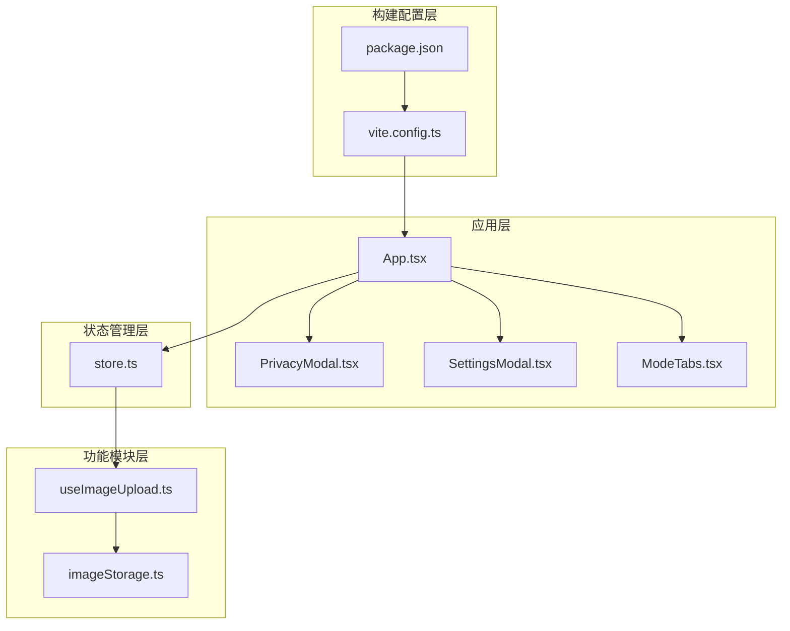
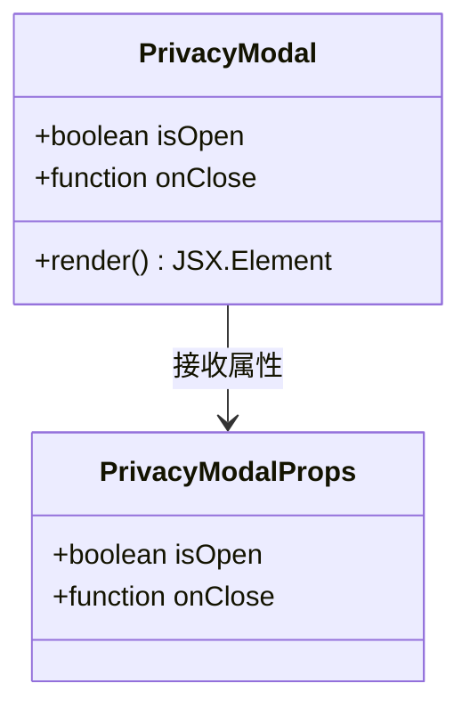
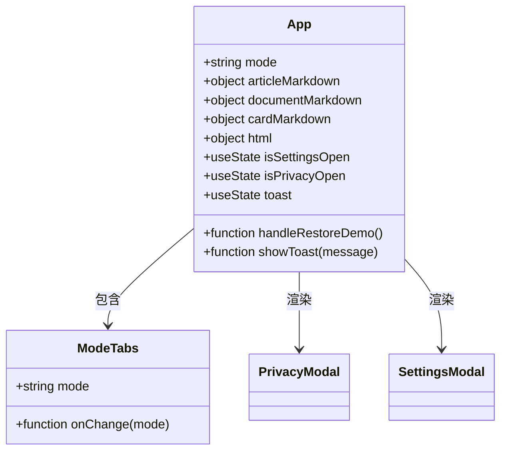
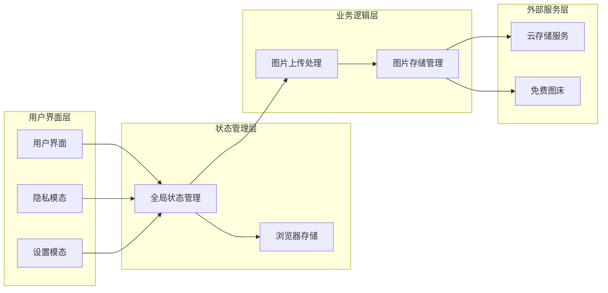
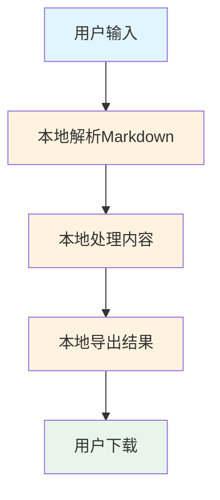
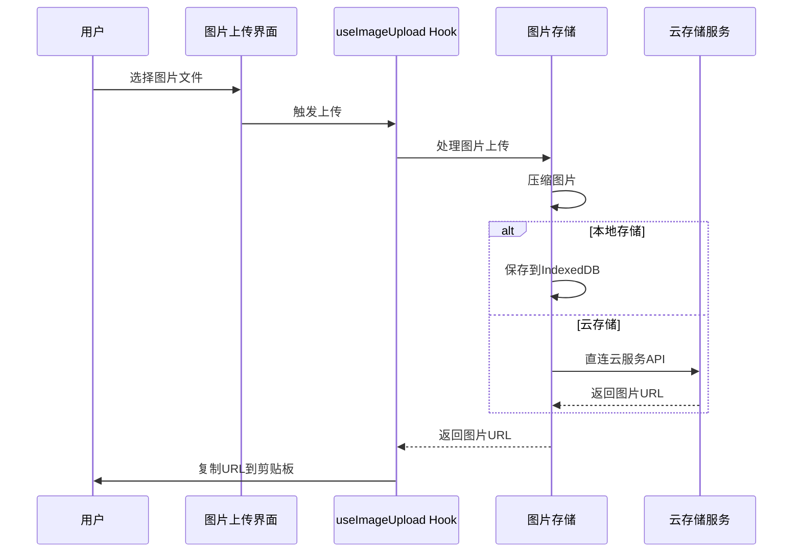
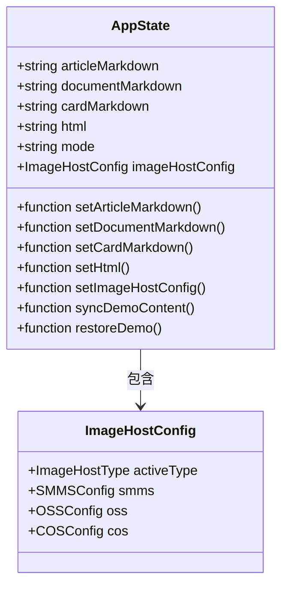
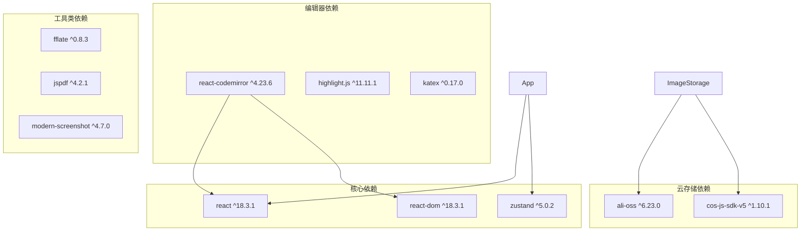

# 隐私模态系统

<cite>
**本文档引用的文件**
- [PrivacyModal.tsx](file://src/components/layout/PrivacyModal.tsx)
- [App.tsx](file://src/App.tsx)
- [store.ts](file://src/lib/store.ts)
- [SettingsModal.tsx](file://src/components/editor/SettingsModal.tsx)
- [useImageUpload.ts](file://src/lib/useImageUpload.ts)
- [imageStorage.ts](file://src/lib/editor/imageStorage.ts)
- [ModeTabs.tsx](file://src/components/layout/ModeTabs.tsx)
- [main.tsx](file://src/main.tsx)
- [package.json](file://package.json)
- [vite.config.ts](file://vite.config.ts)
</cite>

## 目录
1. [简介](#简介)
2. [项目结构](#项目结构)
3. [核心组件](#核心组件)
4. [架构概览](#架构概览)
5. [详细组件分析](#详细组件分析)
6. [依赖关系分析](#依赖关系分析)
7. [性能考虑](#性能考虑)
8. [故障排除指南](#故障排除指南)
9. [结论](#结论)

## 简介

隐私模态系统是一个专注于数据隐私保护的纯前端应用程序，旨在为用户提供完全透明、安全独立的数据处理服务。该系统的核心特点包括：

- **纯前端运行**：所有数据处理都在用户本地浏览器中完成，无需任何服务器参与
- **本地持久化**：使用浏览器的localStorage和IndexedDB进行数据存储
- **直连云服务**：支持直接连接各种云存储服务，拒绝中间转接
- **100%离线可用**：开源项目，可在离线环境下完全运行

该系统提供了多种内容创作模式，包括长图文、A4文档、小红书卡片和自由画布模式，同时确保用户数据的绝对安全。

## 项目结构

项目采用模块化的React架构设计，主要分为以下几个层次：

**图表来源**
- [App.tsx:48-312](file://src/App.tsx#L48-L312)
- [store.ts:186-307](file://src/lib/store.ts#L186-L307)
- [vite.config.ts:1-39](file://vite.config.ts#L1-L39)

**章节来源**
- [App.tsx:1-312](file://src/App.tsx#L1-L312)
- [main.tsx:1-12](file://src/main.tsx#L1-L12)
- [vite.config.ts:1-39](file://vite.config.ts#L1-L39)

## 核心组件

### 隐私模态组件

隐私模态组件是整个系统隐私保护理念的核心体现，它提供了完整的隐私声明和数据处理说明。

**图表来源**
- [PrivacyModal.tsx:3-85](file://src/components/layout/PrivacyModal.tsx#L3-L85)

### 应用主组件

App组件作为整个应用的入口点，负责协调各个子组件的工作。

**图表来源**
- [App.tsx:48-312](file://src/App.tsx#L48-L312)
- [ModeTabs.tsx:15-42](file://src/components/layout/ModeTabs.tsx#L15-L42)

**章节来源**
- [PrivacyModal.tsx:1-85](file://src/components/layout/PrivacyModal.tsx#L1-L85)
- [App.tsx:48-312](file://src/App.tsx#L48-L312)

## 架构概览

系统采用纯前端架构，所有数据处理都在客户端完成，确保用户隐私安全。

**图表来源**
- [store.ts:186-307](file://src/lib/store.ts#L186-L307)
- [useImageUpload.ts:1-42](file://src/lib/useImageUpload.ts#L1-L42)
- [SettingsModal.tsx:1-201](file://src/components/editor/SettingsModal.tsx#L1-L201)

## 详细组件分析

### 隐私保护机制

系统通过以下机制确保用户数据的隐私安全：

#### 1. 纯前端数据处理

**图表来源**
- [PrivacyModal.tsx:36-40](file://src/components/layout/PrivacyModal.tsx#L36-L40)

#### 2. 本地存储策略

系统使用多种本地存储方式来确保数据的安全性和可用性：

| 存储类型 | 存储位置 | 数据内容 | 安全级别 |
|---------|----------|----------|----------|
| localStorage | 浏览器本地存储 | 配置信息、主题设置、编辑状态 | 中等 |
| IndexedDB | 浏览器数据库 | 图片资源、大型数据 | 高 |
| SessionStorage | 会话存储 | 临时数据、会话信息 | 低 |

**章节来源**
- [PrivacyModal.tsx:46-60](file://src/components/layout/PrivacyModal.tsx#L46-L60)
- [store.ts:124-179](file://src/lib/store.ts#L124-L179)

### 图片上传与存储系统

系统提供了灵活的图片上传解决方案，支持多种存储方式：

**图表来源**
- [useImageUpload.ts:16-32](file://src/lib/useImageUpload.ts#L16-L32)
- [imageStorage.ts:25-53](file://src/lib/editor/imageStorage.ts#L25-L53)

#### 图片存储策略

系统支持四种图片存储方式：

1. **本地IndexedDB模式**：最安全的存储方式，图片完全保存在本地
2. **免费图床(SMMS)**：无需配置，直接使用免费服务
3. **阿里云OSS**：企业级云存储服务
4. **腾讯云COS**：企业级云存储服务

**章节来源**
- [SettingsModal.tsx:101-111](file://src/components/editor/SettingsModal.tsx#L101-L111)
- [SettingsModal.tsx:132-181](file://src/components/editor/SettingsModal.tsx#L132-L181)

### 全局状态管理系统

系统使用Zustand进行状态管理，实现了数据的持久化存储：

**图表来源**
- [store.ts:72-115](file://src/lib/store.ts#L72-L115)
- [store.ts:61-71](file://src/lib/store.ts#L61-L71)

**章节来源**
- [store.ts:186-307](file://src/lib/store.ts#L186-L307)

## 依赖关系分析

系统的主要依赖关系如下：

**图表来源**
- [package.json:13-31](file://package.json#L13-L31)

**章节来源**
- [package.json:13-31](file://package.json#L13-L31)
- [vite.config.ts:16-33](file://vite.config.ts#L16-L33)

## 性能考虑

### 代码分割与懒加载

系统采用了多种性能优化策略：

1. **代码分割**：通过Vite的自动代码分割功能，将不同模块分离打包
2. **懒加载**：模式组件使用React.lazy实现按需加载
3. **CDN优化**：第三方库通过CDN加载，减少包体积

### 存储性能优化

1. **IndexedDB异步操作**：所有数据库操作都是异步的，避免阻塞主线程
2. **图片压缩**：自动压缩图片大小，减少存储空间占用
3. **缓存策略**：合理使用浏览器缓存机制

## 故障排除指南

### 常见问题及解决方案

#### 1. 隐私模态无法显示

**问题描述**：用户无法看到隐私说明弹窗

**可能原因**：
- JavaScript被禁用
- CSS样式加载失败
- 组件状态异常

**解决方法**：
1. 检查浏览器JavaScript是否启用
2. 确认网络连接正常
3. 刷新页面重试

#### 2. 图片上传失败

**问题描述**：图片上传到云存储失败

**可能原因**：
- 网络连接不稳定
- 云存储配置错误
- 文件格式不支持

**解决方法**：
1. 检查网络连接
2. 重新配置云存储参数
3. 尝试其他存储方式

#### 3. 数据丢失问题

**问题描述**：用户发现编辑内容丢失

**可能原因**：
- 浏览器缓存被清理
- 存储空间不足
- 浏览器兼容性问题

**解决方法**：
1. 检查浏览器存储权限
2. 清理不必要的缓存数据
3. 更换兼容性更好的浏览器

**章节来源**
- [PrivacyModal.tsx:8-10](file://src/components/layout/PrivacyModal.tsx#L8-L10)
- [SettingsModal.tsx:183-190](file://src/components/editor/SettingsModal.tsx#L183-L190)

## 结论

隐私模态系统通过其独特的设计理念和技术实现，为用户提供了真正意义上的隐私保护。系统的核心优势包括：

1. **完全本地化**：所有数据处理都在用户本地完成，无需服务器参与
2. **多重存储策略**：提供灵活的存储方案，满足不同用户需求
3. **透明化设计**：清晰的隐私声明和数据处理说明
4. **高性能实现**：优化的代码结构和存储策略

该系统特别适合对数据隐私有严格要求的用户，无论是个人用户还是企业用户，都能在保证数据安全的前提下享受高质量的内容创作体验。

通过持续的技术创新和用户体验优化，隐私模态系统将继续为数字时代的数据隐私保护做出贡献。