# 编辑模式系统

<cite>
**本文档引用的文件**
- [App.tsx](file://src/App.tsx)
- [ModeTabs.tsx](file://src/components/layout/ModeTabs.tsx)
- [ArticleMode.tsx](file://src/modes/article/ArticleMode.tsx)
- [ArticlePreview.tsx](file://src/modes/article/ArticlePreview.tsx)
- [DocumentMode.tsx](file://src/modes/document/DocumentMode.tsx)
- [documentModel.ts](file://src/modes/document/documentModel.ts)
- [documentStyles.ts](file://src/modes/document/documentStyles.ts)
- [CardMode.tsx](file://src/modes/card/CardMode.tsx)
- [cardModel.ts](file://src/modes/card/cardModel.ts)
- [HtmlMode.tsx](file://src/modes/html/HtmlMode.tsx)
- [store.ts](file://src/lib/store.ts)
- [markdown.ts](file://src/lib/render/markdown.ts)
- [engine/index.ts](file://src/engine/index.ts)
- [package.json](file://package.json)
- [aiGuide.ts](file://src/lib/aiGuide.ts)
- [demoHtml.ts](file://src/data/demoHtml.ts)
</cite>

## 目录
1. [简介](#简介)
2. [项目结构](#项目结构)
3. [核心组件](#核心组件)
4. [架构概览](#架构概览)
5. [详细组件分析](#详细组件分析)
6. [依赖关系分析](#依赖关系分析)
7. [性能考虑](#性能考虑)
8. [故障排除指南](#故障排除指南)
9. [结论](#结论)
10. [附录](#附录)

## 简介

Markdown2View 是一个功能强大的多模式编辑器系统，专注于将 Markdown 内容转换为多种格式的可视化呈现。该系统提供了四种核心编辑模式，每种模式都针对特定的使用场景进行了精心设计和优化。

系统的核心设计理念是"模式即视图"，通过统一的渲染引擎和状态管理系统，实现了四种不同编辑模式之间的无缝切换和数据共享。每个模式都有其独特的功能特性和优化策略，从长图文的阅读体验优化到A4文档的专业分页渲染，再到小红书卡片的社交媒体适配，以及HTML可视化模式的自由创作能力。

## 项目结构

项目采用模块化的组织方式，按照功能域进行划分：

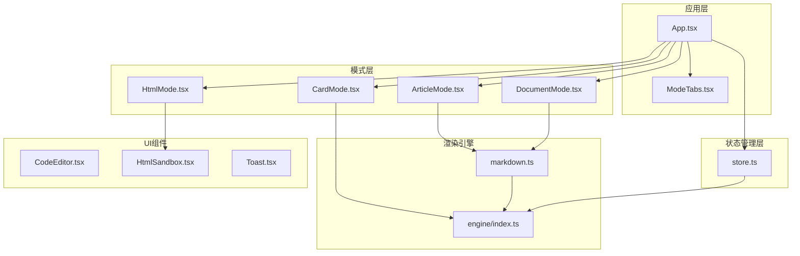

**图表来源**
- [App.tsx:1-172](file://src/App.tsx#L1-L172)
- [store.ts:1-242](file://src/lib/store.ts#L1-L242)

**章节来源**
- [App.tsx:1-172](file://src/App.tsx#L1-L172)
- [package.json:1-52](file://package.json#L1-L52)

## 核心组件

系统的核心组件围绕四个主要编辑模式构建，每个模式都包含编辑器、预览器和专用的功能模块：

### 模式类型定义

系统定义了四种渲染模式：
- **article**: 长图文模式，专注于阅读体验优化
- **document**: A4文档模式，支持专业分页渲染
- **card**: 分页图文模式，适配社交媒体平台
- **html**: 自由画布模式，提供HTML可视化编辑

### 状态管理架构

系统采用Zustand状态管理库，实现了全局状态的集中管理和持久化存储：

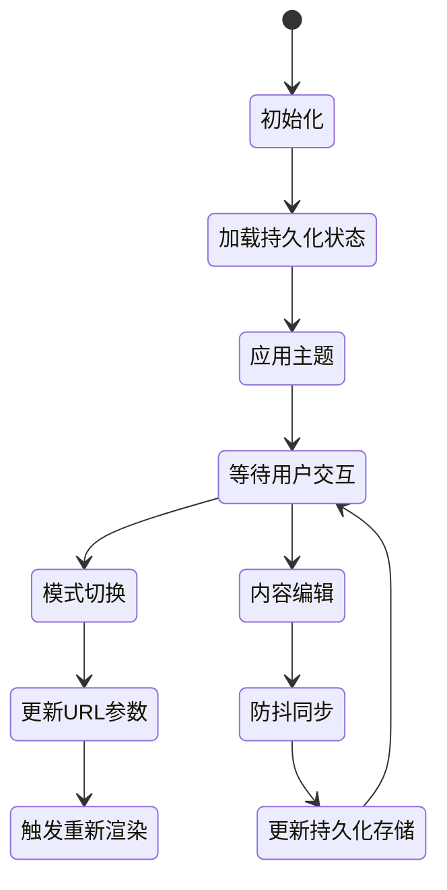

**图表来源**
- [store.ts:163-242](file://src/lib/store.ts#L163-L242)

**章节来源**
- [store.ts:10-92](file://src/lib/store.ts#L10-L92)

## 架构概览

系统采用分层架构设计，确保各层职责明确、耦合度低：

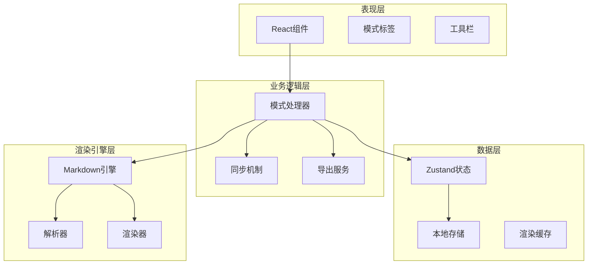

**图表来源**
- [App.tsx:35-172](file://src/App.tsx#L35-L172)
- [store.ts:163-242](file://src/lib/store.ts#L163-L242)

## 详细组件分析

### 长图文模式 (ArticleMode)

长图文模式专为微信公众号等平台的长文章阅读体验而设计：

#### 核心特性
- **双栏布局**: 左侧代码编辑器，右侧预览区域
- **滚动同步**: 实现编辑器与预览区域的平滑滚动联动
- **字体定制**: 支持多种中文字体选择
- **内容导出**: 提供长图导出功能
- **AI指令**: 内置长图文排版指令

#### 数据流设计

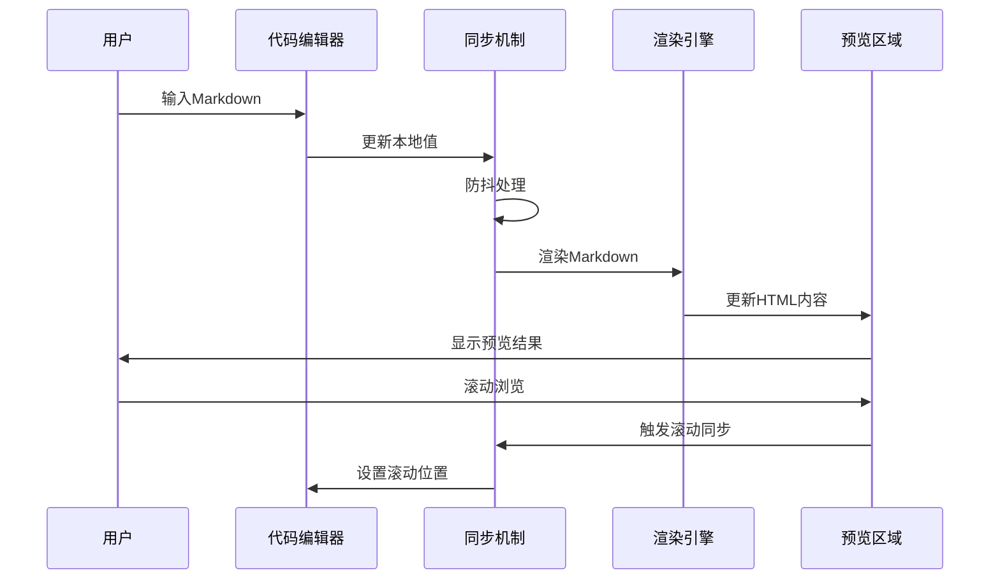

**图表来源**
- [ArticleMode.tsx:16-55](file://src/modes/article/ArticleMode.tsx#L16-L55)
- [ArticlePreview.tsx:20-163](file://src/modes/article/ArticlePreview.tsx#L20-L163)

#### 性能优化策略
- **Memo化渲染**: 使用useMemo避免不必要的重新渲染
- **防抖同步**: useEditorDocSync实现防抖回写机制
- **懒加载预览**: ArticlePreview组件按需渲染

**章节来源**
- [ArticleMode.tsx:1-55](file://src/modes/article/ArticleMode.tsx#L1-L55)
- [ArticlePreview.tsx:1-163](file://src/modes/article/ArticlePreview.tsx#L1-L163)

### A4文档模式 (DocumentMode)

A4文档模式提供专业的文档排版和打印功能：

#### 核心特性
- **精确分页**: 基于实际页面尺寸的智能分页算法
- **样式定制**: 支持多种字体、字号和段落格式
- **页眉页脚**: 可配置的页眉页脚内容
- **PDF导出**: 高质量PDF文档生成
- **AI集成**: 内置文档排版AI指令
- **封面页自动识别**: 智能识别封面页并启用等距分布布局

#### 封面页自动识别功能

**更新** 新增封面页自动识别和等距分布布局功能

系统实现了智能的封面页检测机制，能够自动识别符合特定结构的首页内容：

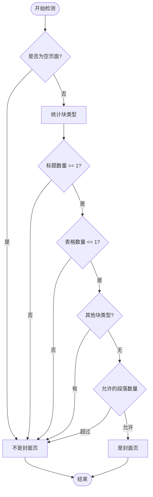

**图表来源**
- [documentModel.ts:271-282](file://src/modes/document/documentModel.ts#L271-L282)

#### 分页算法设计

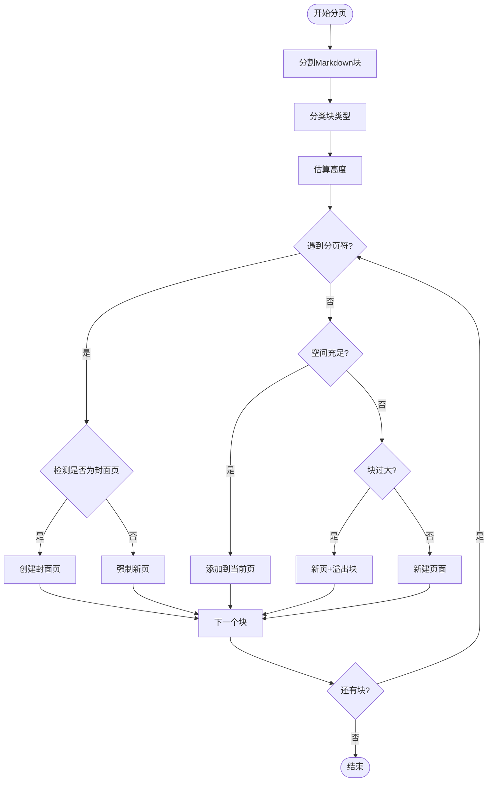

**图表来源**
- [documentModel.ts:284-350](file://src/modes/document/documentModel.ts#L284-L350)

#### 高度测量机制

系统实现了精确的高度测量机制来确保分页准确性：

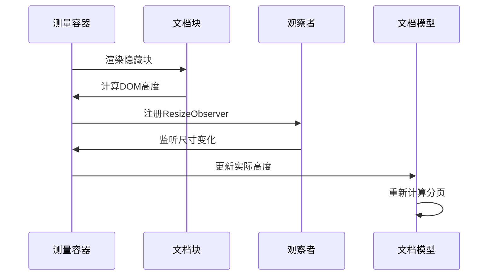

**图表来源**
- [DocumentMode.tsx:66-125](file://src/modes/document/DocumentMode.tsx#L66-L125)
- [documentModel.ts:284-350](file://src/modes/document/documentModel.ts#L284-L350)

**章节来源**
- [DocumentMode.tsx:1-345](file://src/modes/document/DocumentMode.tsx#L1-L345)
- [documentModel.ts:1-350](file://src/modes/document/documentModel.ts#L1-L350)

### 分页图文模式 (CardMode)

分页图文模式专门适配小红书等社交媒体平台：

#### 核心特性
- **比例适配**: 支持多种卡片比例（3:4、9:16）
- **品牌定制**: 支持品牌名称和视觉元素
- **批量导出**: 支持单图下载和ZIP打包
- **AI指令**: 内置小红书图文AI生成指令
- **发布文案**: 自动生成可复制的发布文案

#### 卡片模型设计

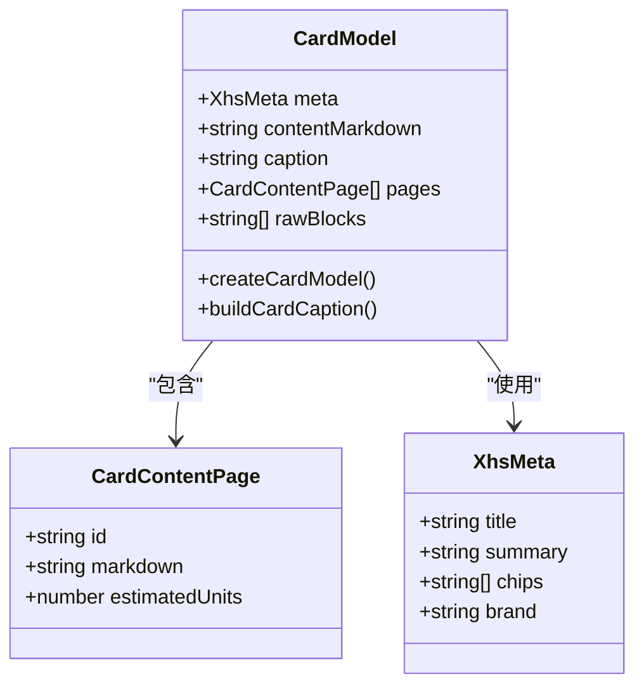

**图表来源**
- [cardModel.ts:11-187](file://src/modes/card/cardModel.ts#L11-L187)

#### 导出流程

系统提供了完整的导出解决方案：

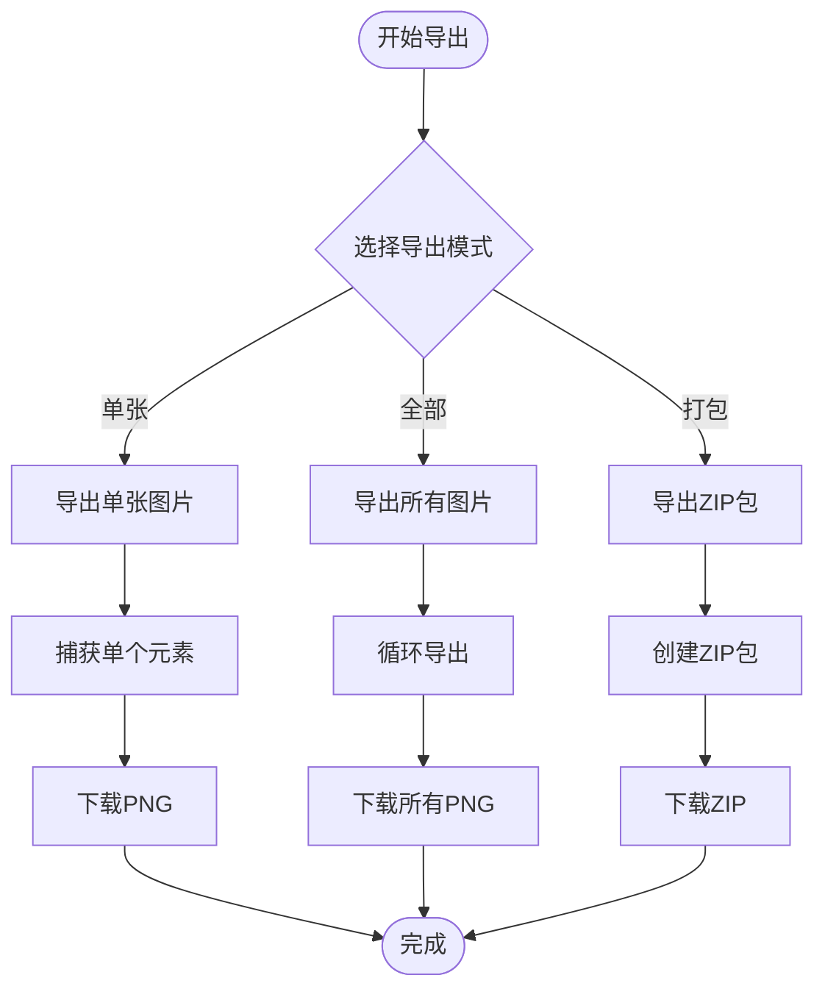

**图表来源**
- [CardMode.tsx:146-214](file://src/modes/card/CardMode.tsx#L146-L214)

**章节来源**
- [CardMode.tsx:1-364](file://src/modes/card/CardMode.tsx#L1-L364)
- [cardModel.ts:1-187](file://src/modes/card/cardModel.ts#L1-L187)

### HTML可视化模式 (HtmlMode)

HTML可视化模式提供最灵活的创作环境：

#### 核心特性
- **实时预览**: iframe沙箱中的实时HTML渲染
- **多页检测**: 自动识别和管理多页内容
- **键盘导航**: 支持键盘左右键翻页
- **滚动同步**: 编辑器与预览的双向滚动同步
- **高保真导出**: 支持PNG和PDF导出

#### 多页管理机制

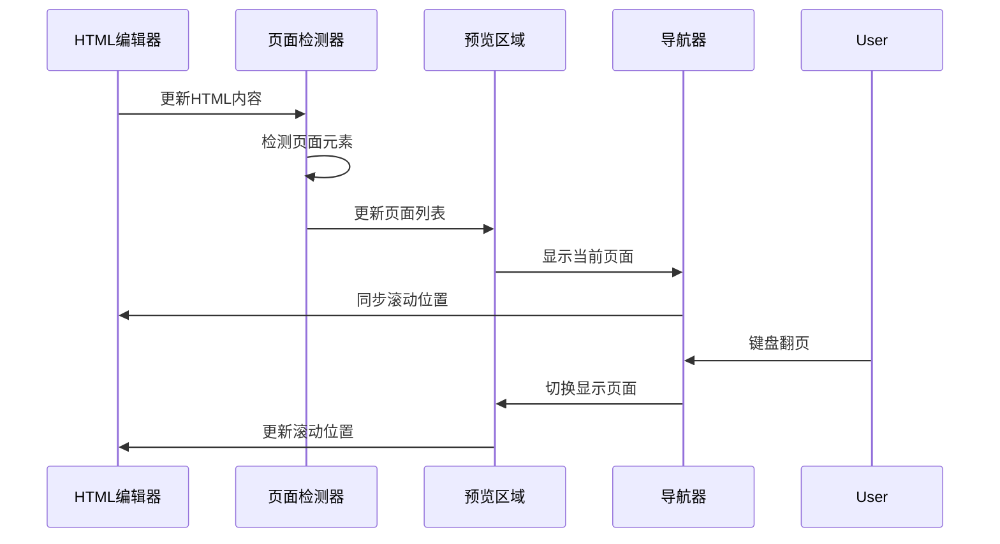

**图表来源**
- [HtmlMode.tsx:115-173](file://src/modes/html/HtmlMode.tsx#L115-L173)
- [HtmlMode.tsx:175-250](file://src/modes/html/HtmlMode.tsx#L175-L250)

#### 缩放适配算法

系统实现了智能的缩放适配机制：

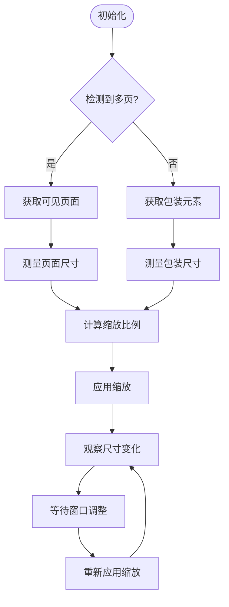

**图表来源**
- [HtmlMode.tsx:252-344](file://src/modes/html/HtmlMode.tsx#L252-L344)

**章节来源**
- [HtmlMode.tsx:1-579](file://src/modes/html/HtmlMode.tsx#L1-L579)

### ModeTabs 组件

ModeTabs 组件负责模式切换的用户界面：

#### 组件设计

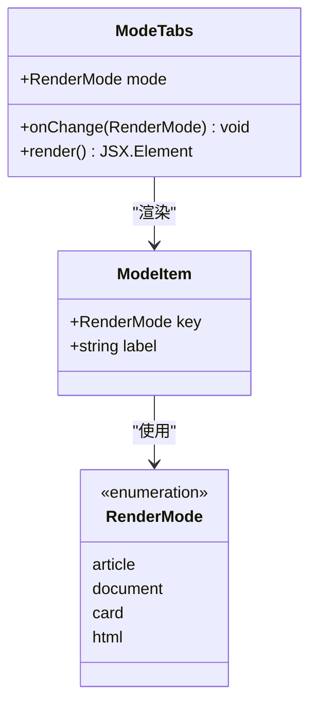

**图表来源**
- [ModeTabs.tsx:3-42](file://src/components/layout/ModeTabs.tsx#L3-L42)

#### 切换机制

组件通过简单的状态管理实现模式切换：

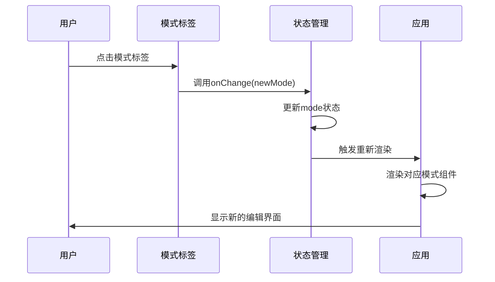

**图表来源**
- [ModeTabs.tsx:15-42](file://src/components/layout/ModeTabs.tsx#L15-L42)
- [App.tsx:89-90](file://src/App.tsx#L89-L90)

**章节来源**
- [ModeTabs.tsx:1-42](file://src/components/layout/ModeTabs.tsx#L1-L42)

## 依赖关系分析

系统采用了清晰的依赖层次结构：

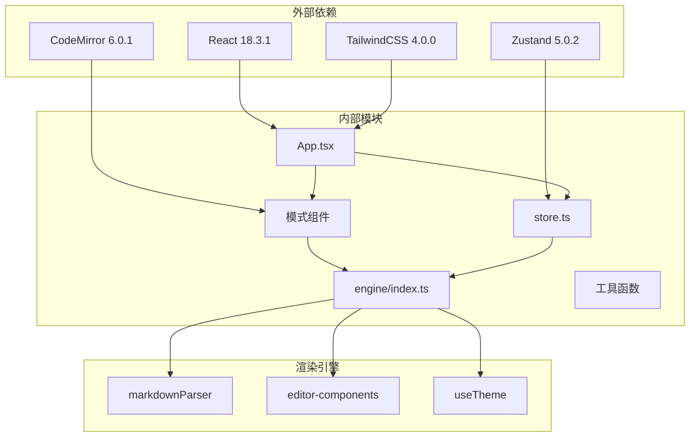

**图表来源**
- [package.json:13-31](file://package.json#L13-L31)
- [engine/index.ts:1-16](file://src/engine/index.ts#L1-L16)

### 关键依赖说明

- **React**: 提供组件化开发基础
- **Zustand**: 轻量级状态管理方案
- **CodeMirror**: 高性能代码编辑器
- **TailwindCSS**: 实用优先的CSS框架
- **Highlight.js**: 语法高亮支持
- **KaTeX**: 数学公式渲染

**章节来源**
- [package.json:1-52](file://package.json#L1-L52)

## 性能考虑

系统在多个层面实现了性能优化：

### 渲染优化
- **Memo化**: 使用useMemo避免重复渲染
- **懒加载**: 模式组件按需加载
- **防抖机制**: 编辑器输入防抖处理
- **虚拟滚动**: 大文档的滚动优化

### 内存管理
- **组件卸载清理**: 及时清理事件监听器
- **定时器管理**: 防止内存泄漏
- **观察者模式**: 合理使用ResizeObserver

### 网络优化
- **图片懒加载**: 避免阻塞页面渲染
- **CDN支持**: 第三方资源加速
- **缓存策略**: 本地存储优化

## 故障排除指南

### 常见问题及解决方案

#### 模式切换问题
**症状**: 点击模式标签后界面不更新
**原因**: 状态管理异常或组件未正确响应
**解决**: 检查ModeTabs组件的onChange回调和store的状态更新

#### 渲染性能问题
**症状**: 大文档编辑卡顿
**原因**: 未使用防抖或过度渲染
**解决**: 确保useEditorDocSync正确配置，检查useMemo使用

#### 导出失败
**症状**: PDF或图片导出失败
**原因**: 权限问题或DOM元素未就绪
**解决**: 检查浏览器权限设置，确保元素完全渲染后再导出

#### 滚动同步异常
**症状**: 编辑器与预览滚动不同步
**原因**: DOM结构变化或事件监听器丢失
**解决**: 重新绑定滚动监听器，检查ref的正确性

#### 封面页识别问题
**症状**: 封面页未正确识别或等距分布
**原因**: 封面页结构不符合规范
**解决**: 确保封面页仅包含1个标题和最多1个表格，遵循AI指导系统的封面页写法

**章节来源**
- [ArticleMode.tsx:18-23](file://src/modes/article/ArticleMode.tsx#L18-L23)
- [DocumentMode.tsx:48-54](file://src/modes/document/DocumentMode.tsx#L48-L54)
- [CardMode.tsx:72-78](file://src/modes/card/CardMode.tsx#L72-L78)
- [HtmlMode.tsx:104-110](file://src/modes/html/HtmlMode.tsx#L104-L110)

## 结论

Markdown2View 编辑模式系统通过精心设计的架构和实现，成功地将四种不同的编辑模式整合在一个统一的平台上。系统的核心优势在于：

1. **模块化设计**: 每个模式都是独立的模块，便于维护和扩展
2. **统一状态管理**: 通过Zustand实现全局状态的一致性
3. **性能优化**: 在渲染、网络和内存管理方面都有完善的优化策略
4. **用户体验**: 提供流畅的编辑体验和丰富的导出选项

系统为开发者提供了清晰的扩展接口，使得开发自定义编辑模式变得相对简单。通过理解现有的四种模式实现，开发者可以快速掌握系统的架构模式并进行二次开发。

**更新** 最新版本增强了A4文档模式的封面页自动识别功能，通过智能检测符合特定结构的首页内容，系统能够自动启用等距分布布局，显著提升了文档的专业外观和用户体验。

## 附录

### 开发自定义编辑模式指南

#### 基本步骤
1. 创建新的模式组件文件
2. 定义模式属性接口
3. 实现渲染逻辑和状态管理
4. 集成到ModeTabs组件
5. 添加到App.tsx的条件渲染

#### 最佳实践
- 使用现有的同步机制 (`useEditorDocSync`)
- 实现防抖处理避免性能问题
- 提供适当的错误处理和用户反馈
- 考虑移动端适配和响应式设计
- 遵循现有的样式和组件规范

#### 数据共享机制
- 通过store访问全局状态
- 使用props传递必要的配置参数
- 实现标准化的导出接口
- 提供统一的错误处理和提示

### AI指导系统集成

**更新** A4文档模式现已集成AI指导系统，提供专业的封面页写法指导：

- **封面页识别规则**: 系统自动识别仅包含1个标题和最多1个表格的首页结构
- **等距分布布局**: 对符合条件的封面页启用垂直居中排版，确保标题到页眉、标题到表格、表格到页脚的间距相等
- **智能分页支持**: AI指导系统支持在第一个分页符前创建专业的封面页

**章节来源**
- [aiGuide.ts:172-183](file://src/lib/aiGuide.ts#L172-L183)
- [demoHtml.ts:1230-1233](file://src/data/demoHtml.ts#L1230-L1233)